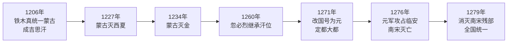
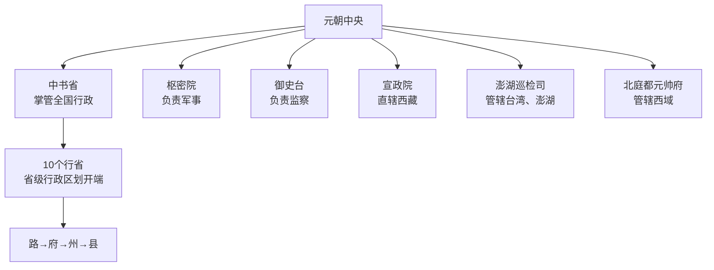

# 第11课 元朝的统一

## 时间线
- 1206 年：铁木真统一蒙古草原，建立蒙古政权，被尊为"成吉思汗"
- 1227 年：蒙古灭西夏
- 1234 年：蒙古灭金
- 1260 年：忽必烈继承汗位
- 1271 年：忽必烈改国号为元，次年定都大都（今北京）
- 1276 年：元军攻占临安，南宋灭亡
- 1279 年：元朝攻灭南宋残部，完成全国统一

## 一、蒙古族的兴起与蒙古政权建立
- 蒙古族是北方草原游牧民族；12 世纪时蒙古草原上各部混战。
- **铁木真**经过多年征战，逐一打败各部，于 **1206 年**完成蒙古草原的统一，建立蒙古政权，被拥立为大汗，尊称"**成吉思汗**"。

**元朝统一全国进程图：**

## 二、蒙古灭西夏与金
- 1227 年灭**西夏**；1234 年灭**金**；随后对南宋形成包围之势。
- 蒙古与南宋的战争持续多年（文天祥抗元即在此背景下）。

## 三、元朝的建立与统一
- **建立**：1260 年忽必烈继承汗位；**1271 年改国号为元**，次年定都**大都**。忽必烈即元世祖。
- **忽必烈的治理**："行汉法""行仁政""不嗜杀"，广开言路，整顿吏治，注重农桑；依照中原王朝的统治方法设立各种机构，建立年号。
- **统一**：1276 年攻占临安，南宋灭亡；**1279 年**消灭南宋残部，**完成全国统一**。
- **文天祥抗元**：南宋大臣文天祥组织武装抗元，兵败被俘后宁死不屈（"人生自古谁无死，留取丹心照汗青"），表现出崇高气节。
- **统一的意义**：结束了我国历史上较长时期的分裂割据局面，为统一多民族国家的进一步发展奠定了基础。元朝是我国历史上**第一个由少数民族贵族为主建立的全国性统一王朝**，疆域"**超越汉唐**"。

## 四、元朝的制度与边疆管理
### 1. 行省制度
- 中央：设**中书省**掌管全国行政事务，下设六部；设枢密院负责军事，设御史台负责监察。
- 地方：设置 10 个**行省**（行中书省），在行省之下设路、府、州、县。
- 意义：行省制度是我国省级行政区划设置的开端，对后世影响深远。
### 2. 边疆管理（因地制宜）
| 地区 | 机构 | 意义 |
| --- | --- | --- |
| 台湾 | **澎湖巡检司**（管辖澎湖和琉球） | **中央政权首次在台湾地区正式建立行政机构** |
| 西藏 | 设**宣慰使司都元帅府**，由**宣政院**直接统辖 | **西藏正式成为中央直接管辖下的地方行政区域** |
| 西域 | 北庭都元帅府 | 加强对西域的管辖 |

**元朝行省制度与边疆管理图：**

### 3. 民族交融
- 边疆各族大量迁入中原和江南，同汉族杂居相处；
- 来自中亚、西亚的波斯人、阿拉伯人等与汉、蒙等族长期杂居通婚，开始形成新的民族——**回族**。

## 背记要点
1. 1206 年铁木真统一蒙古；1271 年忽必烈建元；1279 年统一全国。
2. 灭亡顺序：西夏（1227）→ 金（1234）→ 南宋（1276/1279）。
3. 行省制度：我国省级行政区划的开端。
4. 台湾：澎湖巡检司；西藏：宣政院——两个"首次/正式"必背。
5. 元朝民族交融的重要成果：回族的形成。

## 自测题
1. 铁木真的主要功绩是什么？他为什么被尊为"成吉思汗"？
2. 元朝建立和统一全国分别是哪一年？统一有什么意义？
3. 元朝在地方实行什么制度？有何深远影响？
4. 元朝分别设置什么机构管辖台湾和西藏？各有什么意义？
5. 文天祥的事迹体现了什么精神？元朝时期形成了哪个新民族？
