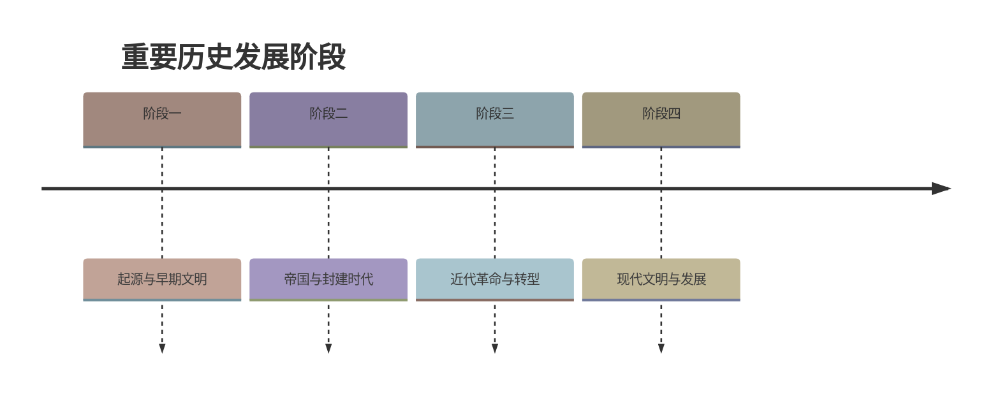

# 第15课 明朝的统治

## 时间线
- 元朝末年：政治腐败、灾害频发，红巾军起义爆发
- 1368 年：朱元璋称帝，建立明朝，定都应天府（今南京），朱元璋即明太祖
- 1368 年：明军攻占大都，结束元朝在全国的统治
- 明太祖时期：废丞相和中书省、设锦衣卫、分封诸子为王
- 明成祖时期：设立东厂，迁都北京

## 一、明朝的建立
- 元末政治腐败，社会动荡，民不聊生，农民起义爆发；
- **1368 年，朱元璋（明太祖）**称帝，建立明朝，定都**应天府（南京）**；随后攻占大都，结束元朝统治。

## 二、明太祖强化皇权
### 1. 目的
吸取元朝灭亡的教训（地方分权和朝臣权力过大），巩固统治，强化皇权。
### 2. 措施
- **在地方**：取消行中书省，设立"**三司**"（承宣布政使司、提刑按察使司、都指挥使司），互不统属；分封诸子为王，驻守各地，监控地方。
- **在中央**：**废除丞相制度和中书省**，提升六部职权，六部直接向皇帝负责；把原来的大都督府分为五军都督府，将军队调动和武官任命的权力统归兵部。
- **特务机构**：设立**锦衣卫**（明太祖），掌管侍卫、缉捕、刑狱诸事，保护皇帝、镇压官民；后明成祖又设**东厂**。厂卫特务机构成为皇帝的耳目和爪牙（"安然朝中坐，却知天下事"）。
### 3. 特点与影响
- 特点：权力的分散与制衡，皇权高度集中。
- 影响：皇权高度集中，**君主专制大为加强**；但也使皇帝负担加重，为宦官专权埋下隐患。

## 三、科举考试的变化：八股取士
- **命题范围**：只能在"**四书**""**五经**"范围内命题；
- **答题标准**：考生对题目的解释必须以朱熹的《四书集注》为标准，**不得自己随意发挥**；
- **文体**：答卷由八个部分组成，格式僵化，称"**八股文**"。
- **影响**：八股文内容空疏，形式呆板，脱离实际，禁锢思想；应试的人为了考中，死读"四书""五经"，成为皇帝旨意的顺从者，**不利于选贤任能，阻碍了思想文化的发展**。
- （对比：隋唐科举促进人才选拔和社会进步，见[[第1课 隋朝统一与灭亡]]；明朝八股取士束缚思想——同一制度不同时期作用不同。）

## 四、经济的发展（了解）
- **农业**：明代引进原产于南美洲的**玉米、甘薯、马铃薯、花生和向日葵**等作物。
- **手工业**：棉纺织业从南方推向北方；苏州是明代丝织业中心；**景德镇**是全国制瓷中心，青花瓷畅销海内外。
- **商业**：北京和南京是全国性的商贸城市；出现有名的商帮，如山西的**晋商**、安徽的**徽商**。

## 概念对比：明朝强化皇权 vs 前代
| 朝代 | 宰相制度 | 特务/监察 |
| --- | --- | --- |
| 秦—元 | 有丞相/中书省 | 御史台等常规监察 |
| 明 | **废丞相**，六部直属皇帝 | 锦衣卫、东厂（厂卫） |

## 背记要点
1. 1368 年朱元璋建明，都应天府（南京）。
2. 强化皇权核心措施：**废丞相和中书省**、地方设三司、设锦衣卫（东厂为明成祖设）。
3. 八股取士：四书五经命题＋朱熹注为标准＋八股文体 → 禁锢思想。
4. 新引进作物：玉米、甘薯、马铃薯、花生、向日葵（原产南美洲）。
5. 明代商帮代表：晋商、徽商。

## 自测题
1. 明朝建立的时间、建立者、都城分别是什么？
2. 明太祖在中央和地方分别采取了哪些强化皇权的措施？
3. 锦衣卫和东厂分别由谁设立？其职能是什么？
4. 什么是"八股取士"？它产生了什么影响？
5. 明代农业、手工业、商业各有哪些新发展？

### 历史时间轴

