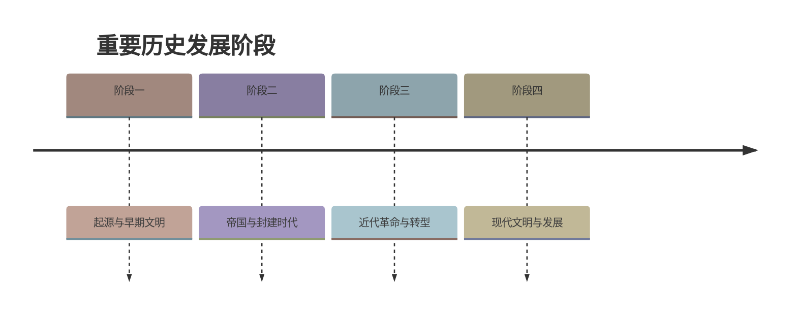

# 第17课 明朝的灭亡和清朝的建立

## 时间线
- 明朝中后期：政治日益腐败，宦官专权（如魏忠贤），土地兼并严重
- 明末：陕西北部连年大旱，农民起义爆发
- 1616 年：努尔哈赤统一女真各部，建立后金
- 1636 年：皇太极改族名为满洲，改国号为清
- 1644 年 3 月：李自成攻入北京，崇祯帝自缢，明朝灭亡
- 1644 年 4 月：吴三桂引清军入关，李自成兵败
- 1644 年后：清朝迁都北京，逐步建立起对全国的统治

## 一、明朝的腐败与灭亡
### 1. 政治腐败
- 明代中后期，皇帝多沉迷享乐，疏于朝政；
- 皇室内部钩心斗角，纷争不已；大臣结党营私，争权夺利；宦官专权（魏忠贤"九千岁"）。
### 2. 社会动荡
- 朝政混乱造成中央对社会的控制力下降，法纪松弛，各级官吏贪赃枉法，盘剥民众；
- **土地兼并严重**，大量农民流离失所。

## 二、李自成起义推翻明朝
### 1. 原因
- 根本：明末政治腐败、赋税苛重；
- 直接：陕西北部连年大旱，官府依旧催征税赋，民众走投无路。
### 2. 口号与政策
- 提出"**均田免赋**"口号，得到广大农民热烈拥护（针对土地兼并和赋税沉重两大问题）；
- 规定严明的军纪，向贫苦民众发放钱粮，队伍发展到 100 多万人。
### 3. 结果
- **1644 年，李自成攻入北京，崇祯帝自缢，明朝被农民起义推翻**。

## 三、满洲兴起与清兵入关
### 1. 满洲兴起
- 明朝后期，活动于我国东北地区的女真族不断发展壮大；
- **1616 年，努尔哈赤**统一女真各部，建立政权，国号大金，史称**后金**；
- **1636 年，皇太极**改族名为**满洲**，改国号为**清**。
### 2. 清兵入关
- 明朝灭亡后，驻守山海关的明军将领**吴三桂**降清，引清兵入关，与清军联合夹击李自成的军队；
- 李自成在山海关交战失利，最后失败；
- 清朝统治者迁都**北京**，逐步建立起对全国的统治。

## 概念梳理：1644 年的三方角力
| 势力 | 代表 | 结局 |
| --- | --- | --- |
| 明朝 | 崇祯帝 | 北京陷落，自缢殉国，明亡 |
| 大顺农民军 | 李自成 | 推翻明朝，后败于清军 |
| 清（后金） | 顺治帝/多尔衮 | 入关夺取全国政权 |
后续清朝巩固统一的措施见[[第18课 统一多民族封建国家的巩固和发展]]。

## 历史启示
- 政治腐败、民生凋敝是王朝灭亡的根本原因（明亡教训与秦、隋类似）；
- "均田免赋"反映农民对土地和减轻负担的迫切要求，得民心者得天下。

## 背记要点
1. 明朝灭亡：1644 年，被**李自成农民起义**推翻（不是被清朝直接灭亡）。
2. 李自成口号："均田免赋"。
3. 1616 年努尔哈赤建后金；1636 年皇太极改国号为清、改族名为满洲。
4. 吴三桂引清兵入关，清迁都北京统治全国。
5. 明亡原因链：政治腐败 → 土地兼并、赋税苛重 → 天灾催化 → 农民起义。

## 自测题
1. 明朝中后期政治腐败有哪些表现？
2. 李自成起义提出了什么口号？为什么能得到农民拥护？
3. 明朝是哪一年灭亡的？是被谁推翻的？
4. 写出后金建立和改国号为清的时间及人物。
5. 清军是如何入关并建立全国统治的？

### 历史时间轴

