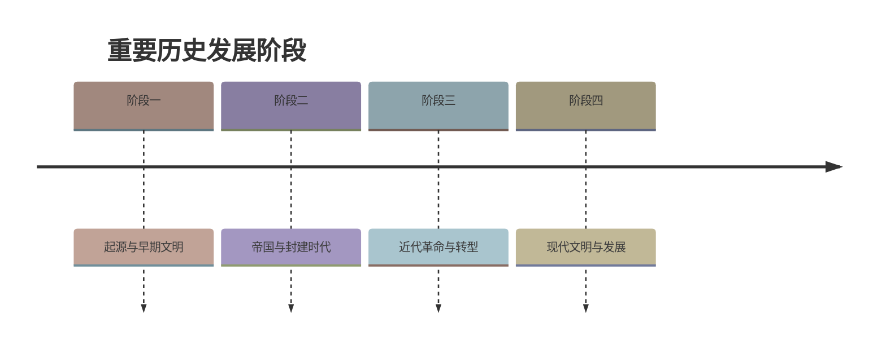

# 第18课 统一多民族封建国家的巩固和发展

## 时间线
- 1662 年：郑成功收复台湾，荷兰殖民者投降
- 1684 年：清朝设置台湾府，隶属福建省；1885 年台湾正式建省
- 1685、1686 年：康熙帝两次雅克萨之战反击沙俄
- 1689 年：中俄签订《尼布楚条约》
- 康熙时：册封"班禅额尔德尼"；平定噶尔丹叛乱
- 1727 年（雍正时）：设置驻藏大臣
- 乾隆时：平定大、小和卓叛乱；1762 年设伊犁将军；1771 年土尔扈特部回归

## 一、郑成功收复台湾与清朝对台湾的治理
- **背景**：明朝末期，**荷兰**殖民者侵占台湾。
- **收复**：1661 年郑成功率军渡海，**1662 年**荷兰殖民者投降，**台湾重新回到祖国怀抱**；郑成功是我国历史上的**民族英雄**（"台湾者，中国之土地也"）。
- **清朝治理**：1683 年清军进入台湾；**1684 年设置台湾府，隶属福建省**——巩固了东南海防，台湾的社会经济发展步入新的历史时期；1885 年台湾正式建省。

## 二、清廷对西藏的有效管辖
- **册封制度**：顺治帝册封五世达赖"**达赖喇嘛**"封号；康熙帝册封五世班禅"**班禅额尔德尼**"封号。此后历代达赖和班禅都须经中央政府册封。
- **驻藏大臣**：**1727 年设置驻藏大臣**，监督西藏地方政务。
- **金瓶掣签**：1793 年颁布《钦定藏内善后章程》，规范达赖、班禅继承人转世程序（金瓶掣签制度）。
- 意义：中央对西藏的管辖大大加强。（元朝设宣政院是西藏归属中央之始，见[[第11课 元朝的统一]]。）

## 三、巩固西北边疆
- **康熙**：三次亲征，平定蒙古准噶尔部**噶尔丹**叛乱，稳定西北部边疆地区。
- **乾隆**：平定回部上层贵族**大、小和卓**叛乱；**1762 年设置伊犁将军**，管辖包括巴尔喀什湖在内的整个新疆地区。
- **土尔扈特部回归**：1771 年，西迁伏尔加河流域的蒙古族土尔扈特部在首领**渥巴锡**率领下返回新疆，为多民族国家的巩固和发展谱写了光辉篇章。

## 四、雅克萨之战与《尼布楚条约》
- 17 世纪中期，沙俄入侵我国黑龙江流域，占据雅克萨等地；
- **康熙帝**组织两次**雅克萨之战**（1685、1686 年），沙俄被迫同意谈判；
- **1689 年中俄签订第一个边界条约《尼布楚条约》**，从法律上肯定了黑龙江和乌苏里江流域包括库页岛在内的广大地区都是中国领土。

## 五、清朝的疆域（背记）
西跨葱岭——西北达巴尔喀什湖——北接西伯利亚——东北至黑龙江以北的外兴安岭和库页岛——东临太平洋——东南到台湾及其附属岛屿钓鱼岛、赤尾屿等——南至南海诸岛。清朝成为亚洲东部最大的国家，**奠定了现代中国版图的基础**。

## 边疆治理方式归纳
| 方式 | 事例 |
| --- | --- |
| 武力平叛/反侵略 | 平噶尔丹、大小和卓；雅克萨之战 |
| 设置机构 | 台湾府、驻藏大臣、伊犁将军 |
| 册封 | 达赖喇嘛、班禅额尔德尼 |
| 立法定约 | 《钦定藏内善后章程》《尼布楚条约》 |

## 背记要点
1. 郑成功 1662 年从荷兰手中收复台湾；1684 年清设台湾府（隶属福建省）。
2. 西藏：册封达赖、班禅＋1727 年驻藏大臣＋金瓶掣签。
3. 新疆：平定大小和卓＋1762 年伊犁将军。
4. 1689 年《尼布楚条约》：中俄第一个边界条约。
5. 清朝疆域奠定现代中国版图基础。

## 自测题
1. 郑成功收复台湾是从哪个殖民国家手中收复的？有何意义？
2. 清朝前期对西藏采取了哪些管辖措施？
3. 康熙和乾隆分别平定了哪些叛乱？新疆设置了什么机构？
4. 《尼布楚条约》是何时签订的？内容是什么？
5. 归纳清朝巩固统一多民族国家的四种方式并各举一例。

### 历史时间轴

