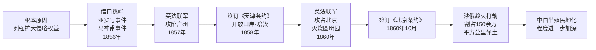

# 第2课 第二次鸦片战争

## 时间线

**第二次鸦片战争事件脉络图：**

- 1856 年 10 月：英法联军以“亚罗号事件”和“马神甫事件”为借口发动战争
- 1857 年：英法联军攻陷广州，成立傀儡政权
- 1858 年：清政府被迫签订中俄、中美、中英、中法《天津条约》
- 1860 年：英法联军攻占北京，洗劫并火烧圆明园
- 1860 年 10 月：清政府签订中英、中法《北京条约》
- 19 世纪 50-80 年代：沙俄强迫清政府签订一系列不平等条约，割占中国北方大片领土

## 历史事件

鸦片战争后，西方列强不满足既得利益，企图进一步打开中国市场，扩大侵略权益。英法联军一路北上，攻陷大沽炮台，进逼天津。清政府被迫签订《天津条约》，开放更多口岸、允许外国公使进驻北京、增开长江通商口岸、赔偿巨额白银。1860 年，英法联军再次出兵，攻占北京，对圆明园进行大肆抢劫后纵火焚烧，这座举世闻名的皇家园林化为焦土，大量珍贵文物流失海外。

## 人物

- 咸丰帝：战争期间逃往热河避暑山庄
- 奕訢：留守北京，代表清政府与英法签订《北京条约》
- 额尔金：英国全权代表，下令焚烧圆明园
- 洪秀全：同一时期领导太平天国运动，牵制清政府

## 意义与影响

第二次鸦片战争使中国丧失更多主权，西方侵略势力由沿海深入到长江中下游地区，中国半殖民地化程度进一步加深。沙俄趁火打劫，通过《瑷珲条约》《北京条约》《勘分西北界约记》等不平等条约，共割占中国东北和西北 150 多万平方公里领土，是近代侵占中国领土最多的国家。

## 概念对比

- 第一次鸦片战争 vs 第二次鸦片战争：前者打开中国门户，后者扩大侵略权益并深入内地
- 商品倾销 vs 资本输出：第二次鸦片战争后，外国侵略势力进一步向中国内地延伸
- 圆明园被毁 vs 文化遗产：警示后人铭记历史、珍爱和平、保护人类文明成果

## 背记要点

1. 第二次鸦片战争的根本原因是列强企图进一步打开中国市场
2. 战争借口是“亚罗号事件”和“马神甫事件”
3. 1860 年英法联军火烧圆明园
4. 沙俄在第二次鸦片战争中割占中国领土最多，达 150 多万平方公里
5. 《天津条约》和《北京条约》使中国半殖民地化程度进一步加深

## 相关链接

本课与 [[第1课 鸦片战争]]、[[第3课 太平天国运动]] 紧密联系，共同反映中国半殖民地半封建社会逐步加深的过程。

## 自测题

1. 第二次鸦片战争的起止时间和发动国分别是？
2. 火烧圆明园的是哪国军队？发生在哪一年？
3. 沙俄通过哪些条约割占中国北方大片领土？
4. 第二次鸦片战争对中国的主要影响是什么？
5. 第二次鸦片战争与第一次鸦片战争有何不同？
