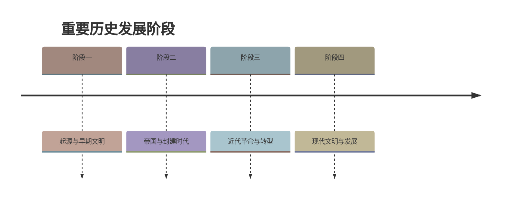

# 第3课 太平天国运动

## 时间线

- 1843 年：洪秀全创立拜上帝会，宣传反清思想
- 1851 年 1 月 11 日：金田起义，建号太平天国
- 1853 年 3 月：太平军攻占南京，改名为天京，定为都城
- 1853-1856 年：北伐和西征，太平天国在军事上达到全盛
- 1856 年：天京事变，领导集团内讧，太平天国由盛转衰
- 1864 年 7 月：天京陷落，太平天国运动失败

## 历史事件

鸦片战争后，清政府加重赋税剥削，社会矛盾激化。洪秀全利用拜上帝会组织发动农民起义。太平天国定都天京后，颁布《天朝田亩制度》，提出“有田同耕，有饭同食”的理想，但具有空想色彩，未能真正实行。后期洪仁玕提出《资政新篇》，主张向西方学习、改革内政，是近代中国第一个带有资本主义色彩的施政方案。由于农民阶级的局限性、领导集团腐化内讧，以及中外反动势力的联合镇压，运动最终失败。

## 人物

- 洪秀全：太平天国运动的最高领导人，自称“天王”
- 杨秀清、萧朝贵、冯云山、韦昌辉、石达开：早期核心领导人
- 洪仁玕：干王，提出《资政新篇》
- 曾国藩、李鸿章：组织湘军、淮军镇压太平天国

## 意义与影响

太平天国运动是中国近代史上规模最宏大的一次农民战争，坚持斗争 14 年，转战大半个中国，沉重打击了清朝的统治和外国侵略势力，谱写了中国近代史上壮烈的一章。它提出的发展资本主义方案，反映了当时部分先进中国人向西方寻找真理的愿望。

## 概念对比

- 《天朝田亩制度》vs《资政新篇》：前者主张绝对平均主义分配土地，具有空想性；后者主张学习西方、发展资本主义，具有进步性但都未能实施
- 农民阶级局限性 vs 资产阶级革命性：太平天国因缺乏科学理论指导和先进阶级领导而失败

## 背记要点

1. 太平天国运动开始于 1851 年金田起义
2. 定都天京（今南京）后颁布《天朝田亩制度》
3. 天京事变是太平天国由盛转衰的转折点
4. 太平天国运动失败的标志是 1864 年天京陷落
5. 太平天国失败的根本原因是农民阶级的局限性

## 相关链接

本课与 [[第1课 鸦片战争]]、[[第2课 第二次鸦片战争]] 一起，展现了近代中国在列强入侵和阶级矛盾激化下的社会动荡。

## 自测题

1. 太平天国运动爆发的标志是什么？
2. 太平天国的都城在哪里？原名叫什么？
3. 《天朝田亩制度》和《资政新篇》的主要区别是什么？
4. 太平天国运动失败的主要原因有哪些？
5. 太平天国运动的历史意义是什么？

### 历史时间轴

