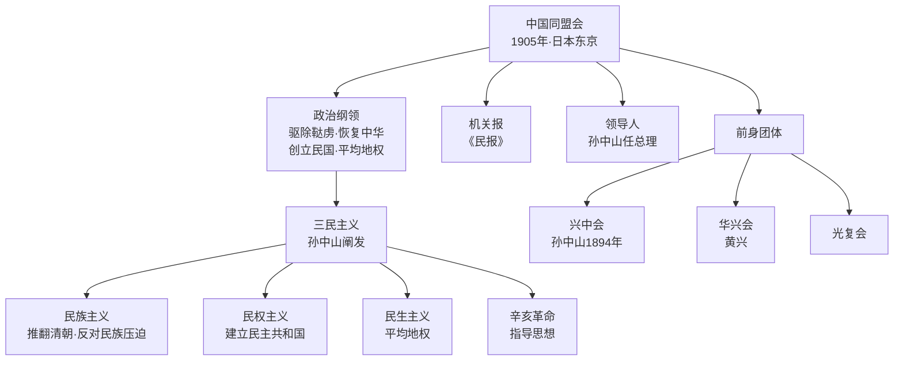

# 第8课 中国同盟会

## 时间线

**中国同盟会与三民主义结构图：**

- 1894 年 11 月：孙中山在檀香山成立兴中会，提出“振兴中华”
- 1905 年 8 月：中国同盟会在日本东京成立
- 1905 年：同盟会创办机关报《民报》
- 1905 年：孙中山在《民报》发刊词中提出“三民主义”
- 1906-1911 年：同盟会领导多次武装起义
- 1911 年 10 月：武昌起义爆发，辛亥革命推翻清朝统治

## 历史事件

《辛丑条约》签订后，清政府沦为“洋人的朝廷”，资产阶级革命思想迅速传播。孙中山早年创立兴中会，提出“驱除鞑虏，恢复中华”的革命纲领。1905 年，兴中会、华兴会、光复会等革命团体在日本东京联合成立中国同盟会，推举孙中山为总理。同盟会是中国第一个全国规模的、统一的资产阶级革命政党，它的成立使全国资产阶级革命派有了一个统一的领导和明确的奋斗目标。

## 人物

- 孙中山：中国民主革命的伟大先行者，同盟会总理
- 黄兴：同盟会重要领导人，多次领导武装起义
- 章炳麟、邹容、陈天华：宣传资产阶级革命思想的代表人物
- 秋瑾、徐锡麟：同盟会女革命家和革命志士

## 意义与影响

中国同盟会的成立标志着中国资产阶级民主革命进入新阶段。同盟会提出了“驱除鞑虏，恢复中华，创立民国，平均地权”的政治纲领，后来孙中山将其阐发为民族、民权、民生三大主义，即“三民主义”，成为辛亥革命的指导思想。同盟会领导和发动了一系列武装起义，为辛亥革命作了组织上和思想上的重要准备。

## 概念对比

- 兴中会 vs 中国同盟会：前者是早期革命团体，后者是全国性统一的资产阶级革命政党
- 维新派 vs 革命派：前者主张君主立宪、和平改良，后者主张民主共和、暴力革命
- 三民主义 vs 维新思想：前者要建立资产阶级共和国，后者要维护清朝统治进行改革
- 民族主义 vs 民权主义 vs 民生主义：分别对应民族革命、政治革命、社会革命

## 背记要点

1. 中国同盟会成立于 1905 年，地点是日本东京
2. 同盟会的政治纲领是“驱除鞑虏，恢复中华，创立民国，平均地权”
3. 同盟会的机关报是《民报》
4. 孙中山将同盟会纲领阐发为民族、民权、民生三大主义
5. 中国同盟会是第一个全国规模的、统一的资产阶级革命政党
6. 三民主义是辛亥革命的指导思想

## 相关链接

本课是 [[第9课 辛亥革命]] 的重要铺垫，与 [[第10课 帝制复辟与军阀割据]] 共同构成第三单元“资产阶级民主革命与中华民国的建立”。

## 自测题

1. 中国同盟会成立的时间、地点和领导人分别是什么？
2. 同盟会的政治纲领是什么？
3. 三民主义包括哪些内容？
4. 中国同盟会的成立有什么历史意义？
5. 兴中会与中国同盟会有什么区别？
