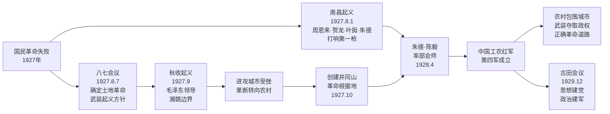

# 第13课 国共合作与北伐战争

## 时间线

**井冈山道路探索脉络图：**

- 1923 年 6 月：中共三大在广州召开，决定与国民党合作
- 1924 年 1 月：国民党一大在广州召开，国共第一次合作正式形成
- 1924 年 5 月：黄埔军校创办
- 1926 年 7 月：国民革命军出师北伐
- 1927 年 3 月：北伐军占领南京
- 1927 年 4 月 12 日：蒋介石发动四一二反革命政变
- 1927 年 7 月 15 日：汪精卫发动七一五反革命政变，国民革命失败

## 历史事件

中国共产党成立后，认识到要战胜强大敌人必须建立革命统一战线。1924 年，国民党一大在广州召开，把旧三民主义发展为新三民主义，确立“联俄、联共、扶助农工”三大政策，同意共产党员以个人身份加入国民党，国共第一次合作正式形成。黄埔军校培养了大量军事人才。1926 年，国民革命军正式出师北伐，目标是打倒帝国主义，推翻北洋军阀统治，统一全国。北伐军从广东出发，在工农群众支持下，迅速消灭吴佩孚、孙传芳主力，革命势力发展到长江流域。

## 人物

- 孙中山：提出新三民主义，推动国共第一次合作
- 蒋介石：黄埔军校校长，北伐军总司令，后发动反革命政变
- 周恩来：黄埔军校政治部主任
- 叶挺：率领独立团在北伐中屡建奇功，被誉为“北伐名将”
- 汪精卫：后发动七一五反革命政变

## 意义与影响

国共第一次合作建立了革命统一战线，推动了国民革命运动的发展。北伐战争基本推翻了北洋军阀的反动统治，沉重打击了帝国主义在华势力。但由于国民党右派叛变革命，国民革命最终失败。这次失败使中国共产党认识到掌握革命武装和领导权的重要性，开始独立领导武装斗争。

## 概念对比

- 旧三民主义 vs 新三民主义：后者增加反帝反封建内容，确立三大政策
- 第一次国共合作 vs 第二次国共合作：前者反帝反封建，后者抗日民族统一战线
- 四一二政变 vs 七一五政变：前者蒋介石叛变，后者汪精卫叛变

## 背记要点

1. 国共第一次合作正式形成的标志是 1924 年国民党一大召开
2. 黄埔军校创办于 1924 年 5 月，校长蒋介石，政治部主任周恩来
3. 北伐战争开始于 1926 年 7 月
4. 北伐的主要对象是吴佩孚、孙传芳、张作霖
5. 四一二、七一五反革命政变标志国民革命失败
6. 北伐战争基本推翻北洋军阀统治

## 相关链接

本课与 [[第12课 中国共产党诞生]]、[[新民主主义革命兴起综述]]、[[第14课 毛泽东开辟井冈山道路]] 紧密联系，展现了国共关系从合作到分裂的历史转折。

## 自测题

1. 国共第一次合作正式形成的标志是什么？
2. 黄埔军校的创办有什么重要作用？
3. 北伐战争的主要对象和结果是什么？
4. 国民革命失败的主要原因是什么？
5. 国民革命失败给中国共产党带来什么教训？
