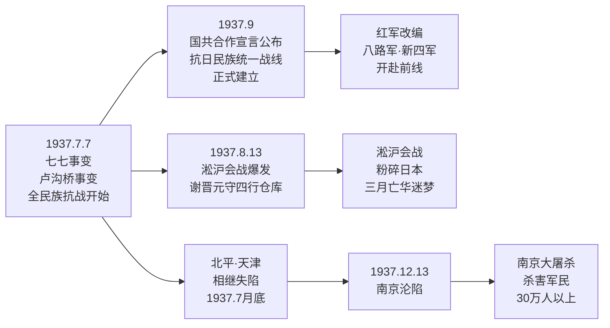

# 第17课 七七事变与全民族抗战

## 时间线

**七七事变与全民族抗战脉络图：**

- 1937 年 7 月 7 日：七七事变（卢沟桥事变）爆发
- 1937 年 7 月底：北平、天津相继失陷
- 1937 年 8 月 13 日：淞沪会战爆发
- 1937 年 9 月：国民党公布中共提交的国共合作宣言，抗日民族统一战线正式建立
- 1937 年 12 月 13 日：南京沦陷
- 1937 年 12 月：日军制造南京大屠杀

## 历史事件

1937 年 7 月 7 日夜，日军借口士兵失踪，要求进入宛平城搜查，遭到中国守军拒绝。日军随即向卢沟桥和宛平城发动进攻，中国守军奋起抵抗，七七事变爆发。七七事变标志着中国全民族抗战的开始。在国共两党共同努力下，9 月，国民党公布中共中央提交的国共合作宣言，蒋介石发表谈话，承认中国共产党的合法地位，以国共合作为主体的抗日民族统一战线正式建立。工农红军改编为国民革命军第八路军和新编第四军，开赴抗日前线。淞沪会战粉碎了日本三个月灭亡中国的迷梦。南京沦陷后，日军进行长达 6 周的大屠杀，杀害中国军民 30 万人以上，犯下滔天罪行。

## 人物

- 佟麟阁、赵登禹：在七七事变和北平保卫战中殉国的爱国将领
- 谢晋元：率部坚守上海四行仓库
- 蒋介石：发表庐山谈话，表示准备抗战
- 毛泽东：发表《对日寇的最后一战》等文章，指导抗战

## 意义与影响

七七事变是日本全面侵华战争的开始，也是中国全民族抗战的开始。抗日民族统一战线的正式建立，实现了全民族抗战，为抗战胜利提供了根本保证。南京大屠杀是日本侵略者对中国人民犯下的滔天罪行，必须铭记历史、珍爱和平、开创未来。

## 概念对比

- 九一八事变 vs 七七事变：前者是局部抗战起点，后者是全民族抗战起点
- 抗日民族统一战线初步形成 vs 正式建立：西安事变和平解决是初步形成，国共合作宣言公布是正式建立
- 正面战场 vs 敌后战场：国民党主导正面战场，共产党主导敌后战场
- 片面抗战路线 vs 全面抗战路线：前者单纯依靠政府和军队，后者依靠人民群众

## 背记要点

1. 七七事变爆发于 1937 年 7 月 7 日，又称卢沟桥事变
2. 七七事变是中国全民族抗战的开始
3. 抗日民族统一战线正式建立的标志是 1937 年 9 月国共合作宣言的公布
4. 红军改编为八路军和新四军
5. 南京大屠杀中被害中国军民达 30 万人以上
6. 淞沪会战粉碎了日本三个月灭亡中国的迷梦

## 相关链接

本课与 [[第16课 从九一八事变到西安事变]]、[[第18课 全民族抗战中的正面战场和敌后战场]] 紧密联系，共同构成第六单元“中华民族的抗日战争”。

## 自测题

1. 七七事变爆发的时间和影响是什么？
2. 抗日民族统一战线正式建立的标志是什么？
3. 红军改编后的名称是什么？
4. 南京大屠杀的基本史实有哪些？
5. 为什么说七七事变是全民族抗战的开始？
