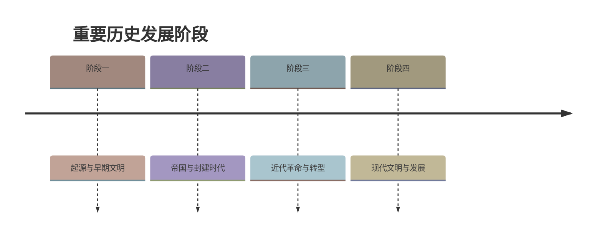

# 第20课 国民党挑起内战

## 时间线

- 1945 年 8-10 月：重庆谈判，签订“双十协定”
- 1946 年 1 月：政治协商会议在重庆召开
- 1946 年 6 月：国民党军队大举进攻中原解放区，全面内战爆发
- 1947 年 3 月：国民党军队重点进攻陕北和山东解放区
- 1947 年 3 月：中共中央主动撤离延安，转战陕北
- 1947 年：人民解放军粉碎国民党全面进攻和重点进攻

## 历史事件

抗日战争胜利后，全国人民渴望和平民主。蒋介石为发动内战赢得准备时间，三次电邀毛泽东到重庆谈判。1945 年 8 月，毛泽东亲赴重庆，经过 43 天谈判，国共双方签署《政府与中共代表会谈纪要》，即“双十协定”。1946 年 1 月，政治协商会议在重庆召开，通过了和平建国纲领等决议。但国民党很快撕毁协定和决议，1946 年 6 月，国民党军队以 20 多万兵力大举围攻中原解放区，全面内战爆发。随后，国民党军队对陕北解放区和山东解放区发动重点进攻。中共中央主动撤离延安，毛泽东、周恩来等转战陕北，指挥全国解放战争。

## 人物

- 毛泽东：赴重庆谈判，争取和平民主
- 蒋介石：假和平、真内战，撕毁政协决议
- 周恩来：陪同毛泽东参加重庆谈判

## 意义与影响

重庆谈判和政治协商会议使人们看到了和平建国的希望。但国民党坚持独裁内战方针，发动全面内战，使中国人民再一次陷入战争灾难。中国共产党领导解放区军民进行自卫战争，粉碎了国民党的全面进攻和重点进攻，为战略反攻创造条件。

## 概念对比

- 重庆谈判 vs 政协会议：前者是国共两党谈判，后者是各党派协商
- 全面进攻 vs 重点进攻：国民党军事策略的变化
- 国民党“假和平” vs 共产党“真和平”：反映了两种不同的政治立场
- 重庆谈判结果 vs 内战爆发：和平努力最终未能阻止战争

## 背记要点

1. 重庆谈判签订“双十协定”
2. 全面内战爆发的标志是 1946 年 6 月国民党军队进攻中原解放区
3. 国民党重点进攻陕北和山东解放区
4. 中共中央主动撤离延安，转战陕北
5. 国民党坚持独裁内战，共产党争取和平民主
6. 人民解放军粉碎了国民党的全面进攻和重点进攻

## 相关链接

本课与 [[第19课 抗日战争的胜利]]、[[第21课 人民解放战争的胜利]] 紧密联系，展现了抗日战争胜利后中国两种命运、两个前途的决战。

## 自测题

1. 重庆谈判的时间和结果是什么？
2. 全面内战爆发的标志是什么？
3. 国民党重点进攻哪些解放区？
4. 中共中央为什么要主动撤离延安？
5. 重庆谈判的历史意义是什么？

### 历史时间轴

