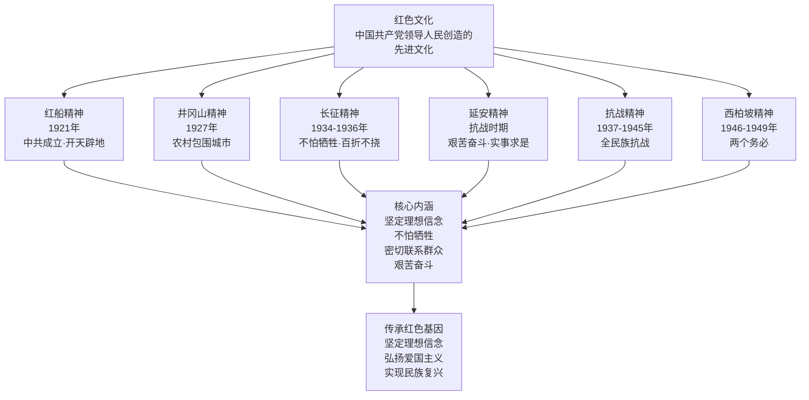

# 第22课 活动课：探寻红色文化的历史基因

## 时间线

**红色文化精神谱系图：**

- 1921 年：中国共产党成立，红船精神诞生
- 1927 年：南昌起义、秋收起义，井冈山革命根据地创建
- 1934-1936 年：红军长征，长征精神形成
- 1935 年：遵义会议召开
- 1936 年：西安事变和平解决
- 1937-1945 年：全民族抗日战争，抗战精神形成
- 1946-1949 年：人民解放战争，西柏坡精神形成

## 历史事件

红色文化是中国共产党领导中国人民在革命、建设和改革进程中创造的具有中国特色的先进文化。它包括红船精神、井冈山精神、长征精神、延安精神、抗战精神、西柏坡精神等。这些精神共同体现了中国共产党人坚定的理想信念、不怕牺牲的革命精神、密切联系群众的优良作风和艰苦奋斗的政治本色。探寻红色文化的历史基因，就是要了解中国共产党为什么“能”、马克思主义为什么“行”、中国特色社会主义为什么“好”。

## 人物

- 革命先烈：方志敏、刘胡兰、董存瑞等为革命事业英勇献身
- 领袖群体：毛泽东、周恩来、朱德等老一辈革命家
- 普通战士和人民群众：在革命战争中作出巨大贡献

## 意义与影响

红色文化是中华民族宝贵的精神财富，是中国特色社会主义文化的重要组成部分。传承红色基因，有利于坚定理想信念，培育和践行社会主义核心价值观，增强民族自信心和凝聚力。作为新时代青少年，要铭记革命历史，传承红色基因，为实现中华民族伟大复兴贡献力量。

## 概念对比

- 红色文化 vs 传统文化：红色文化是革命年代形成的先进文化，传统文化是历史传承的民族文化
- 红色精神 vs 时代精神：红色精神是历史积淀，时代精神是当代发展，二者一脉相承
- 历史基因 vs 文化传承：历史基因是精神内核，文化传承是实践路径

## 背记要点

1. 红色文化是中国共产党领导人民创造的先进文化
2. 红色文化包括红船精神、井冈山精神、长征精神、延安精神、抗战精神、西柏坡精神等
3. 红色文化的核心是坚定的理想信念和为人民服务的宗旨
4. 传承红色基因有利于坚定理想信念、弘扬爱国主义
5. 青少年应铭记历史、传承红色基因、争做时代新人

## 相关链接

本活动课与 [[第12课 中国共产党诞生]]、[[第15课 中国工农红军长征与遵义会议]]、[[第19课 抗日战争的胜利]]、[[第21课 人民解放战争的胜利]] 紧密联系，是对八年级上册中国近代史革命历程的回顾与总结。

## 自测题

1. 红色文化主要包括哪些精神？
2. 红色文化的核心内涵是什么？
3. 为什么要传承红色基因？
4. 青少年应如何传承红色文化？
5. 举例说明一位革命先烈的事迹及其精神品质。
