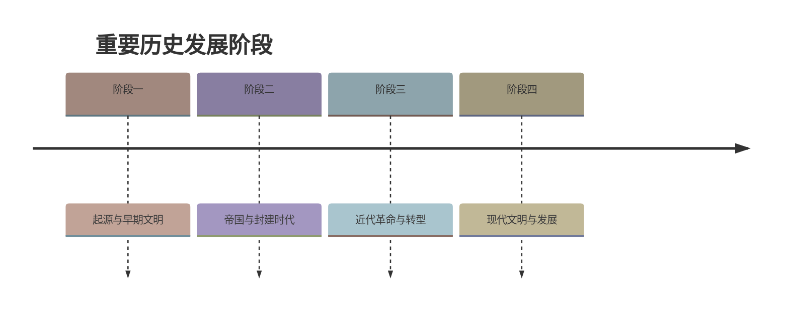

# 第3课 土地改革

## 时间线

- 1950 年：中央人民政府颁布《中华人民共和国土地改革法》
- 1950 年冬起：全国分批进行土地改革
- 1952 年底：除部分少数民族地区外，全国大陆基本完成土地改革

## 历史事件

### 土地改革的背景

新中国成立时，占全国人口绝大多数的农民仍被束缚在封建土地制度之下。地主、富农占有大部分土地，而贫农、雇农占有很少土地。封建土地制度严重阻碍农村经济和中国社会的发展，广大农民迫切要求获得土地。

### 土地改革的经过

1950 年，中央人民政府颁布《中华人民共和国土地改革法》，规定废除地主阶级封建剥削的土地所有制，实行农民的土地所有制。1950 年冬起，全国分批进行土地改革，没收地主的土地，分给无地或少地的农民耕种；同时也分给地主一份，让他们自己耕种，在劳动中改造自己。

到 1952 年底，除部分少数民族地区外，全国大陆基本完成土地改革，约 3 亿无地少地的农民分到了土地。

## 人物

- 广大翻身农民：土地改革的主体和受益者，获得土地后生产积极性大大提高

## 意义与影响

1. 彻底摧毁了我国存在两千多年的封建土地制度，消灭了地主阶级
2. 农民翻了身，得到了土地，成为土地的主人
3. 使人民政权更加巩固，大大解放了农村生产力
4. 农业生产获得迅速恢复和发展，为国家的工业化建设准备了条件

## 概念对比

- 地主土地所有制 vs 农民土地所有制：土地改革废除前者、确立后者，但两者都属于土地私有制
- 土地改革（1950—1952） vs 农业合作化（1953—1956）：土改把土地分给农民（私有）；农业合作化引导农民走集体化道路，把土地私有变为公有（见 [[第5课 三大改造]]）

## 背记要点

1. 法律依据：1950 年《中华人民共和国土地改革法》
2. 核心内容：废除地主阶级封建剥削的土地所有制，实行农民的土地所有制
3. 完成时间：1952 年底（除部分少数民族地区外）
4. 土地改革后土地仍是私有制（农民私有），不是公有制
5. 根本意义：摧毁封建土地制度，解放农村生产力
6. 为工业化建设准备了条件

## 相关链接

土地改革与 [[第2课 抗美援朝]] 共同巩固了 [[第1课 中华人民共和国成立]] 后的新生政权；它解放的农村生产力为 [[第4课 新中国工业化的起步和人民代表大会制度的确立]] 奠定基础，其确立的农民土地私有制后来经 [[第5课 三大改造]] 转变为社会主义公有制。

## 自测题

1. 土地改革的法律依据是什么？何时颁布？
2. 土地改革的主要内容是什么？
3. 土地改革基本完成于哪一年？
4. 土地改革后我国农村的土地所有制是什么性质？
5. 土地改革有哪些历史意义？
6. 土地改革与三大改造中的农业合作化有何区别？

### 历史时间轴

