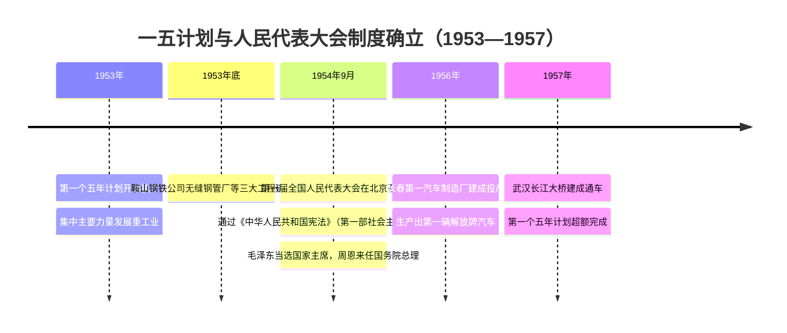

# 第4课 新中国工业化的起步和人民代表大会制度的确立

## 时间线

**第一个五年计划时间轴：**

- 1953 年：第一个五年计划开始执行
- 1953 年底：鞍山钢铁公司无缝钢管厂等三大工程建成投产
- 1954 年 9 月：第一届全国人民代表大会在北京召开，通过《中华人民共和国宪法》
- 1956 年：中国第一个生产载重汽车的工厂——长春第一汽车制造厂建成投产
- 1957 年：武汉长江大桥建成；第一个五年计划超额完成

## 历史事件

### 第一个五年计划（1953—1957）

背景：新中国成立后经济获得根本好转，但我国还是一个落后的农业国，工业水平很低，基础薄弱，门类不全。

基本任务：集中主要力量发展重工业，建立国家工业化和国防现代化的初步基础；相应地发展交通运输业、轻工业、农业和商业；相应地培养建设人才。

主要成就：

**"一五"计划主要成就示意图：**

<svg xmlns="http://www.w3.org/2000/svg" viewBox="0 0 800 320" style="max-width:100%;height:auto">
  <rect width="800" height="320" fill="#EFEBE9" rx="10"/>
  <text x="400" y="30" text-anchor="middle" font-size="16" font-weight="bold" fill="#3E2723">"一五"计划主要成就（1953—1957）</text>
  <!-- 钢铁 -->
  <rect x="30" y="55" width="160" height="70" rx="8" fill="#795548"/>
  <text x="110" y="82" text-anchor="middle" font-size="13" fill="#FFF5E1" font-weight="bold">钢铁工业</text>
  <text x="110" y="100" text-anchor="middle" font-size="11" fill="#FFF5E1">鞍山钢铁公司</text>
  <text x="110" y="116" text-anchor="middle" font-size="11" fill="#FFF5E1">无缝钢管厂等三大工程</text>
  <!-- 汽车 -->
  <rect x="210" y="55" width="160" height="70" rx="8" fill="#6D4C41"/>
  <text x="290" y="82" text-anchor="middle" font-size="13" fill="#FFF5E1" font-weight="bold">汽车工业</text>
  <text x="290" y="100" text-anchor="middle" font-size="11" fill="#FFF5E1">长春第一汽车制造厂</text>
  <text x="290" y="116" text-anchor="middle" font-size="11" fill="#FFF5E1">第一辆解放牌汽车</text>
  <!-- 飞机 -->
  <rect x="390" y="55" width="160" height="70" rx="8" fill="#795548"/>
  <text x="470" y="82" text-anchor="middle" font-size="13" fill="#FFF5E1" font-weight="bold">航空工业</text>
  <text x="470" y="100" text-anchor="middle" font-size="11" fill="#FFF5E1">第一个飞机制造厂</text>
  <text x="470" y="116" text-anchor="middle" font-size="11" fill="#FFF5E1">试制成功喷气式飞机</text>
  <!-- 机床 -->
  <rect x="570" y="55" width="160" height="70" rx="8" fill="#6D4C41"/>
  <text x="650" y="82" text-anchor="middle" font-size="13" fill="#FFF5E1" font-weight="bold">机械工业</text>
  <text x="650" y="100" text-anchor="middle" font-size="11" fill="#FFF5E1">沈阳第一机床厂</text>
  <text x="650" y="116" text-anchor="middle" font-size="11" fill="#FFF5E1">建成投产</text>
  <!-- 桥梁 -->
  <rect x="120" y="155" width="200" height="70" rx="8" fill="#4E342E"/>
  <text x="220" y="182" text-anchor="middle" font-size="13" fill="#FFF5E1" font-weight="bold">交通·桥梁</text>
  <text x="220" y="200" text-anchor="middle" font-size="11" fill="#FFF5E1">武汉长江大桥建成</text>
  <text x="220" y="216" text-anchor="middle" font-size="11" fill="#FFF5E1">"一桥飞架南北"</text>
  <!-- 公路 -->
  <rect x="350" y="155" width="200" height="70" rx="8" fill="#4E342E"/>
  <text x="450" y="182" text-anchor="middle" font-size="13" fill="#FFF5E1" font-weight="bold">交通·公路</text>
  <text x="450" y="200" text-anchor="middle" font-size="11" fill="#FFF5E1">川藏、青藏、新藏</text>
  <text x="450" y="216" text-anchor="middle" font-size="11" fill="#FFF5E1">公路相继通车</text>
  <!-- 意义 -->
  <rect x="100" y="255" width="600" height="45" rx="8" fill="#D7CCC8"/>
  <text x="400" y="275" text-anchor="middle" font-size="13" fill="#3E2723" font-weight="bold">意义：开始改变工业落后面貌，向社会主义工业化迈进</text>
  <text x="400" y="293" text-anchor="middle" font-size="12" fill="#4E342E">重点建设东北工业基地，借鉴苏联经验，集中力量发展重工业</text>
</svg>

- 鞍山钢铁公司无缝钢管厂等三大工程建成投产
- 长春第一汽车制造厂生产出第一辆解放牌汽车
- 中国第一个飞机制造厂试制成功第一架喷气式飞机
- 沈阳第一机床厂建成投产
- 武汉长江大桥建成（“一桥飞架南北，天堑变通途”）
- 川藏、青藏、新藏公路相继通车

### 人民代表大会制度的确立

1954 年 9 月，第一届全国人民代表大会第一次会议在北京召开。大会制定了《中华人民共和国宪法》，这是我国第一部社会主义类型的宪法，也是我国有史以来真正反映人民利益的宪法。宪法规定中华人民共和国全国人民代表大会是最高国家权力机关。人民代表大会制度是我国的根本政治制度。

## 人物

- 毛泽东：当选中华人民共和国主席
- 周恩来：被任命为国务院总理

## 意义与影响

1. “一五”计划完成，我国开始改变工业落后的面貌，向社会主义工业化迈进
2. 1954 年宪法确立人民代表大会制度，为社会主义民主政治建设奠定了基础

## 概念对比

- 《共同纲领》 vs 1954 年宪法：前者是临时宪法（政协会议通过），后者是我国第一部社会主义类型的宪法（全国人大通过）
- 政治协商制度 vs 人民代表大会制度：前者是基本政治制度，后者是根本政治制度
- “一五”计划优先发展重工业 vs 苏联模式：借鉴苏联经验，重点建设东北工业基地

## 背记要点

1. “一五”计划时间：1953—1957 年；基本任务：集中主要力量发展重工业
2. 成就口诀：一桥（武汉长江大桥）、二铁（宝成、鹰厦铁路）、三路（川藏、青藏、新藏公路）、四厂（鞍钢、长春一汽、沈阳机床、飞机制造厂）
3. “一五”计划完成的意义：开始改变工业落后面貌，向社会主义工业化迈进
4. 1954 年第一届全国人大制定《中华人民共和国宪法》
5. 1954 年宪法是我国第一部社会主义类型的宪法
6. 人民代表大会制度是我国的根本政治制度

## 相关链接

“一五”计划建立在 [[第3课 土地改革]] 解放的生产力和 [[第2课 抗美援朝]] 赢得的和平环境基础上；工业化起步与 [[第5课 三大改造]] 同时进行，共同推动中国进入社会主义。

## 自测题

1. 第一个五年计划的起止时间和基本任务是什么？
2. 列举“一五”计划期间的三项重要成就。
3. “一五”计划完成有什么意义？
4. 我国第一部社会主义类型的宪法是何时、由哪次会议制定的？
5. 我国的根本政治制度是什么？
6. 为什么“一五”计划要集中力量发展重工业？
