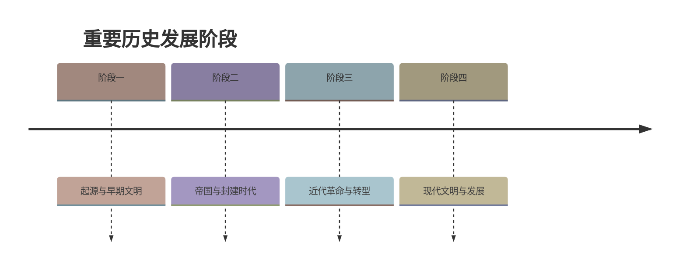

# 第5课 三大改造

## 时间线

- 1953 年：国家开始对农业、手工业和资本主义工商业进行社会主义改造
- 1955 年：全国掀起农业合作化高潮
- 1956 年初：资本主义工商业的社会主义改造出现全行业公私合营高潮
- 1956 年底：三大改造基本完成，社会主义基本制度在我国建立起来

## 历史事件

### 农业的社会主义改造

土地改革后，农民分到了土地，但一家一户分散经营，难以解决水利问题、抵御自然灾害，影响农业生产的发展，满足不了国家工业化建设的需要。国家对农业进行社会主义改造，把分散的个体农民组织起来，引导他们参加农业生产合作社，走集体化和共同富裕的社会主义道路。1955 年，全国掀起农业合作化的高潮；1956 年，全国绝大多数农户参加了农业生产合作社。

### 手工业的社会主义改造

农业合作化运动推动了手工业的社会主义改造。1956 年，90% 以上的个体手工业者参加了手工业生产合作社。

### 资本主义工商业的社会主义改造

从 1954 年起，国家对资本主义工商业进行社会主义改造，逐步发展为企业的公私合营。1956 年初出现全行业公私合营的高潮。在改造过程中，国家对资本家占有的生产资料实行赎买政策，即按全行业公私合营时资本家的资本发给定息。这种赎买政策实现了和平过渡，是中国社会主义改造的创举。

## 意义与影响

到 1956 年底，国家基本完成对农业、手工业和资本主义工商业的社会主义改造，实现了生产资料私有制向社会主义公有制的转变。社会主义基本制度在我国建立起来，我国从此进入社会主义初级阶段。这是中国历史上最深刻的社会变革。

局限：在社会主义改造工作后期，也存在要求过急、工作过粗、改变过快等缺点。

## 概念对比

- 三大改造 vs 土地改革：土改确立农民土地私有制；三大改造把私有制变为社会主义公有制（见 [[第3课 土地改革]]）
- 赎买政策 vs 没收：对资本家的生产资料采取赎买而非没收，实现和平过渡，是改造的创举
- 新中国成立（1949） vs 社会主义制度建立（1956）：1949 年进入新民主主义社会，1956 年三大改造完成才进入社会主义社会

## 背记要点

1. 三大改造的对象：农业、手工业、资本主义工商业
2. 农业、手工业改造的方式：建立生产合作社
3. 资本主义工商业改造的方式：公私合营；政策创举：赎买政策
4. 完成时间：1956 年底
5. 实质：生产资料私有制转变为社会主义公有制
6. 意义：社会主义基本制度建立，进入社会主义初级阶段
7. 缺点：要求过急、工作过粗、改变过快

## 相关链接

三大改造与 [[第4课 新中国工业化的起步和人民代表大会制度的确立]] 中的“一五”计划同步进行；改造完成后，中国开始了 [[第6课 艰辛探索与建设成就]] 中的社会主义建设探索。

## 自测题

1. 三大改造的对象和方式分别是什么？
2. 国家对资本主义工商业改造中的创举是什么？
3. 三大改造基本完成于哪一年？其实质是什么？
4. 三大改造完成有什么历史意义？
5. 三大改造后期存在哪些缺点？
6. 为什么说 1956 年我国进入社会主义初级阶段？

### 历史时间轴

