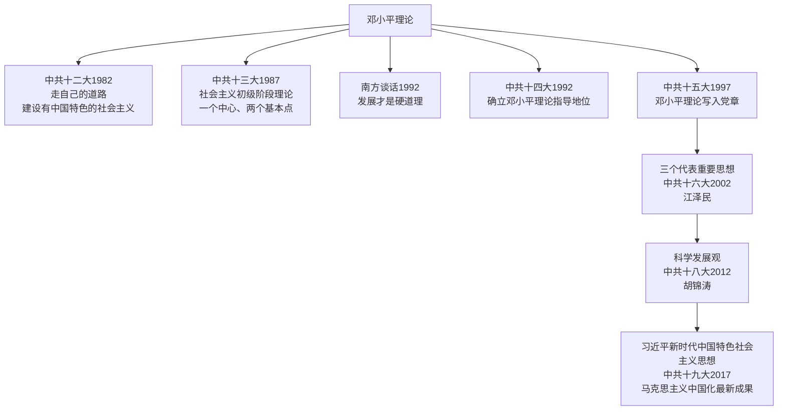

# 第10课 建设中国特色社会主义

## 时间线

**中国特色社会主义理论体系发展脉络图：**

- 1982 年：中共十二大，邓小平提出“走自己的道路，建设有中国特色的社会主义”
- 1987 年：中共十三大，系统阐述社会主义初级阶段理论，提出党在社会主义初级阶段的基本路线
- 1992 年：邓小平南方谈话；中共十四大确立邓小平建设有中国特色社会主义理论在全党的指导地位
- 1997 年：中共十五大，把邓小平理论确立为党的指导思想
- 2002 年：中共十六大，“三个代表”重要思想被确立为党的指导思想
- 2012 年：中共十八大，科学发展观被确立为党的指导思想
- 2017 年：中共十九大，习近平新时代中国特色社会主义思想被确立为党必须长期坚持的指导思想

## 历史事件

### 邓小平理论的形成

- 中共十二大（1982）：提出“走自己的道路，建设有中国特色的社会主义”
- 中共十三大（1987）：阐明社会主义初级阶段理论，提出“一个中心、两个基本点”的基本路线（以经济建设为中心，坚持四项基本原则，坚持改革开放）
- 南方谈话（1992）：强调发展才是硬道理，进一步解放了人们的思想，对建设中国特色社会主义产生深远影响
- 中共十四大（1992）：确立邓小平建设有中国特色社会主义理论在全党的指导地位
- 中共十五大（1997）：把邓小平理论写入党章，确立为党的指导思想

邓小平理论阐明了在中国建设社会主义、巩固和发展社会主义的基本问题，是马克思主义在中国发展的新阶段。邓小平是我国改革开放和社会主义现代化建设的总设计师。

### 中国特色社会主义理论体系的发展

- “三个代表”重要思想（江泽民）：中共十六大（2002）确立为党的指导思想
- 科学发展观（胡锦涛）：中共十八大（2012）确立为党的指导思想
- 习近平新时代中国特色社会主义思想：中共十九大（2017）确立为党必须长期坚持的指导思想，是马克思主义中国化的最新成果

## 人物

- 邓小平：改革开放和社会主义现代化建设的总设计师，邓小平理论的主要创立者

## 概念对比

- 毛泽东思想 vs 邓小平理论：前者解决中国革命道路问题，后者解决建设中国特色社会主义问题，都是马克思主义中国化的成果
- 基本路线“一个中心、两个基本点”：以经济建设为中心是兴国之要；四项基本原则是立国之本；改革开放是强国之路

## 背记要点

1. “建设有中国特色的社会主义”首次提出：中共十二大（1982）
2. 社会主义初级阶段基本路线提出：中共十三大（1987）
3. 1992 年南方谈话的核心：发展才是硬道理，进一步解放思想
4. 邓小平理论确立为党的指导思想：中共十五大（1997）
5. 各次党代会与指导思想对应：十五大—邓小平理论；十六大—“三个代表”；十八大—科学发展观；十九大—习近平新时代中国特色社会主义思想
6. 邓小平的历史地位：改革开放和社会主义现代化建设的总设计师

## 相关链接

本课是 [[第7课 伟大的历史转折]]、[[第8课 经济体制改革]]、[[第9课 对外开放]] 实践经验的理论总结；中国特色社会主义进入新时代后的奋斗目标见 [[第11课 为实现中国梦而努力奋斗]]。

## 自测题

1. “建设有中国特色的社会主义”是在哪次会议上提出的？
2. 党在社会主义初级阶段的基本路线内容是什么？
3. 1992 年邓小平南方谈话有什么重要影响？
4. 邓小平理论是在哪次党代会上被确立为党的指导思想的？
5. 请按时间顺序说出十五大至十九大分别确立的指导思想。
6. 为什么称邓小平为改革开放的总设计师？
