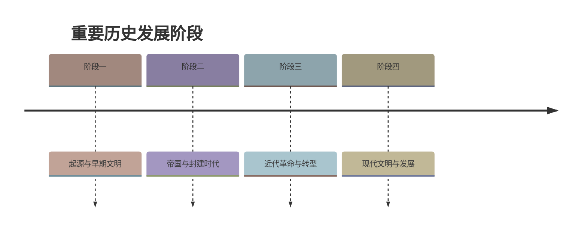

# 第12课 民族大团结

## 时间线

- 1947 年：内蒙古自治区成立，是我国建立的第一个省级少数民族自治区
- 1949 年：《共同纲领》将民族区域自治制度确定为一项基本政治制度
- 1954 年：民族区域自治制度被载入宪法
- 1984 年：《中华人民共和国民族区域自治法》颁布实施
- 20 世纪末：中央决定实施西部大开发战略
- 2006 年：青藏铁路全线通车

## 历史事件

### 民族区域自治制度

我国民族问题的历史特点：中国是统一的多民族国家，各民族在长期历史发展中形成相互依存、不可分离的关系，并且形成以汉族为主体的各民族大杂居、小聚居、交错杂居的分布格局。

民族区域自治制度的含义：在国家统一领导下，在少数民族聚居的地方实行区域自治，由当地民族管理本民族内部事务，行使自治权。

我国已建立内蒙古、新疆、广西、宁夏、西藏 5 个自治区和许多自治州、自治县。民族区域自治制度是我国的一项基本政治制度。

### 共同繁荣发展

- 新中国成立后，党和政府在少数民族地区进行民主改革和社会主义改造，各族人民迈进社会主义社会
- 国家采取优惠政策，加强少数民族地区经济建设，促进各民族共同繁荣发展
- 国家重视少数民族文化的保护与发展，尊重各民族的宗教信仰和风俗习惯
- 20 世纪末实施西部大开发战略，为民族地区加快发展创造巨大机遇；青藏铁路 2006 年全线通车，大大加强了祖国内地与边疆地区的联系

## 意义与影响

实行民族区域自治制度：

1. 体现了国家充分尊重和保障各少数民族管理本民族内部事务权利的精神
2. 对维护民族团结、巩固祖国统一和促进少数民族地区发展具有重大意义
3. 为实现各民族共同繁荣发展奠定了基础

## 概念对比

- 民族区域自治区 vs 经济特区 vs 特别行政区：自治区解决民族问题（自治权），经济特区实行特殊经济政策（见 [[第9课 对外开放]]），特别行政区实行资本主义制度（见 [[第13课 香港和澳门回归祖国]]）
- 根本政治制度 vs 基本政治制度：人民代表大会制度是根本政治制度；民族区域自治制度是基本政治制度

## 背记要点

1. 处理民族关系的基本政治制度：民族区域自治制度
2. 第一个省级自治区：内蒙古自治区（1947 年，成立于新中国成立前）
3. 五个自治区：内蒙古、新疆、广西、宁夏、西藏
4. 1984 年颁布《中华人民共和国民族区域自治法》
5. 促进民族地区发展的战略：西部大开发；标志工程：青藏铁路（2006 年通车）
6. 新型民族关系：民族平等、民族团结、各民族共同繁荣

## 相关链接

民族大团结与 [[第13课 香港和澳门回归祖国]]、[[第14课 海峡两岸的交往]] 同属第四单元“民族团结与祖国统一”；各民族共同繁荣是实现 [[第11课 为实现中国梦而努力奋斗]] 中民族复兴目标的重要保障。

## 自测题

1. 我国解决民族问题的基本政治制度是什么？
2. 我国最早成立的省级自治区是哪一个？成立于哪一年？
3. 我国共有哪五个省级自治区？
4. 实行民族区域自治制度有什么意义？
5. 国家为促进少数民族地区发展采取了哪些措施？
6. 青藏铁路通车有什么意义？

### 历史时间轴

