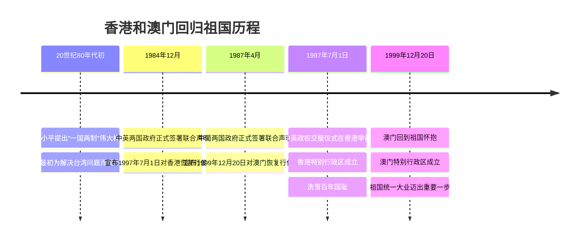

# 第13课 香港和澳门回归祖国

## 时间线

**港澳回归历程时间轴：**

- 20 世纪 80 年代初：邓小平提出“一国两制”的伟大构想
- 1984 年 12 月：中英两国政府正式签署联合声明
- 1987 年 4 月：中葡两国政府正式签署联合声明
- 1997 年 7 月 1 日：中国对香港恢复行使主权，香港特别行政区成立
- 1999 年 12 月 20 日：中国对澳门恢复行使主权，澳门特别行政区成立

## 历史事件

### “一国两制”的构想

进入改革开放新时期后，邓小平从维护祖国和中华民族根本利益出发，创造性地提出“一国两制”的伟大构想。

“一国两制”的含义：在祖国统一的前提下，国家的主体坚持社会主义制度，同时在台湾、香港、澳门保持原有的资本主义制度和生活方式长期不变。“一国两制”为实现祖国和平统一开辟了新途径，首先被成功运用于解决香港和澳门问题。

### 香港回归

1984 年 12 月，中英两国政府正式签署联合声明，宣布中华人民共和国政府将于 1997 年 7 月 1 日对香港恢复行使主权。1997 年 7 月 1 日，中英两国政府在香港举行政权交接仪式，香港特别行政区成立。

### 澳门回归

1987 年 4 月，中葡两国政府签署联合声明，宣布中华人民共和国政府将于 1999 年 12 月 20 日对澳门恢复行使主权。1999 年 12 月 20 日，澳门回到祖国怀抱，澳门特别行政区成立。

## 人物

- 邓小平：提出“一国两制”伟大构想，在中英谈判中坚持主权问题不容讨论

## 意义与影响

1. 香港、澳门回归祖国，标志着中国人民洗雪了百年国耻，在完成祖国统一大业的道路上迈出了重要一步
2. 证明“一国两制”构想是完全正确的、行得通的，为解决台湾问题提供了范例
3. 香港、澳门回归后保持繁荣稳定，融入国家发展大局（如粤港澳大湾区建设）

## 概念对比

- 特别行政区 vs 经济特区：特别行政区保持资本主义制度，享有高度自治权；经济特区实行社会主义制度，只是经济政策特殊（见 [[第9课 对外开放]]）
- 特别行政区 vs 民族自治区：前者是“一国两制”下的制度安排，后者是社会主义制度下的民族区域自治（见 [[第12课 民族大团结]]）
- 香港被割占（国耻） vs 香港回归（雪耻）：回归的根本原因是改革开放后中国综合国力增强、国际地位提高

## 背记要点

1. “一国两制”的提出者：邓小平；含义：一个国家，两种制度
2. “一国两制”最初是为解决台湾问题提出的，首先成功运用于港澳问题
3. 香港回归：1997 年 7 月 1 日（从英国手中收回）
4. 澳门回归：1999 年 12 月 20 日（从葡萄牙手中收回）
5. 港澳顺利回归的根本原因：中国综合国力的增强
6. 意义关键词：洗雪百年国耻、祖国统一大业迈出重要一步

## 相关链接

“一国两制”构想同样适用于 [[第14课 海峡两岸的交往]] 中的台湾问题；港澳回归与 [[第12课 民族大团结]] 同属祖国统一主题；回归的根本保障是 [[第8课 经济体制改革]] 和 [[第9课 对外开放]] 带来的国力增强。

## 自测题

1. “一国两制”是谁提出的？其基本含义是什么？
2. 香港、澳门分别于何时回归祖国？
3. 香港和澳门顺利回归的根本原因是什么？
4. 港澳回归有什么历史意义？
5. 特别行政区与经济特区有什么区别？
6. “一国两制”对解决台湾问题有什么借鉴意义？
