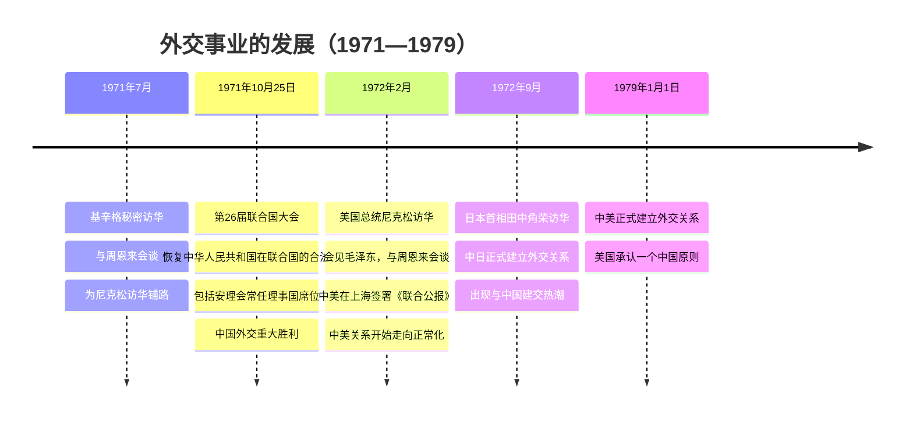

# 第17课 外交事业的发展

## 时间线

**20世纪70年代三大外交成就时间轴：**

- 1971 年 7 月：基辛格秘密访华，与周恩来会谈
- 1971 年 10 月 25 日：第 26 届联合国大会恢复中华人民共和国在联合国的合法席位
- 1972 年 2 月：美国总统尼克松访华，中美在上海签署《联合公报》
- 1972 年 9 月：日本首相田中角荣访华，中日正式建交
- 1979 年 1 月 1 日：中美正式建立外交关系
- 2001 年：中国承办亚太经合组织（APEC）会议；加入世界贸易组织
- 2014 年：北京再次举办 APEC 领导人非正式会议

## 历史事件

### 恢复在联合国的合法席位

1971 年 10 月 25 日，第 26 届联合国大会通过决议，恢复中华人民共和国在联合国的一切合法权利，包括安理会常任理事国席位。这是中国外交的重大胜利，中国在国际事务中发挥了越来越重要的作用。（毛泽东风趣地说，是非洲兄弟“把我们抬进了联合国”。）

### 中美建交

20 世纪 70 年代初，随着中国国际地位的提高和国际形势的变化，改善中美关系成为两国共同的要求。1971 年基辛格秘密访华；1972 年尼克松总统访华，会见毛泽东，与周恩来会谈，双方在上海签署《联合公报》，中美关系开始走向正常化。1979 年 1 月 1 日，中美正式建交，美国承认只有一个中国，台湾是中国的一部分。

### 中日建交与建交热潮

1972 年，日本首相田中角荣访华，中日两国正式建立外交关系。许多国家纷纷与中国建交，出现了与中国建交的热潮。

### 全方位外交

改革开放以后，中国继续奉行独立自主的和平外交政策，积极发展全球伙伴关系，推动构建人类命运共同体。中国举办首届“一带一路”国际合作高峰论坛、APEC 会议、二十国集团（G20）领导人杭州峰会、金砖国家领导人厦门会晤等重要国际会议。中国的国际地位不断提高，成为维护和促进世界和平、稳定与发展的坚定力量，形成全方位、多层次、立体化的外交布局。

## 人物

- 周恩来、毛泽东：推动中美关系正常化
- 尼克松、基辛格：美国方面推动中美关系解冻的关键人物

## 概念对比

- 1972 年尼克松访华（关系开始正常化） vs 1979 年中美建交（关系正常化实现）
- 恢复联合国席位是“恢复”而非“加入”：中国是联合国创始会员国和安理会常任理事国

## 背记要点

1. 1971 年 10 月 25 日，第 26 届联大恢复新中国在联合国的合法席位
2. 1972 年尼克松访华、签署《联合公报》，中美关系开始走向正常化
3. 1979 年中美正式建交；美国承认一个中国原则
4. 1972 年中日建交（日本首相田中角荣访华）
5. 20 世纪 70 年代中国外交三件大事：恢复联合国席位、中美关系正常化、中日建交
6. 新时代外交理念：构建人类命运共同体；布局：全方位、多层次、立体化

## 相关链接

70 年代外交突破建立在 [[第16课 独立自主的和平外交]] 奠定的原则基础上，也得益于 [[第18课 科技文化成就]] 中“两弹一星”和 [[第15课 钢铁长城]] 增强的综合国力；全方位外交服务于 [[第11课 为实现中国梦而努力奋斗]] 的民族复兴目标。

## 自测题

1. 中国恢复在联合国合法席位是在哪一年、哪届联大？
2. 尼克松访华和中美建交分别是哪一年？
3. 中美关系开始走向正常化的标志是什么？
4. 中日建交是在哪一年？
5. 20 世纪 70 年代中国取得了哪三项重大外交成就？
6. 改革开放后中国形成了怎样的外交布局？
