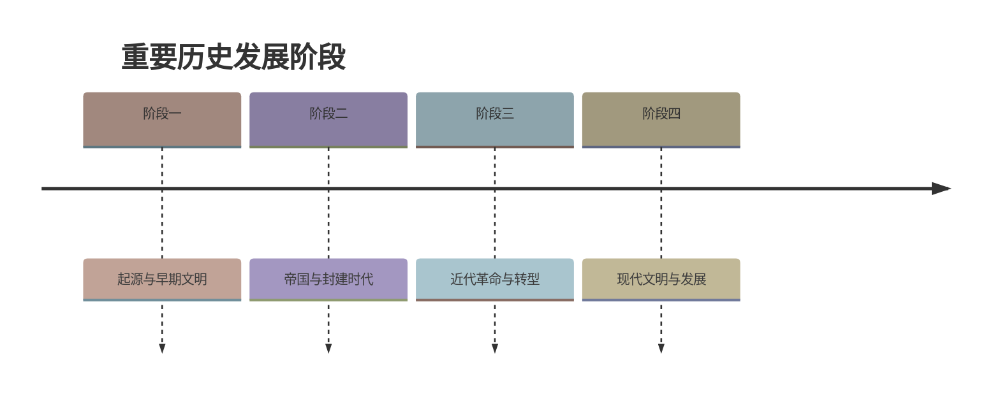

# 第19课 社会生活的变迁

## 时间线

- 新中国成立后：人民当家作主，生活发生根本变化，但物资匮乏
- 计划经济时期：凭票证限量供应粮食、食用油、布匹等（粮票、布票等）
- 1978 年改革开放后：人民生活水平不断提高，衣食住行发生翻天覆地的变化
- 20 世纪 90 年代以来：高速公路、移动通信快速发展
- 21 世纪：高铁网络、互联网普及，中国进入信息化时代

## 历史事件

### 日常生活的变化

衣：改革开放前，人们买衣服要凭布票，色彩和样式单调（“蓝灰海洋”）；改革开放后，衣着丰富多彩，服饰成为显示风度、展示个性的方式。

食：改革开放前，饮食结构单一，有些农村甚至没有解决温饱问题；改革开放后，不仅能“吃饱”，还要“吃好”，讲究营养均衡、粗细搭配，绿色食品等科学卫生的概念日益深入人心。

住：改革开放前，住房比较拥挤，室内设施简单；改革开放后，人均住房面积扩大，室内装修和居住环境明显改善。

生活方式：随着生活水平提高，休闲娱乐成为日常生活的一部分，旅游、健身等多样化生活方式流行。

### 交通、通信的不断发展

- 铁路：截至 2010 年底，中国的铁路营运里程已居世界第二位；高速铁路里程世界第一
- 公路：全国建立起比较密集的公路网，高速公路里程已居世界前列
- 民航：中国已成为世界民航大国
- 城市交通：地铁、轻轨发展迅速；私家车进入寻常百姓家
- 通信：我国的电信网络规模和用户数均居全球第一，互联网普及率越来越高

交通、通信的发展使人们的出行更加方便快捷，极大地促进了商品流通，也深刻改变了人们的思想观念和生活方式。

## 意义与影响

社会生活变迁的根本原因是改革开放以来社会经济的快速发展和综合国力的提升。人民生活从贫困走向温饱、再迈向全面小康，反映了社会主义制度的优越性和改革开放政策的正确性。

## 概念对比

- 票证时代 vs 市场供应：计划经济时期物资短缺凭票供应；改革开放后商品丰富，票证退出历史舞台
- “吃饱” vs “吃好”：温饱问题的解决与生活质量的提升，反映消费观念从生存型向发展型、享受型转变

## 背记要点

1. 改革开放（1978）是人民生活发生翻天覆地变化的分水岭
2. 计划经济时期的票证：粮票、布票等，反映物资匮乏
3. 衣食住行用各方面变化的具体表现要能举例
4. 我国高铁里程世界第一，电信网络规模和用户数全球第一
5. 社会生活变迁的根本原因：改革开放促进经济发展
6. 变迁趋势：从贫困到温饱再到小康

## 相关链接

社会生活的变迁是 [[第8课 经济体制改革]] 和 [[第9课 对外开放]] 成果的直接体现；科技进步的推动见 [[第18课 科技文化成就]]；生活环境的具体调查见 [[第20课 活动课：生活环境的巨大变化]]。

## 自测题

1. 改革开放前后人们的衣、食、住发生了哪些变化？
2. 计划经济时期为什么要凭票证购物？
3. 我国交通事业发展的主要成就有哪些？
4. 社会生活发生巨大变迁的根本原因是什么？
5. 通信事业的发展给人们的生活带来了哪些影响？
6. 从“吃饱”到“吃好”的变化说明了什么？

### 历史时间轴

