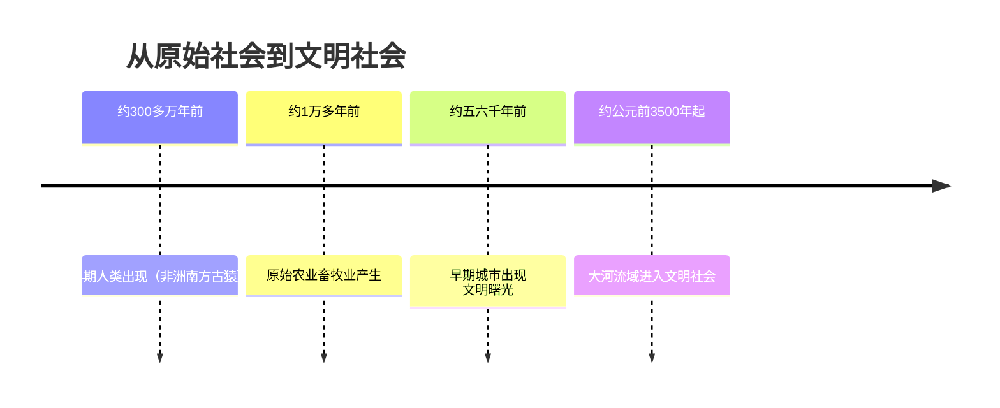
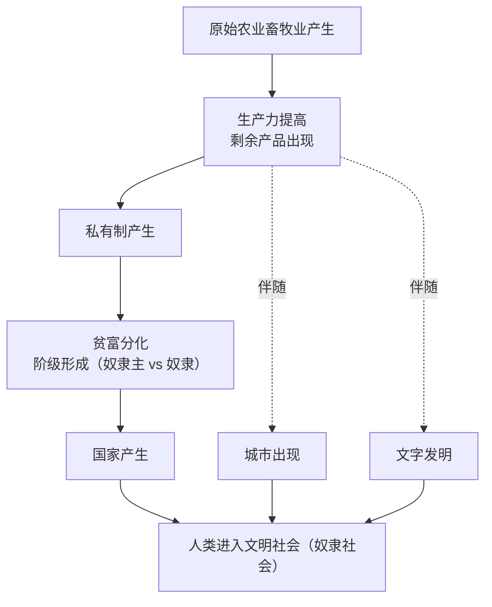

# 第1课 从原始社会到奴隶社会

## 时间线

- 约 300 多万年前：非洲的南方古猿等早期人类出现
- 约 1 万多年前：原始农业和畜牧业逐渐产生，人类进入新石器时代
- 约五六千年前：亚非大河流域出现早期城市与文明曙光
- 约公元前 3500 年起：两河流域、尼罗河流域先后进入文明社会，奴隶制国家形成

## 历史事件

人类由古猿进化而来。在漫长的原始社会中，人们最初以采集和渔猎为生，共同劳动、共同分配，没有私有财产和阶级差别。原始农业和畜牧业出现后，生产力提高，出现了剩余产品。随着生产的发展，一部分人占有更多财富，私有制逐渐产生，氏族内部出现贫富分化。

在私有制发展的基础上，社会分裂为奴隶主和奴隶两大对立阶级。为了维护奴隶主阶级的利益，管理公共事务，国家应运而生，人类进入奴隶社会。奴隶社会取代原始社会，是生产力发展的结果，是历史的进步。

## 因果关系图

## 人物与群体

- 南方古猿：目前已知最早的古人类之一，发现于非洲
- 氏族成员：原始社会的基本生产生活单位是氏族，先母系氏族后父系氏族
- 奴隶主与奴隶：奴隶社会的两大对立阶级，奴隶被视为会说话的工具

## 意义与影响

原始社会向奴隶社会的过渡，标志着人类从蒙昧走向文明。私有制、阶级和国家的出现，是进入文明社会的重要标志。此外，城市的兴起和文字的发明也是文明产生的重要表现。文明最早诞生在大河流域，如两河流域、尼罗河流域、印度河流域和黄河长江流域。

## 地图示意：亚非大河文明分布

<svg viewBox="0 0 640 300" xmlns="http://www.w3.org/2000/svg" style="max-width:640px;width:100%">
  <rect width="640" height="300" fill="#eaf4fb"/>
  <path d="M60,90 Q120,60 200,80 Q260,50 330,70 Q420,40 520,80 Q580,110 590,170 Q560,230 480,240 Q400,270 320,250 Q240,260 160,230 Q80,210 60,150 Z" fill="#f5efdc" stroke="#c8b98a" stroke-width="2"/>
  <path d="M150,120 q10,40 -5,80" stroke="#3b82c4" stroke-width="4" fill="none"/>
  <circle cx="148" cy="160" r="6" fill="#d97706"/>
  <text x="90" y="115" font-size="14" fill="#7c5c10">尼罗河流域</text>
  <text x="95" y="132" font-size="12" fill="#555">古埃及</text>
  <path d="M250,110 q15,35 5,70 M270,108 q12,38 0,72" stroke="#3b82c4" stroke-width="3" fill="none"/>
  <circle cx="262" cy="150" r="6" fill="#d97706"/>
  <text x="225" y="95" font-size="14" fill="#7c5c10">两河流域</text>
  <text x="222" y="200" font-size="12" fill="#555">古巴比伦</text>
  <path d="M370,120 q8,40 -2,75" stroke="#3b82c4" stroke-width="4" fill="none"/>
  <circle cx="368" cy="160" r="6" fill="#d97706"/>
  <text x="340" y="105" font-size="14" fill="#7c5c10">印度河流域</text>
  <text x="352" y="215" font-size="12" fill="#555">古印度</text>
  <path d="M470,110 q40,20 80,10 M470,150 q45,25 90,15" stroke="#3b82c4" stroke-width="4" fill="none"/>
  <circle cx="510" cy="130" r="6" fill="#d97706"/>
  <text x="470" y="95" font-size="14" fill="#7c5c10">黄河·长江流域</text>
  <text x="500" y="185" font-size="12" fill="#555">古代中国</text>
  <text x="20" y="285" font-size="12" fill="#888">示意图：四大文明古国均诞生于大河流域（水源充足、土壤肥沃、利于农耕）</text>
</svg>

## 概念对比

- 原始社会 vs 奴隶社会：前者无私有制、无阶级、无国家，共同劳动平均分配；后者出现私有制、阶级对立和国家机器
- 母系氏族 vs 父系氏族：前者妇女在生产生活中占主导地位，后者随农牧业发展男子地位上升
- 生产力 vs 生产关系：生产力发展（农业畜牧业出现、剩余产品增多）推动生产关系变革（私有制、阶级产生）

## 背记要点

1. 人类由古猿进化而来，最早的古人类化石多发现于非洲
2. 原始农业和畜牧业的产生是人类历史上第一次大的社会分工的基础
3. 私有制产生的根源是生产力的发展和剩余产品的出现
4. 阶级和国家的出现标志着人类进入文明社会（奴隶社会）
5. 文明产生的标志：私有制、阶级、国家的产生，城市的出现，文字的发明
6. 最早的文明诞生于亚非大河流域

## 相关链接

本课是世界古代史的开篇，与 [[第2课 古代两河流域]]、[[第3课 古代埃及]]、[[第4课 古代印度]] 共同构成第一单元"文明的产生和古代亚非文明"的内容。

## 自测题

1. 私有制是怎样产生的？
2. 国家产生的根本原因是什么？
3. 人类进入文明社会的标志有哪些？
4. 为什么说奴隶社会取代原始社会是历史的进步？
5. 世界上最早的文明大多产生在什么地理环境中？为什么？
