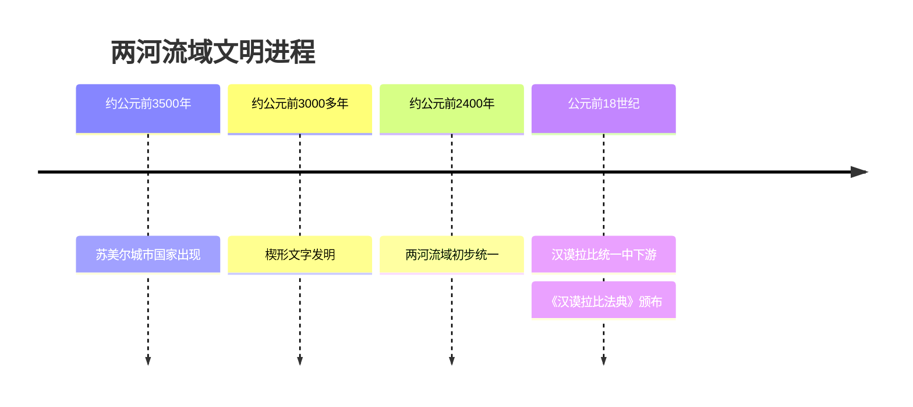

# 第2课 古代两河流域

## 时间线

- 约公元前 3500 年：两河流域南部（苏美尔地区）开始出现城市国家
- 约公元前 3000 多年：苏美尔人发明楔形文字
- 约公元前 2400 年：两河流域实现初步统一
- 公元前 18 世纪：古巴比伦国王汉谟拉比统一两河流域中下游
- 汉谟拉比在位期间：制定《汉谟拉比法典》

## 历史事件

"两河"指西亚的幼发拉底河与底格里斯河，两河流域又称"美索不达米亚"，意为"两河之间的地方"，大体位于今伊拉克境内。这里干旱少雨，但两河定期泛滥带来肥沃淤泥，苏美尔人修建灌溉工程，发展农业，建立起最早的一批城市国家。

公元前 18 世纪，古巴比伦国王汉谟拉比完成两河流域中下游的统一，实行君主专制制度，加强中央集权。他制定了一部较为系统完整的法典——《汉谟拉比法典》，刻在黑色石柱上，用楔形文字书写。

## 地图示意：两河流域

<svg viewBox="0 0 560 300" xmlns="http://www.w3.org/2000/svg" style="max-width:560px;width:100%">
  <rect width="560" height="300" fill="#eaf4fb"/>
  <path d="M40,60 Q180,30 340,60 Q480,40 530,100 Q540,180 480,240 Q360,275 220,255 Q90,245 45,170 Z" fill="#f5efdc" stroke="#c8b98a" stroke-width="2"/>
  <path d="M150,55 Q200,120 260,175 Q300,210 350,235" stroke="#3b82c4" stroke-width="5" fill="none"/>
  <text x="110" y="50" font-size="14" fill="#1d4e89">幼发拉底河</text>
  <path d="M250,50 Q290,115 330,165 Q355,200 370,228" stroke="#3b82c4" stroke-width="5" fill="none"/>
  <text x="255" y="42" font-size="14" fill="#1d4e89">底格里斯河</text>
  <path d="M350,235 L370,228 L390,250 L340,258 Z" fill="#7fb6d9" stroke="#3b82c4"/>
  <text x="395" y="258" font-size="12" fill="#1d4e89">波斯湾</text>
  <circle cx="300" cy="185" r="7" fill="#c0392b"/>
  <text x="312" y="182" font-size="14" fill="#c0392b">巴比伦城</text>
  <text x="215" y="140" font-size="15" fill="#7c5c10" font-weight="bold">美索不达米亚</text>
  <text x="222" y="158" font-size="12" fill="#8a7430">（两河之间的地方）</text>
  <text x="20" y="288" font-size="12" fill="#888">示意图：两河自西北流向东南注入波斯湾，大体位于今伊拉克境内</text>
</svg>

## 人物

- 汉谟拉比：古巴比伦王国第六代国王，统一两河流域中下游，制定《汉谟拉比法典》
- 苏美尔人：两河流域早期文明的创造者，发明楔形文字和阴历，创制 60 进位制

## 意义与影响

《汉谟拉比法典》是迄今已知世界上第一部较为完整的成文法典，是研究古巴比伦社会的第一手资料。法典宣扬"君权神授"，严格保护奴隶主阶级的利益，反映了古巴比伦是奴隶社会。法典中还有许多关于租赁、雇佣、交换、借贷等方面的规定，说明商品经济在古巴比伦比较活跃。

两河流域的文明成就还包括：楔形文字（世界上最早的文字之一）、阴历、60 进位制（至今用于计时）。

## 概念对比

- 《汉谟拉比法典》的实质 vs 表象：表面宣称"公平正义"，实质是维护奴隶主阶级利益的工具
- 楔形文字 vs 象形文字：前者是苏美尔人发明、刻写在泥板上；后者是古埃及人使用的文字
- 自由民内部分化：法典把自由民分为拥有公民权的自由民和无公民权的自由民，等级森严

## 背记要点

1. 两河流域指幼发拉底河和底格里斯河流域，被称为"美索不达米亚"
2. 苏美尔人发明了楔形文字，创制了阴历和 60 进位制
3. 公元前 18 世纪汉谟拉比统一两河流域中下游，实行君主专制
4. 《汉谟拉比法典》是迄今已知世界上第一部较为完整的成文法典
5. 法典实质：维护奴隶主阶级的利益，是奴隶主专政的工具
6. 法典的历史价值：研究古巴比伦社会的第一手史料

## 相关链接

本课与 [[第3课 古代埃及]]、[[第4课 古代印度]] 同属亚非大河文明，可与 [[第1课 从原始社会到奴隶社会]] 中文明产生的标志相互印证。

## 自测题

1. 两河流域文明的自然地理条件是什么？
2. 《汉谟拉比法典》的地位和实质分别是什么？
3. 苏美尔人有哪些文明成就？
4. 为什么说《汉谟拉比法典》是研究古巴比伦社会的第一手资料？
5. 比较楔形文字与古埃及象形文字的异同。
