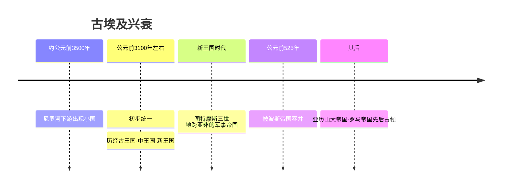

# 第3课 古代埃及

## 时间线

- 约公元前 3500 年：尼罗河下游陆续出现若干小国家
- 公元前 3100 年左右：古埃及初步实现统一，此后经历古王国、中王国、新王国时代
- 新王国时代（图特摩斯三世在位时）：古埃及成为强大的军事帝国，地跨亚非
- 公元前 525 年：波斯帝国吞并古埃及
- 后来：亚历山大帝国和罗马帝国先后占领古埃及，古埃及近 3000 年的文明没有延续下去

## 历史事件

古埃及位于非洲东北角，尼罗河纵贯全境。尼罗河每年定期泛滥，泛滥后留下肥沃的黑色淤泥，便于农业耕作，古埃及文明被认为是"尼罗河的赠礼"。

古埃及国王称"法老"，是全国最高统治者，集军、政、财、神等大权于一身，其意志就是法律，对全国土地、资源拥有绝对支配权。法老被认为是"神之子"，具有无上的权威。但到古王国时代后期，王权逐渐衰落，胡夫之后的法老修建的金字塔越来越小。

## 地图示意：尼罗河与古埃及

<svg viewBox="0 0 400 340" xmlns="http://www.w3.org/2000/svg" style="max-width:400px;width:100%">
  <rect width="400" height="340" fill="#eaf4fb"/>
  <path d="M60,40 Q200,20 340,45 Q370,150 345,300 Q200,325 65,300 Q35,160 60,40 Z" fill="#f2e2b8" stroke="#c8b98a" stroke-width="2"/>
  <path d="M200,300 Q195,240 205,180 Q210,130 200,90" stroke="#3b82c4" stroke-width="6" fill="none"/>
  <path d="M200,90 L160,55 M200,90 L200,50 M200,90 L245,58" stroke="#3b82c4" stroke-width="4" fill="none"/>
  <path d="M120,45 Q200,28 290,45 L290,52 Q200,38 120,52 Z" fill="#7fb6d9"/>
  <text x="150" y="24" font-size="13" fill="#1d4e89">地中海</text>
  <text x="215" y="75" font-size="12" fill="#1d4e89">尼罗河三角洲（下埃及）</text>
  <text x="215" y="200" font-size="13" fill="#1d4e89">尼罗河</text>
  <text x="110" y="255" font-size="12" fill="#7c5c10">上埃及</text>
  <polygon points="150,150 165,120 180,150" fill="#d9a441" stroke="#a67c2e"/>
  <polygon points="170,152 182,128 194,152" fill="#e3b45c" stroke="#a67c2e"/>
  <text x="95" y="172" font-size="12" fill="#8a5a10">吉萨金字塔群</text>
  <circle cx="205" cy="105" r="5" fill="#c0392b"/>
  <text x="255" y="108" font-size="12" fill="#c0392b">孟斐斯</text>
  <text x="20" y="330" font-size="12" fill="#888">示意图：尼罗河自南向北注入地中海，定期泛滥孕育古埃及文明</text>
</svg>

## 人物

- 法老：古埃及国王的称号，被视为"神之子"，实行君主专制统治
- 胡夫：古王国时代法老，修建了最大的金字塔（胡夫金字塔）
- 图特摩斯三世：新王国时代法老，多次发动对外扩张，使埃及成为地跨亚非的军事帝国

## 意义与影响

古埃及的文明成就极为辉煌：太阳历是古埃及天文学的突出成就之一，是今天公历的重要源头；象形文字是世界上最早的文字之一；医学方面制作木乃伊的过程促进了解剖学知识的积累。

金字塔是古埃及法老的陵墓，是古埃及文明的象征，反映了古埃及社会经济发展的较高水平，是古埃及人智慧的结晶；同时金字塔工程浩大，也体现了法老的无限权力和对民众的残酷奴役。

## 概念对比

- 金字塔的双重性：既是文明成就与智慧结晶，也是奴役人民的见证
- 法老 vs 汉谟拉比：都实行君主专制，法老更强调"神权"色彩（自称神之子）
- 太阳历 vs 阴历：古埃及创制太阳历（依据尼罗河泛滥和太阳运行），两河流域使用阴历（依据月亮盈亏）

## 背记要点

1. 古埃及文明是"尼罗河的赠礼"，尼罗河定期泛滥利于农业
2. 公元前 3100 年左右古埃及初步统一；公元前 525 年被波斯帝国吞并
3. 金字塔是法老的陵墓，是古埃及文明的象征；最大的是胡夫金字塔
4. 法老是古埃及最高统治者，集军、政、财、神权于一身
5. 古埃及文明成就：太阳历、象形文字、医学（木乃伊）
6. 图特摩斯三世时期埃及成为地跨亚非的军事帝国

## 相关链接

本课与 [[第2课 古代两河流域]]、[[第4课 古代印度]] 同属亚非大河文明；古埃及后被波斯、亚历山大帝国和罗马帝国占领，可联系 [[第6课 古代罗马]]。

## 自测题

1. 为什么说古埃及文明是"尼罗河的赠礼"？
2. 金字塔有哪些历史价值？如何评价它的双重性？
3. 法老的权力有哪些表现？
4. 古埃及有哪些主要文明成就？
5. 古埃及文明为什么没有延续下去？
