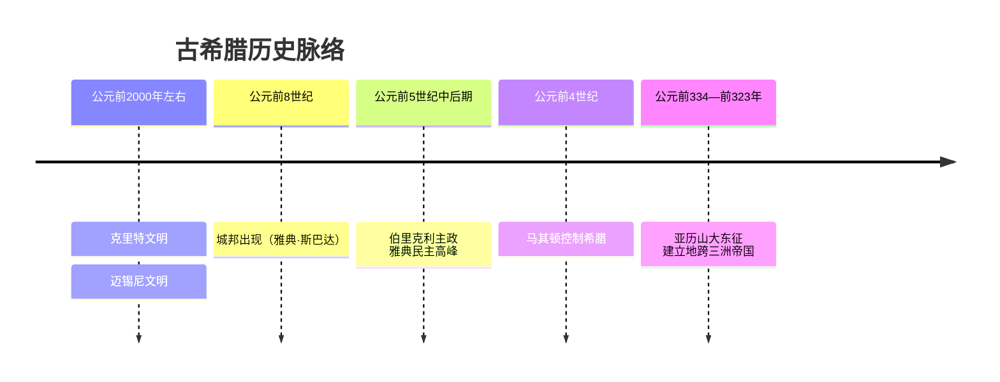

# 第5课 古代希腊

## 时间线

- 公元前 2000 年左右：爱琴海地区出现克里特文明，后有迈锡尼文明
- 公元前 8 世纪：希腊出现城邦，斯巴达和雅典是最重要的两个城邦
- 公元前 5 世纪中后期：伯里克利主政时期，雅典达到全盛，奴隶制民主政治发展到高峰
- 公元前 4 世纪：希腊北部的马其顿崛起，控制希腊
- 公元前 334 年：亚历山大率军东征波斯
- 公元前 323 年：亚历山大病逝，帝国随后分裂

## 历史事件

希腊地理范围包括希腊半岛和爱琴海诸岛，环海、多山、多岛屿，平原面积狭小，不适于农耕，但适合发展海外贸易，这种地理环境孕育了小国寡民的城邦。城邦的居民分为公民和非公民，只有成年男性公民才有参与政治的权利。

伯里克利主政时期，扩大公民权利，公职人员几乎都从全体公民中抽签产生；代表各地的 10 个主席团轮流主持城邦日常事务；公民大会是最高权力机构，具有立法、司法等多种职能；为保证贫穷公民参政议政，还建立了津贴制度。但占人口多数的外邦人、奴隶和妇女没有任何政治权利。

公元前 4 世纪，马其顿国王亚历山大东征，历经 10 年征战，灭亡波斯帝国，建立起地跨欧、亚、非三洲的亚历山大帝国，定都巴比伦。

## 地图示意：亚历山大东征路线

<svg viewBox="0 0 640 300" xmlns="http://www.w3.org/2000/svg" style="max-width:640px;width:100%">
  <rect width="640" height="300" fill="#eaf4fb"/>
  <path d="M30,70 Q150,40 300,60 Q460,35 600,70 Q620,150 590,230 Q450,270 300,250 Q140,265 40,225 Q15,150 30,70 Z" fill="#f5efdc" stroke="#c8b98a" stroke-width="2"/>
  <ellipse cx="180" cy="160" rx="90" ry="45" fill="#7fb6d9" opacity="0.75"/>
  <text x="140" y="165" font-size="13" fill="#1d4e89">地中海</text>
  <circle cx="90" cy="95" r="7" fill="#2e7d32"/>
  <text x="45" y="82" font-size="14" fill="#2e7d32" font-weight="bold">马其顿·希腊</text>
  <path d="M97,100 Q170,90 240,110" stroke="#c0392b" stroke-width="3" fill="none" marker-end="url(#arr)"/>
  <path d="M240,110 Q260,160 220,205" stroke="#c0392b" stroke-width="3" fill="none" marker-end="url(#arr)"/>
  <text x="185" y="228" font-size="12" fill="#7c5c10">埃及</text>
  <path d="M225,205 Q310,220 370,170" stroke="#c0392b" stroke-width="3" fill="none" marker-end="url(#arr)"/>
  <circle cx="382" cy="163" r="6" fill="#c0392b"/>
  <text x="360" y="150" font-size="12" fill="#c0392b">巴比伦（定都）</text>
  <path d="M388,165 Q470,150 540,130" stroke="#c0392b" stroke-width="3" fill="none" marker-end="url(#arr)"/>
  <text x="455" y="128" font-size="12" fill="#7c5c10">波斯</text>
  <path d="M545,132 Q580,150 595,185" stroke="#c0392b" stroke-width="3" fill="none" marker-end="url(#arr)"/>
  <text x="545" y="210" font-size="12" fill="#7c5c10">印度河流域</text>
  <defs><marker id="arr" markerWidth="8" markerHeight="8" refX="6" refY="3" orient="auto"><path d="M0,0 L6,3 L0,6 Z" fill="#c0392b"/></marker></defs>
  <text x="20" y="290" font-size="12" fill="#888">示意图：公元前334年自马其顿出发，经埃及、两河流域、波斯，抵达印度河流域</text>
</svg>

## 人物

- 伯里克利：雅典主政者，使雅典奴隶制民主政治达到高峰
- 亚历山大：马其顿国王，东征建立地跨三洲的大帝国，推动希腊文化向东方传播

## 意义与影响

雅典民主政治为后世提供了宝贵的民主实践经验（如公民大会、抽签、津贴制），但其实质是建立在奴隶制基础上的少数成年男性公民的民主。

亚历山大东征具有侵略性质，给东方人民带来巨大灾难，掠夺了东方世界的无数财富；但客观上也促进了东西方文化的大交汇，加强了东西方之间的经济联系和贸易往来。

## 概念对比

- 城邦特点：小国寡民、独立自治；公民与非公民界限分明
- 雅典民主的进步性 vs 局限性：进步在于公民广泛参政；局限在于妇女、外邦人、奴隶被排除在外
- 雅典（民主政治、工商业）vs 斯巴达（军事强国、崇尚武力）

## 背记要点

1. 希腊文明的源头是爱琴文明（克里特文明和迈锡尼文明）
2. 希腊城邦的突出特点是"小国寡民"
3. 伯里克利主政时期雅典民主政治达到高峰；公民大会是最高权力机构
4. 雅典民主的实质：奴隶制基础上少数成年男性公民的民主
5. 亚历山大帝国地跨欧、亚、非三洲
6. 亚历山大东征客观上促进了东西方文化的大交汇

## 相关链接

本课与 [[第6课 古代罗马]] 同属海洋文明（古代欧洲文明），与亚非大河文明（[[第3课 古代埃及]]、[[第2课 古代两河流域]]）形成对比；希腊文化的复兴可联系 [[第13课 西欧经济社会发展与文艺复兴运动]]。

## 自测题

1. 希腊城邦有什么突出特点？与其地理环境有何关系？
2. 伯里克利时期雅典民主政治有哪些具体表现？
3. 如何评价雅典的民主政治？
4. 亚历山大东征的路线和结果如何？
5. 如何辩证评价亚历山大东征的影响？
