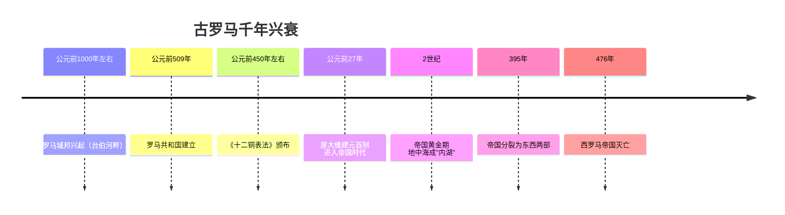
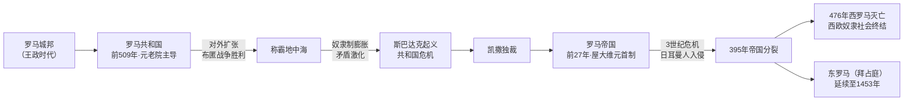

# 第6课 古代罗马

## 时间线

- 公元前 1000 年左右：罗马城邦在意大利半岛中部的台伯河畔兴起
- 公元前 509 年：罗马建立共和国，国家统治的决策权掌握在元老院手里
- 公元前 450 年左右：罗马颁布《十二铜表法》
- 公元前 264—前 146 年：罗马同迦太基进行三次布匿战争，最终获胜
- 公元前 73 年：斯巴达克领导奴隶起义
- 公元前 49 年：凯撒率军控制罗马，后被任命为终身独裁官
- 公元前 31 年：屋大维成为最后的胜利者
- 公元前 27 年：屋大维首创"元首制"，罗马共和国演变为罗马帝国
- 2 世纪：罗马帝国进入黄金时期，地跨欧、亚、非三洲，地中海成为其"内湖"
- 375 年：日耳曼人入侵罗马帝国
- 395 年：罗马帝国分裂为东西两部分
- 476 年：西罗马帝国灭亡，标志西欧奴隶社会终结

## 历史事件

罗马共和国时期，元老院掌握决策权，两名权力相等的执政官主持日常政务，公民大会是形式上的最高权力机关。平民与贵族的斗争推动了《十二铜表法》的颁布，这是罗马法制建设的第一步，是后世罗马法典乃至欧洲法学的渊源。

罗马通过布匿战争等对外扩张控制了地中海地区，但奴隶制迅速发展导致矛盾激化，斯巴达克起义沉重打击了奴隶主的统治。共和国最终被帝制取代：屋大维采取"元首制"这一政治形式，掌握最高统治实权。

## 政体演变与因果

## 地图示意：2 世纪罗马帝国疆域

<svg viewBox="0 0 640 300" xmlns="http://www.w3.org/2000/svg" style="max-width:640px;width:100%">
  <rect width="640" height="300" fill="#eaf4fb"/>
  <path d="M60,50 Q200,25 340,45 Q500,30 590,75 Q615,150 585,225 Q460,270 320,255 Q160,270 60,230 Q30,145 60,50 Z" fill="#e8c9a0" stroke="#b98a54" stroke-width="2"/>
  <ellipse cx="320" cy="155" rx="150" ry="55" fill="#7fb6d9"/>
  <text x="265" y="160" font-size="15" fill="#1d4e89" font-weight="bold">地 中 海（内湖）</text>
  <circle cx="255" cy="105" r="7" fill="#c0392b"/>
  <text x="228" y="92" font-size="14" fill="#c0392b" font-weight="bold">罗马</text>
  <text x="120" y="70" font-size="13" fill="#7c4a10">高卢·西班牙（欧洲）</text>
  <text x="470" y="100" font-size="13" fill="#7c4a10">小亚细亚·叙利亚（亚洲）</text>
  <text x="270" y="245" font-size="13" fill="#7c4a10">埃及·北非（非洲）</text>
  <text x="20" y="290" font-size="12" fill="#888">示意图：2世纪帝国地跨欧亚非三洲，环地中海一圈皆为罗马领土</text>
</svg>

## 人物

- 凯撒：控制罗马政权，被任命为终身独裁官，后遭刺杀
- 屋大维：首创元首制，罗马进入帝国时代
- 斯巴达克：奴隶起义领袖

## 意义与影响

《十二铜表法》使量刑定罪有了文字依据，一定程度上遏制了贵族对法律的曲解和滥用，是罗马法乃至欧洲法学的渊源。罗马帝国的扩张促进了地中海地区经济文化的交流与发展。西罗马帝国的灭亡标志着西欧奴隶社会的历史随之终结，西欧进入封建社会（中世纪）。

## 概念对比

- 罗马共和国 vs 罗马帝国：前者决策权在元老院（贵族共和），后者实权集中于元首（君主专制实质）
- 雅典民主 vs 罗马共和：雅典公民直接参政；罗马由元老院贵族主导
- 西罗马帝国灭亡（476 年）：欧洲奴隶社会结束的标志，也常作为"中世纪"开始的标志

## 背记要点

1. 公元前 509 年罗马共和国建立，决策权掌握在元老院手中
2. 《十二铜表法》是罗马法制建设的第一步，是欧洲法学的渊源
3. 公元前 27 年屋大维建立元首制，罗马进入帝国时代
4. 2 世纪罗马帝国地跨欧亚非三洲，地中海成为它的"内湖"
5. 395 年罗马帝国分裂；476 年西罗马帝国灭亡（西欧奴隶社会终结）
6. 斯巴达克起义是古罗马最大的奴隶起义

## 相关链接

本课与 [[第5课 古代希腊]] 同属古代欧洲文明；西罗马帝国灭亡后西欧进入封建时代，衔接 [[第7课 法兰克王国和西欧封建制度]]；东罗马帝国的延续见 [[第9课 拜占庭帝国]]。

## 自测题

1. 罗马共和国的权力机构是如何设置的？
2. 《十二铜表法》的内容特点和历史地位是什么？
3. 罗马是如何从共和国演变为帝国的？
4. 西罗马帝国灭亡的时间及标志意义是什么？
5. 比较雅典民主政治与罗马共和制度的异同。
