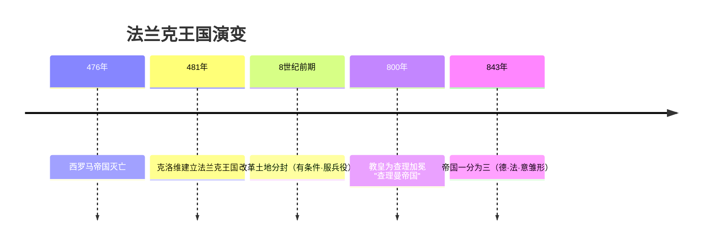

# 第7课 法兰克王国和西欧封建制度

## 时间线

- 476 年：西罗马帝国灭亡，日耳曼人在其废墟上建立许多王国
- 481 年：克洛维建立法兰克王国，是日耳曼人王国中最强大的
- 8 世纪前期：法兰克王国进行改革，实行有条件的土地分封
- 800 年：教皇为查理举行加冕礼，称查理为"罗马人的皇帝"，法兰克王国史称"查理曼帝国"
- 814 年：查理曼去世
- 843 年：查理曼的三个孙子缔结条约，将帝国一分为三，形成以后德意志、法兰西和意大利三个国家的雏形

## 历史事件

克洛维为巩固统治，皈依基督教，承认罗马教会在欧洲的重要地位，保留了原来罗马大地主的土地，把原属罗马国有的土地和无主土地赐给教会和部下，取得了罗马教会、信基督教的高卢罗马人的广泛支持。

8 世纪前期，法兰克王国改变以往无偿赏赐土地的做法，实行有条件的土地分封：得到封地的人必须为封主服兵役。这种以土地的封赐为纽带而形成的封建制度在西欧逐渐推广。封君与封臣的关系有着严格的等级性，权利义务交织：封臣对封君要忠诚，封君对封臣有保护的义务；但这种关系仅限于直接建立契约的双方，即"我的附庸的附庸，不是我的附庸"。

查理继位后四处征伐，800 年前后王国版图扩展到今西欧大部，实行鼓励基督教发展的政策，把王国划分为很多教区，命令每个教区的人贡献"什一税"。

## 结构示意：西欧封君封臣等级

<svg viewBox="0 0 520 320" xmlns="http://www.w3.org/2000/svg" style="max-width:520px;width:100%">
  <rect width="520" height="320" fill="#fdfaf3"/>
  <rect x="200" y="15" width="120" height="42" rx="6" fill="#8e44ad"/>
  <text x="238" y="42" font-size="15" fill="#fff" font-weight="bold">国王</text>
  <rect x="80" y="95" width="120" height="40" rx="6" fill="#2e6da4"/>
  <rect x="320" y="95" width="120" height="40" rx="6" fill="#2e6da4"/>
  <text x="105" y="120" font-size="14" fill="#fff">大封建主（公·侯）</text>
  <text x="345" y="120" font-size="14" fill="#fff">大封建主（伯爵）</text>
  <rect x="30" y="175" width="110" height="38" rx="6" fill="#3f8f5f"/>
  <rect x="160" y="175" width="110" height="38" rx="6" fill="#3f8f5f"/>
  <rect x="330" y="175" width="110" height="38" rx="6" fill="#3f8f5f"/>
  <text x="60" y="199" font-size="13" fill="#fff">小封建主</text>
  <text x="190" y="199" font-size="13" fill="#fff">小封建主</text>
  <text x="360" y="199" font-size="13" fill="#fff">骑士</text>
  <rect x="150" y="255" width="220" height="38" rx="6" fill="#a0793d"/>
  <text x="200" y="279" font-size="13" fill="#fff">农奴·自由农民（不在契约内）</text>
  <line x1="240" y1="57" x2="140" y2="95" stroke="#666" stroke-width="2"/>
  <line x1="280" y1="57" x2="380" y2="95" stroke="#666" stroke-width="2"/>
  <line x1="120" y1="135" x2="85" y2="175" stroke="#666" stroke-width="2"/>
  <line x1="150" y1="135" x2="205" y2="175" stroke="#666" stroke-width="2"/>
  <line x1="385" y1="135" x2="385" y2="175" stroke="#666" stroke-width="2"/>
  <text x="15" y="80" font-size="12" fill="#c0392b">↓ 封君：授土地·给保护</text>
  <text x="330" y="160" font-size="12" fill="#2e6da4">↑ 封臣：效忠·服兵役</text>
  <text x="20" y="312" font-size="12" fill="#888">"我的附庸的附庸，不是我的附庸"——权利义务仅限直接缔约的双方</text>
</svg>

## 人物

- 克洛维：法兰克王国建立者，皈依基督教以巩固统治
- 查理（查理曼/查理大帝）：使法兰克王国成为地跨西欧大部的"查理曼帝国"，800 年由教皇加冕

## 意义与影响

西欧封建制度（封君封臣制）以土地封赐为纽带，构建起层层分封的等级体系，成为中世纪西欧社会的基本政治制度。基督教会在此过程中势力大增，成为西欧最有权势的力量之一。843 年帝国一分为三，奠定了德意志、法兰西、意大利三国的雏形。

## 概念对比

- 封君封臣制 vs 西周分封制：都以土地为纽带层层分封；西欧强调双向契约义务、"附庸的附庸不是我的附庸"，西周以血缘宗法为基础、天子是天下共主
- 无偿赏赐 vs 有条件分封：8 世纪改革后受封者须服兵役，权利义务对等
- 教权与王权：克洛维、查理都借助教会巩固统治，教会也借此扩张势力（什一税）

## 背记要点

1. 481 年克洛维建立法兰克王国，皈依基督教巩固统治
2. 8 世纪前期改革：实行有条件的土地分封（服兵役）
3. 封君封臣关系特点：等级森严、权利义务交织、契约意识、"我的附庸的附庸不是我的附庸"
4. 800 年教皇为查理加冕，史称"查理曼帝国"
5. 什一税：教区人民向教会贡献收入的十分之一
6. 843 年帝国一分为三，成为德、法、意三国雏形

## 相关链接

本课上承 [[第6课 古代罗马]]（西罗马帝国灭亡），与 [[第8课 西欧的城市和大学]] 共同展现封建时代的欧洲；封建制度的瓦解见 [[第13课 西欧经济社会发展与文艺复兴运动]]。

## 自测题

1. 克洛维采取了哪些巩固统治的措施？
2. 8 世纪前期法兰克王国土地分封改革的内容是什么？
3. 西欧封君与封臣的关系有何特点？
4. "查理曼帝国"是怎样形成又怎样分裂的？
5. 比较西欧封君封臣制与中国西周分封制的异同。
