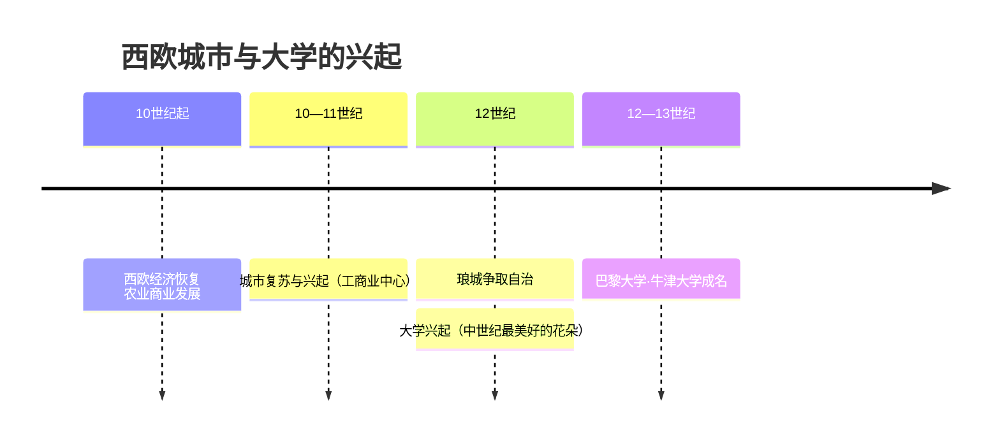
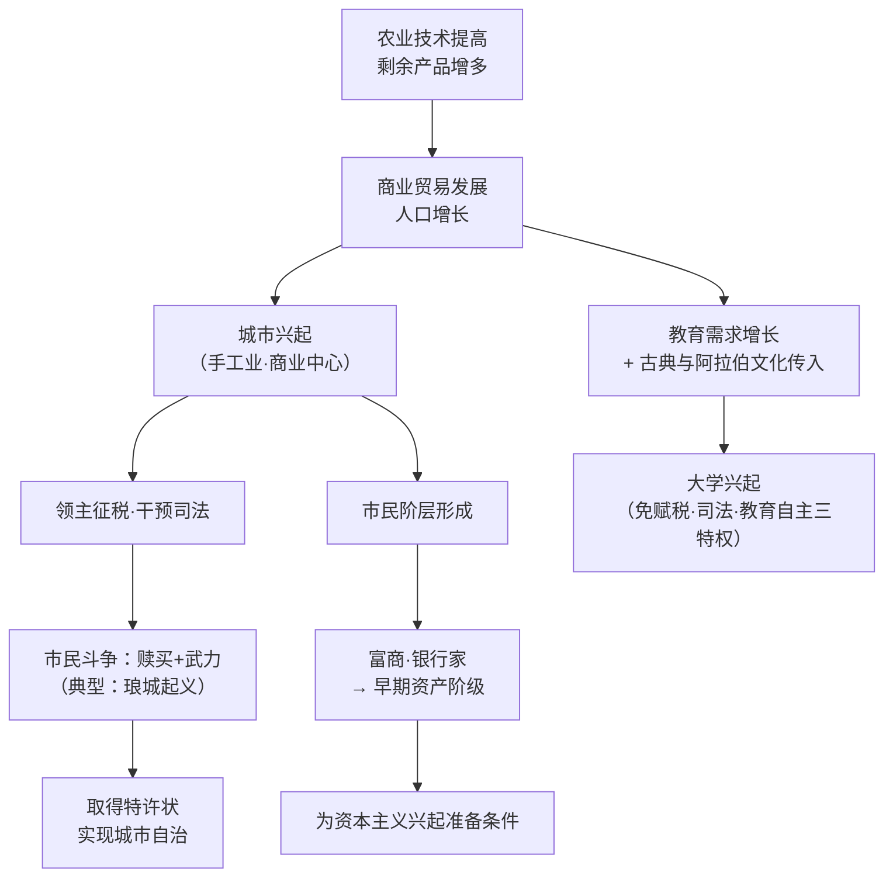

# 第8课 西欧的城市和大学

## 时间线

- 10 世纪起：西欧开始恢复起来，农业技术提高，商业贸易发展，人口增长
- 10—11 世纪：旧城市复苏，新城市兴起，以手工业和商业为中心
- 12 世纪：法国琅城市民争取自治权的斗争成为典型；大学兴起，被认为是欧洲中世纪教育"最美好的花朵"
- 12—13 世纪：巴黎大学、牛津大学等相继获得教皇或国王支持，成为知名学府

## 历史事件

西欧中世纪城市多兴起于交通便利、相对安全、能吸引人们聚集的地区，规模不大，以手工业和商业为中心。城市一般坐落在封建领主的领地上，领主像控制庄园一样对城市征税、干预司法。城市居民采取多种方式反抗，争取自治，常用手段包括金钱赎买和武力斗争。法国琅城市民为争取自治先赎买后起义，是典型代表。取得自治的形式是从国王或领主手里取得"特许状"。部分城市还取得选举市长、市政官员的权利，成为自治城市。

城市居民主体是手工工匠和商人。手工业者组成行会，规范生产经营。农奴逃入城市住满一年零一天即可获得自由身份，"城市的空气使人自由"。随着城市发展，市民阶层形成，其中的富裕商人和银行家发展为早期资产阶级，为资本主义的兴起准备了条件。

大学的兴起源于教育需求的增长：11 世纪后希腊、罗马古典著作和阿拉伯文化传入西欧，教师和学生组成行会性质的团体，逐渐发展为大学。大学享有免赋税特权、司法特权、教育自主权。大学课程包括基础课程（文法、修辞、逻辑、算术、几何、天文、音乐）和专业课程（法学、医学、神学），既受基督教会影响，也反映了经济和社会发展的要求。

## 因果关系图

## 人物与群体

- 琅城市民：以赎买和武装起义争取自治的典型
- 市民阶层：手工业者、商人；富裕商人和银行家发展为早期资产阶级

## 意义与影响

城市自治削弱了封建领主的势力，国王给城市颁发特许状也加强了王权。城市孕育的市民阶层是近代资产阶级的前身，为资本主义兴起准备了条件。大学的兴起推动了教育与学术的发展，被视为欧洲中世纪教育"最美好的花朵"。

## 概念对比

- 西欧城市 vs 中国古代城市：西欧城市以工商业为中心、争取自治；中国古代城市多为政治军事中心、受官府直接控制
- 自治城市的权利边界：可自选官员，但仍要向国王纳税、服从司法等（自治≠独立）
- 大学三项特权：免赋税特权、司法特权、教育自主权

## 背记要点

1. 西欧城市于 10—11 世纪重新兴起，以手工业和商业为中心
2. 争取自治的常用手段：金钱赎买、武力斗争（典型：法国琅城）
3. 取得自治的形式：从国王或领主处取得"特许状"
4. "城市的空气使人自由"：农奴入城住满一年零一天获自由
5. 市民阶层中的富商、银行家发展为早期资产阶级
6. 大学被认为是欧洲中世纪教育"最美好的花朵"，享有三项特权

## 相关链接

本课上承 [[第7课 法兰克王国和西欧封建制度]]；城市工商业发展和早期资产阶级的形成，直接为 [[第13课 西欧经济社会发展与文艺复兴运动]] 铺垫。

## 自测题

1. 西欧中世纪城市是在什么背景下兴起的？
2. 城市争取自治的方式和取得自治的形式是什么？
3. 如何理解"城市的空气使人自由"？
4. 市民阶层的形成有什么历史意义？
5. 中世纪大学享有哪些特权？课程设置反映了什么？
