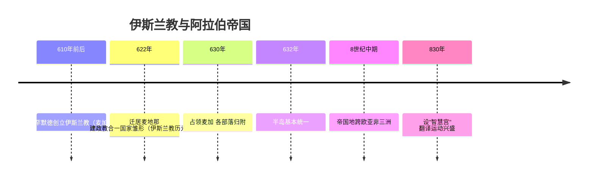

# 第11课 阿拉伯帝国

## 时间线

- 6 世纪末 7 世纪初：阿拉伯半岛氏族部落盛行多神崇拜，相互仇杀，社会矛盾丛生
- 610 年前后：穆罕默德阐述独尊安拉的宗教思想，创立伊斯兰教，最初在麦加传教
- 622 年：穆罕默德迁居麦地那，建立穆斯林公社，政教合一的阿拉伯国家雏形诞生（伊斯兰教历元年）
- 630 年：穆罕默德率穆斯林占领麦加，此后半岛各部落纷纷归附
- 632 年：穆罕默德去世时，阿拉伯半岛已基本统一
- 8 世纪中期：阿拉伯帝国横跨欧、亚、非三洲，是当时世界上疆域最大的帝国
- 830 年：哈里发设立"智慧宫"，集科学院、图书馆、翻译馆于一体

## 历史事件

穆罕默德创立伊斯兰教，宣扬"独尊安拉"，反对多神崇拜，顺应了阿拉伯半岛统一的需要。622 年他迁居麦地那，建立起政教合一的国家雏形；到他去世时，半岛已基本统一。

此后阿拉伯人大规模向外扩张：北进叙利亚，东灭波斯，进而征服中亚和印度西北部；751 年在中亚打败唐朝军队，控制中亚大部分地区；向西攻占埃及和北非，一直到达西班牙。8 世纪中期，阿拉伯帝国形成，地跨欧、亚、非三洲。

哈里发重视知识，支持翻译运动，将希腊、波斯、印度的典籍译为阿拉伯语（"翻译运动"），设立"智慧宫"。阿拉伯学者改造印度数字形成"阿拉伯数字"并传入欧洲；完整代数学由阿拉伯人创造；《医学集成》《医典》长期是欧洲医学标准教科书；《天方夜谭》（《一千零一夜》）是阿拉伯文学的瑰宝。

## 地图示意：8 世纪中期阿拉伯帝国疆域与扩张

<svg viewBox="0 0 640 300" xmlns="http://www.w3.org/2000/svg" style="max-width:640px;width:100%">
  <rect width="640" height="300" fill="#eaf4fb"/>
  <path d="M40,80 Q180,45 340,65 Q500,40 605,85 Q625,160 590,235 Q440,275 300,255 Q150,270 50,225 Q20,150 40,80 Z" fill="#d9ead3" stroke="#8fb573" stroke-width="2"/>
  <circle cx="360" cy="200" r="7" fill="#2e7d32"/>
  <text x="330" y="225" font-size="13" fill="#2e7d32" font-weight="bold">麦加·麦地那</text>
  <path d="M360,193 Q350,150 330,120" stroke="#c0392b" stroke-width="3" fill="none" marker-end="url(#arr2)"/>
  <text x="300" y="108" font-size="12" fill="#7c4a10">叙利亚</text>
  <path d="M368,195 Q440,160 505,130" stroke="#c0392b" stroke-width="3" fill="none" marker-end="url(#arr2)"/>
  <text x="470" y="118" font-size="12" fill="#7c4a10">波斯·中亚（751年败唐军）</text>
  <path d="M352,200 Q260,205 190,190" stroke="#c0392b" stroke-width="3" fill="none" marker-end="url(#arr2)"/>
  <text x="170" y="215" font-size="12" fill="#7c4a10">埃及·北非</text>
  <path d="M185,188 Q110,160 75,115" stroke="#c0392b" stroke-width="3" fill="none" marker-end="url(#arr2)"/>
  <text x="38" y="102" font-size="12" fill="#7c4a10">西班牙</text>
  <circle cx="395" cy="140" r="6" fill="#8e44ad"/>
  <text x="405" y="140" font-size="12" fill="#8e44ad">巴格达（智慧宫）</text>
  <defs><marker id="arr2" markerWidth="8" markerHeight="8" refX="6" refY="3" orient="auto"><path d="M0,0 L6,3 L0,6 Z" fill="#c0392b"/></marker></defs>
  <text x="20" y="290" font-size="12" fill="#888">示意图：自阿拉伯半岛三路扩张，8世纪中期成为地跨欧亚非的大帝国</text>
</svg>

## 人物

- 穆罕默德：伊斯兰教创始人，实现阿拉伯半岛基本统一
- 哈里发：穆罕默德的继承者称号，阿拉伯帝国政教合一的最高统治者

## 意义与影响

伊斯兰教为阿拉伯半岛的统一提供了精神力量，是世界三大宗教之一。阿拉伯人担当了沟通东西方文化的角色：中国的造纸术、指南针、火药等经阿拉伯人传入欧洲，印度的棉花、食糖等也由他们传入西方，为世界文化的发展作出了卓越贡献。

## 概念对比

- 三大宗教创立顺序：佛教（前 6 世纪）→ 基督教（1 世纪）→ 伊斯兰教（7 世纪）
- 政教合一：穆罕默德及哈里发既是宗教领袖又是国家元首
- 三大地跨欧亚非帝国（本册）：亚历山大帝国、罗马帝国、阿拉伯帝国（另有拜占庭、奥斯曼）
- 阿拉伯文化的特点：兼收并蓄、承前启后、东西方文化交流的桥梁

## 背记要点

1. 7 世纪初穆罕默德在麦加创立伊斯兰教
2. 622 年迁居麦地那建立政教合一国家（伊斯兰教历元年）
3. 8 世纪中期阿拉伯帝国成为地跨欧、亚、非三洲的大帝国
4. "智慧宫"体现哈里发对知识文化的重视
5. 阿拉伯数字：印度人发明、阿拉伯人改造传播
6. 阿拉伯人是东西方文化交流的桥梁（传播造纸术、指南针、火药等）

## 相关链接

阿拉伯数字源头见 [[第4课 古代印度]]；阿拉伯帝国与 [[第9课 拜占庭帝国]] 长期对峙；本课与 [[第10课 封建时代的日本]]、[[第12课 中古时期的非洲和美洲]] 同属第四单元。

## 自测题

1. 伊斯兰教创立的背景和作用是什么？
2. 为什么把 622 年定为伊斯兰教历元年？
3. 阿拉伯帝国的疆域何时达到最大？范围如何？
4. 阿拉伯文化有哪些主要成就？
5. 为什么说阿拉伯人是东西方文化交流的桥梁？
