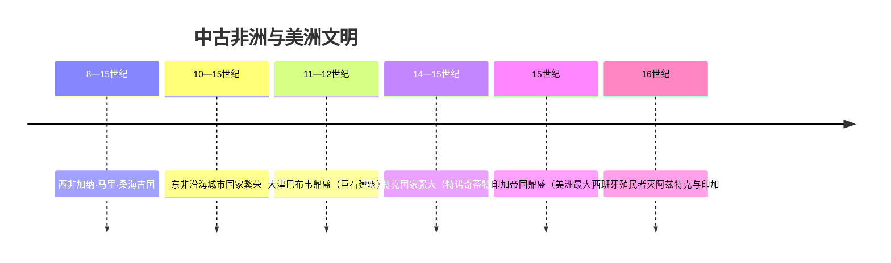

# 第12课 中古时期的非洲和美洲

## 时间线

- 8—15 世纪：西非先后兴起加纳、马里和桑海等古国
- 10—15 世纪：东非沿海地区出现一系列城市国家（摩加迪沙、蒙巴萨、基尔瓦等）
- 11—12 世纪：东南非洲的大津巴布韦进入鼎盛时期，留下巨石建筑群
- 14 世纪：马里国王曼萨·穆萨朝觐麦加，沿途挥金如土，显示西非的富庶
- 14—15 世纪：中美洲的阿兹特克人建立强大国家，都城特诺奇蒂特兰
- 15 世纪：南美洲的印加帝国进入鼎盛，成为美洲面积最大的帝国
- 16 世纪：西班牙殖民者先后灭亡阿兹特克国家和印加帝国

## 历史事件

中古时期的非洲文明各具特色。西非的加纳、马里、桑海诸国控制着穿越撒哈拉沙漠的黄金—食盐贸易，以廷巴克图为代表的城市成为西非重要的文化中心。东非沿海城市国家依托印度洋贸易繁荣发展，广泛使用来自中国的瓷器等商品，斯瓦希里文化融合了非洲本土与阿拉伯文化。东南非洲的大津巴布韦以宏大的石头建筑群闻名，"津巴布韦"意即"石头建筑"。

美洲的印第安人独立发展出灿烂文明。玛雅人创造了美洲最发达的文字，发明了独特的历法，数学上知道"零"的概念。阿兹特克人在特斯科科湖中建造"浮动园地"（人工岛田），扩大耕地面积，都城特诺奇蒂特兰建于湖心岛上。印加帝国建立了完善的道路系统（驿道）和统治体系，修建山地梯田，马丘比丘遗址是其建筑杰作。美洲印第安人还培育了玉米、马铃薯、番茄、花生、南瓜等重要农作物，对世界农业贡献巨大。

## 地图示意：中古非洲与美洲文明分布

<svg viewBox="0 0 640 320" xmlns="http://www.w3.org/2000/svg" style="max-width:640px;width:100%">
  <rect width="640" height="320" fill="#eaf4fb"/>
  <path d="M100,60 Q140,40 175,70 Q190,120 165,180 Q150,250 120,285 Q90,250 80,180 Q75,110 100,60 Z" fill="#f2e2b8" stroke="#c8b98a" stroke-width="2"/>
  <text x="105" y="35" font-size="14" fill="#7c5c10" font-weight="bold">美洲</text>
  <circle cx="118" cy="110" r="6" fill="#c0392b"/>
  <text x="130" y="105" font-size="12" fill="#c0392b">玛雅（中美洲）</text>
  <circle cx="112" cy="140" r="6" fill="#d97706"/>
  <text x="126" y="140" font-size="12" fill="#b45309">阿兹特克·特诺奇蒂特兰</text>
  <circle cx="118" cy="215" r="6" fill="#2e7d32"/>
  <text x="132" y="215" font-size="12" fill="#2e7d32">印加·马丘比丘（安第斯山）</text>
  <path d="M400,55 Q470,35 520,70 Q545,130 525,200 Q500,270 450,295 Q405,265 390,195 Q380,115 400,55 Z" fill="#e8d5b5" stroke="#c8b98a" stroke-width="2"/>
  <text x="440" y="32" font-size="14" fill="#7c5c10" font-weight="bold">非洲</text>
  <circle cx="415" cy="120" r="6" fill="#c0392b"/>
  <text x="300" y="118" font-size="12" fill="#c0392b">西非：加纳·马里·桑海</text>
  <circle cx="520" cy="160" r="6" fill="#d97706"/>
  <text x="533" y="160" font-size="12" fill="#b45309">东非沿海城邦</text>
  <circle cx="480" cy="245" r="6" fill="#2e7d32"/>
  <text x="493" y="248" font-size="12" fill="#2e7d32">大津巴布韦</text>
  <path d="M415,113 Q440,80 470,72" stroke="#8a6d1a" stroke-width="2" stroke-dasharray="5,4" fill="none"/>
  <text x="418" y="70" font-size="11" fill="#8a6d1a">跨撒哈拉黄金—食盐贸易</text>
  <text x="20" y="310" font-size="12" fill="#888">示意图：非洲三大区域文明与美洲三大印第安文明的大致位置</text>
</svg>

## 人物与群体

- 曼萨·穆萨：马里国王，朝觐麦加展示西非财富
- 玛雅人、阿兹特克人、印加人：美洲三大印第安文明的创造者

## 意义与影响

中古时期非洲和美洲的历史表明，世界各地的人民都创造了独具特色的文明，人类文明是多元的、多中心的。美洲文明在与其他大陆基本隔绝的条件下独立发展，尤其证明了人类文明发展道路的多样性。玉米、马铃薯等美洲作物后来传遍世界，深刻影响了全球人口与经济。

## 概念对比

- 非洲三区域文明：西非（黄金贸易古国）、东非（沿海商业城邦）、东南非（大津巴布韦石构建筑）
- 美洲三大文明：玛雅（文字历法数学）、阿兹特克（浮动园地）、印加（驿道与帝国治理）
- 独立发展 vs 交流融合：美洲文明基本独立发展；东非文明则融合本土与阿拉伯文化

## 背记要点

1. 西非古国：加纳、马里、桑海，以黄金贸易著称
2. 东非沿海城市国家因印度洋贸易而繁荣
3. 大津巴布韦以巨石建筑群闻名
4. 玛雅人创造了美洲最发达的文字和历法
5. 阿兹特克人发明"浮动园地"；印加帝国修建完善驿道
6. 印第安人培育了玉米、马铃薯、番茄等作物，贡献巨大

## 相关链接

本课与 [[第10课 封建时代的日本]]、[[第11课 阿拉伯帝国]] 同属中古亚非美文明；美洲文明的毁灭与 [[第14课 探寻新航路]]、[[第15课 早期殖民掠夺]] 直接相关。

## 自测题

1. 中古西非有哪些著名古国？它们靠什么繁荣？
2. 东非沿海城市国家的文化有什么特点？
3. 美洲三大印第安文明各自的代表性成就是什么？
4. 印第安人对世界农业有哪些贡献？
5. 非洲和美洲文明的历史说明了什么道理？
