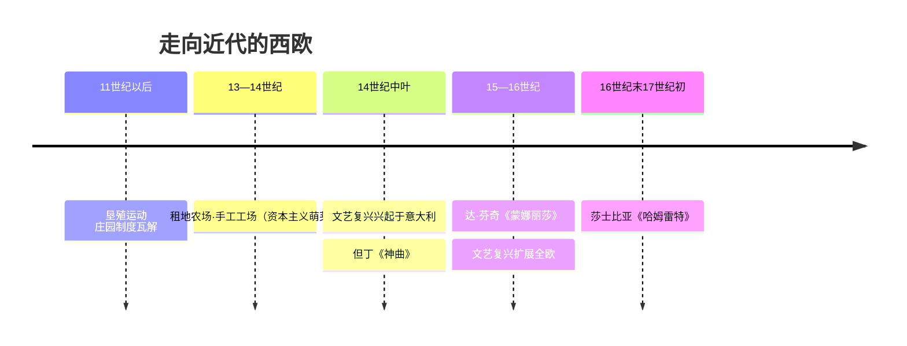
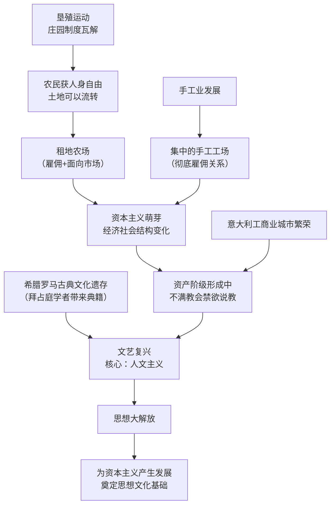

# 第13课 西欧经济社会发展与文艺复兴运动

## 时间线

- 11 世纪以后：欧洲农村发生变化，垦殖运动兴起，土地关系变化
- 13—14 世纪：农村出现租地农场，手工业领域出现手工工场，资本主义萌芽产生
- 14 世纪中叶：文艺复兴运动兴起于意大利
- 14 世纪：但丁完成长诗《神曲》
- 15—16 世纪：达·芬奇创作《蒙娜丽莎》《最后的晚餐》
- 15 世纪后：文艺复兴扩展到欧洲其他地区
- 16 世纪末 17 世纪初：莎士比亚创作《哈姆雷特》《罗密欧与朱丽叶》等

## 历史事件

11 世纪以后，西欧农村掀起垦殖运动，新开垦地区仿效自治城市成为具有独立司法权和行政自治权的地区。庄园制度逐渐瓦解，农民通过货币购买劳役豁免权或缴纳迁徙税获得人身自由。一些富裕农民通过承租、购买领主土地等方式将土地集中，建立租地农场，雇用少地无地的农民耕种，产品面向市场。手工业方面，分散的手工工场逐渐转向集中的手工工场，工人与雇主形成彻底的雇佣关系。土地关系的变化和手工业的发展，使欧洲经济和社会结构发生重大变化：富裕农民和市民阶层（城市中的手工业者、商人）成为新的经济力量，政治权利也不断扩大。

经济的发展使形成中的资产阶级不满教会宣扬的禁欲苦行，要求建立以人为中心的生活哲学。14 世纪中叶，文艺复兴在意大利兴起，其核心思潮是人文主义。新兴资产阶级借助复兴希腊罗马古典文化的形式，宣传新思想，实际上是一场反对教会"神权至上"和提倡人文主义的新文化运动。

## 因果关系图

## 人物

- 但丁：文艺复兴的先驱，与彼特拉克、薄伽丘并称"文学三杰"，代表作《神曲》，被誉为旧时代最后一位诗人、新时代最初一位诗人
- 达·芬奇：与拉斐尔、米开朗琪罗并称"美术三杰"，代表作《蒙娜丽莎》《最后的晚餐》
- 莎士比亚：英国文学巨匠，代表作《哈姆雷特》《罗密欧与朱丽叶》

## 意义与影响

租地农场和手工工场中出现的雇佣关系，是资本主义生产关系的萌芽，为西欧走向近代奠定了经济基础。文艺复兴促进了人们思想的大解放，推动欧洲文化思想领域的繁荣，为欧洲资本主义社会的产生和发展奠定了思想文化基础。

## 概念对比

- 庄园 vs 租地农场：前者自给自足、农奴劳役；后者雇佣劳动、产品面向市场
- "复兴" 的实质：不是简单复古，而是借古典文化外衣宣传资产阶级新思想（继承 + 创新）
- 人文主义 vs 神学禁欲主义：以人为中心 vs 以神为中心；追求现世幸福 vs 禁欲苦行

## 背记要点

1. 11 世纪后西欧农村的垦殖运动推动庄园制度瓦解
2. 租地农场和集中的手工工场体现了资本主义萌芽（雇佣关系）
3. 文艺复兴 14 世纪中叶兴起于意大利，核心思潮是人文主义
4. 文艺复兴的实质：资产阶级性质的新文化运动（思想解放运动）
5. 但丁《神曲》、达·芬奇《蒙娜丽莎》、莎士比亚《哈姆雷特》
6. 意义：为欧洲资本主义的产生和发展奠定思想文化基础

## 相关链接

本课上承 [[第8课 西欧的城市和大学]]（市民阶层形成）；古典文化的保存见 [[第9课 拜占庭帝国]]；与 [[第14课 探寻新航路]]、[[第15课 早期殖民掠夺]] 共同构成"走向近代"单元。

## 自测题

1. 租地农场和手工工场"新"在哪里？
2. 文艺复兴为什么首先兴起于意大利？
3. 人文主义的基本内涵是什么？
4. 如何理解文艺复兴的实质？
5. 列举文艺复兴的三位代表人物及其代表作。
