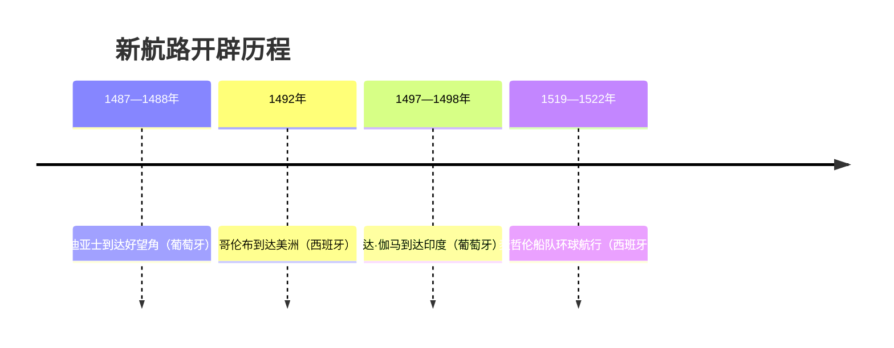

# 第14课 探寻新航路

## 时间线

- 1487 年：迪亚士率船队沿非洲西海岸南下，次年到达非洲最南端（好望角）
- 1492 年：哥伦布横渡大西洋，到达巴哈马群岛、古巴、海地等地，误认为到了印度
- 1497—1498 年：达·伽马绕过好望角，横渡印度洋到达印度西海岸
- 1519—1522 年：麦哲伦船队完成人类历史上第一次环球航行（麦哲伦本人死于菲律宾）

## 历史事件

新航路开辟的原因：随着西欧商品经济日趋发达，欧洲人渴求开拓新的贸易市场；《马可·波罗行纪》激起欧洲人对东方的向往（寻金热）；奥斯曼帝国控制东西方贸易的传统商路，商品到达欧洲后价格猛涨，欧洲人渴望另辟一条通往东方的新航路。

新航路开辟的条件：地圆说逐渐流行，欧洲人相信向西航行也能到达东方；欧洲的造船技术取得重大突破；指南针（经阿拉伯人从中国传入）应用于航海；葡萄牙和西班牙王室的支持。

四位航海家的路线：迪亚士到达好望角（葡萄牙支持，向东路线）；达·伽马到达印度（葡萄牙支持，向东路线）；哥伦布到达美洲（西班牙支持，向西路线）；麦哲伦船队环球航行（西班牙支持，依次经大西洋—太平洋—印度洋—回到欧洲），用实践证明了地圆说。

## 地图示意：四条新航路

<svg viewBox="0 0 660 340" xmlns="http://www.w3.org/2000/svg" style="max-width:660px;width:100%">
  <rect width="660" height="340" fill="#cfe6f5"/>
  <path d="M70,50 Q110,35 150,55 Q165,95 140,130 Q120,180 130,230 Q120,275 95,295 Q70,255 65,190 Q55,110 70,50 Z" fill="#f2e2b8" stroke="#c8b98a"/>
  <text x="80" y="150" font-size="13" fill="#7c5c10">美洲</text>
  <path d="M290,40 Q340,25 385,45 Q400,80 380,110 Q420,105 450,130 Q460,180 440,230 Q415,280 385,295 Q355,260 345,200 Q320,150 300,110 Q285,70 290,40 Z" fill="#e8d5b5" stroke="#c8b98a"/>
  <text x="300" y="70" font-size="13" fill="#7c5c10">欧洲</text>
  <text x="380" y="200" font-size="13" fill="#7c5c10">非洲</text>
  <path d="M470,60 Q560,35 640,60 L640,180 Q580,200 530,170 Q490,130 470,60 Z" fill="#e8d5b5" stroke="#c8b98a"/>
  <text x="560" y="90" font-size="13" fill="#7c5c10">亚洲</text>
  <circle cx="315" cy="95" r="6" fill="#1d4e89"/>
  <text x="255" y="90" font-size="12" fill="#1d4e89">葡·西</text>
  <path d="M310,100 Q340,180 390,240 Q410,275 400,290" stroke="#2e7d32" stroke-width="3" fill="none" marker-end="url(#a3)"/>
  <text x="330" y="255" font-size="11" fill="#2e7d32">①迪亚士1488→好望角</text>
  <path d="M400,292 Q470,300 520,240 Q545,205 555,180" stroke="#8e44ad" stroke-width="3" fill="none" marker-end="url(#a3)"/>
  <text x="480" y="290" font-size="11" fill="#8e44ad">②达·伽马1498→印度</text>
  <path d="M308,100 Q220,110 150,120" stroke="#c0392b" stroke-width="3" fill="none" marker-end="url(#a3)"/>
  <text x="165" y="105" font-size="11" fill="#c0392b">③哥伦布1492→美洲</text>
  <path d="M305,105 Q200,160 120,235 Q60,290 30,300 M30,300 L20,300" stroke="#d97706" stroke-width="3" fill="none"/>
  <path d="M640,310 Q520,320 420,300" stroke="#d97706" stroke-width="3" stroke-dasharray="6,4" fill="none" marker-end="url(#a3)"/>
  <text x="150" y="290" font-size="11" fill="#b45309">④麦哲伦船队1519—1522环球（西→太平洋→印度洋→归）</text>
  <defs><marker id="a3" markerWidth="8" markerHeight="8" refX="6" refY="3" orient="auto"><path d="M0,0 L6,3 L0,6 Z" fill="#555"/></marker></defs>
  <text x="20" y="330" font-size="12" fill="#666">示意图：葡萄牙支持向东（①②），西班牙支持向西（③④）</text>
</svg>

## 人物

- 迪亚士：1488 年到达非洲好望角
- 哥伦布：1492 年"发现"美洲新大陆（本人始终以为到达的是亚洲）
- 达·伽马：开辟绕非洲直达印度的航路
- 麦哲伦：其船队完成首次环球航行，证明地圆说

## 意义与影响

新航路开辟后，欧洲大西洋沿岸工商业经济繁荣起来，贸易中心从地中海转移到大西洋沿岸，促进了资本主义的产生和发展。同时，欧洲与亚洲、非洲、美洲之间建立起直接的商业联系，往来日益密切，世界开始连为一个整体，世界的观念也从此逐步确立起来。但对亚非拉人民而言，新航路的开辟也拉开了殖民掠夺的序幕。

## 概念对比

- 根本原因 vs 直接原因：根本是商品经济发展、追求财富市场；直接是奥斯曼帝国阻断传统商路
- 哥伦布"发现"新大陆的双重评价：促进联系交流 / 开启殖民灾难
- 郑和下西洋 vs 新航路开辟：目的（宣扬国威 vs 追求财富）、性质（和平交往 vs 殖民扩张前奏）、影响不同

## 背记要点

1. 新航路开辟的根本原因：西欧商品经济发展，渴求市场与黄金
2. 1492 年哥伦布到达美洲；1497—1498 年达·伽马到达印度
3. 麦哲伦船队 1519—1522 年完成首次环球航行，证明地圆说
4. 支持国：葡萄牙（迪亚士、达·伽马）；西班牙（哥伦布、麦哲伦）
5. 最重要影响：世界开始连为一个整体
6. 欧洲贸易中心由地中海沿岸转移到大西洋沿岸

## 相关链接

商路受阻与 [[第9课 拜占庭帝国]]（奥斯曼帝国崛起）相关；思想动力来自 [[第13课 西欧经济社会发展与文艺复兴运动]]；直接后果见 [[第15课 早期殖民掠夺]]；被毁灭的美洲文明见 [[第12课 中古时期的非洲和美洲]]。

## 自测题

1. 新航路开辟的原因和条件分别有哪些？
2. 说出四位航海家的航行路线和支持国。
3. 为什么说麦哲伦船队的航行证明了地圆说？
4. 新航路开辟最重要的世界性影响是什么？
5. 如何辩证评价哥伦布的远航？
