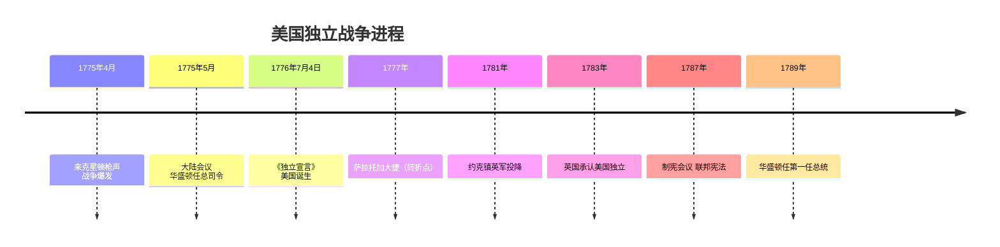

# 第17课 美国的独立

## 时间线

- 17 世纪—18 世纪早期：英国在北美东海岸建立 13 个殖民地
- 1775 年 4 月 19 日：来克星顿枪声，北美独立战争爆发
- 1775 年 5 月：第二届大陆会议召开，任命华盛顿为大陆军总司令
- 1776 年 7 月 4 日：大陆会议通过《独立宣言》，宣告美国诞生
- 1777 年：萨拉托加大捷，成为独立战争的转折点
- 1781 年：约克镇战役，英军主力投降
- 1783 年：英国被迫承认美国独立
- 1787 年：制宪会议制定美国宪法（1787 年宪法）
- 1789 年：华盛顿当选美国第一任总统

## 历史事件

英属北美 13 个殖民地经济发展较快，逐渐形成新的美利坚民族。英国竭力压制殖民地经济发展，把殖民地作为原料产地和商品市场，不断颁布法令加征税收（如印花税），激起殖民地人民强烈不满。"无代表不纳税"成为反抗口号。

1775 年来克星顿枪声打响独立战争第一枪。1776 年 7 月 4 日《独立宣言》发表，宣称人人生而平等，享有生命权、自由权和追求幸福的权利，同时宣布 13 个殖民地脱离英国独立。战争初期大陆军连遭挫败，1777 年萨拉托加大捷扭转战局，法国等国相继援美。1781 年约克镇英军投降，1783 年英国承认美国独立。

1787 年宪法依据分权制衡原则设计联邦制共和国：行政、立法、司法三权分立，总统、国会、最高法院分别行使，相互制约；联邦政府与州政府分享权力。但宪法允许奴隶制存在，打上了种族歧视的烙印。

## 结构示意：1787 年宪法三权分立

<svg viewBox="0 0 560 300" xmlns="http://www.w3.org/2000/svg" style="max-width:560px;width:100%">
  <rect width="560" height="300" fill="#fdfaf3"/>
  <rect x="200" y="20" width="160" height="55" rx="8" fill="#2e6da4"/>
  <text x="240" y="43" font-size="14" fill="#fff" font-weight="bold">立法权</text>
  <text x="228" y="63" font-size="13" fill="#dce9f5">国会（参·众两院）</text>
  <rect x="40" y="190" width="160" height="55" rx="8" fill="#3f8f5f"/>
  <text x="85" y="213" font-size="14" fill="#fff" font-weight="bold">行政权</text>
  <text x="88" y="233" font-size="13" fill="#e0f0e5">总统</text>
  <rect x="360" y="190" width="160" height="55" rx="8" fill="#b06a2b"/>
  <text x="400" y="213" font-size="14" fill="#fff" font-weight="bold">司法权</text>
  <text x="385" y="233" font-size="13" fill="#f5e8da">最高法院</text>
  <path d="M215,80 Q150,120 130,185" stroke="#666" stroke-width="2" fill="none" marker-end="url(#a5)"/>
  <path d="M150,190 Q200,130 240,82" stroke="#666" stroke-width="2" fill="none" marker-end="url(#a5)"/>
  <text x="80" y="130" font-size="11" fill="#555">国会可弹劾总统 /</text>
  <text x="80" y="145" font-size="11" fill="#555">总统可否决法案</text>
  <path d="M345,80 Q410,120 430,185" stroke="#666" stroke-width="2" fill="none" marker-end="url(#a5)"/>
  <path d="M410,190 Q365,130 325,82" stroke="#666" stroke-width="2" fill="none" marker-end="url(#a5)"/>
  <text x="390" y="130" font-size="11" fill="#555">法院可裁定法律违宪 /</text>
  <text x="390" y="145" font-size="11" fill="#555">国会批准大法官任命</text>
  <path d="M205,225 L355,225" stroke="#666" stroke-width="2" fill="none" marker-end="url(#a5)"/>
  <path d="M355,210 L205,210" stroke="#666" stroke-width="2" fill="none" marker-end="url(#a5)"/>
  <text x="218" y="270" font-size="11" fill="#555">总统提名大法官 / 法院可判行政违宪</text>
  <defs><marker id="a5" markerWidth="8" markerHeight="8" refX="6" refY="3" orient="auto"><path d="M0,0 L6,3 L0,6 Z" fill="#666"/></marker></defs>
  <text x="20" y="292" font-size="12" fill="#888">分权制衡：三大机构相互制约，防止任何一方权力独大</text>
</svg>

## 人物

- 华盛顿：大陆军总司令、美国第一任总统，主动交权不恋栈，开创总统连任不超过两届的先例
- 杰斐逊：《独立宣言》主要起草人

## 意义与影响

美国独立战争既是一场民族解放战争，又是一场资产阶级革命：它结束了英国的殖民统治，实现了国家独立，确立了比较民主的资产阶级政治体制，有利于美国资本主义的发展，也对法国大革命和拉丁美洲独立运动起到了推动作用。《独立宣言》被称为"第一个人权宣言"。

## 概念对比

- 双重性质：民族解放战争 + 资产阶级革命
- 《独立宣言》vs 1787 年宪法：前者宣告独立与天赋人权；后者确立联邦制、三权分立的政体
- 英国君主立宪制 vs 美国联邦共和制：国家元首（世袭国王 vs 民选总统）、政体形式不同，但都属资产阶级代议制

## 背记要点

1. 导火线之一：英国对殖民地的高压征税；口号"无代表不纳税"
2. 1775 年来克星顿枪声：独立战争开始
3. 1776 年 7 月 4 日《独立宣言》发表：美国诞生（7 月 4 日为美国国庆日）
4. 转折点：1777 年萨拉托加大捷
5. 1787 年宪法：世界上第一部资产阶级成文宪法，确立三权分立联邦共和制
6. 局限：允许奴隶制存在，种族歧视烙印

## 相关链接

殖民地的建立背景见 [[第15课 早期殖民掠夺]]；与 [[第16课 英国资产阶级革命]]、[[第18课 法国大革命和拿破仑帝国]] 同属资产阶级革命时代，美国革命直接影响了法国大革命。

## 自测题

1. 美国独立战争爆发的根本原因是什么？
2. 《独立宣言》的主要内容和历史地位是什么？
3. 1787 年宪法确立了怎样的政治体制？有何局限？
4. 华盛顿在美国历史上有哪些主要贡献？
5. 为什么说美国独立战争具有双重性质？
