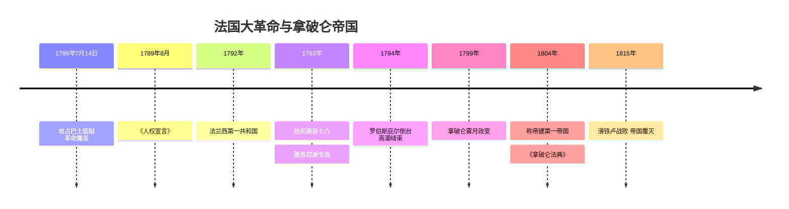
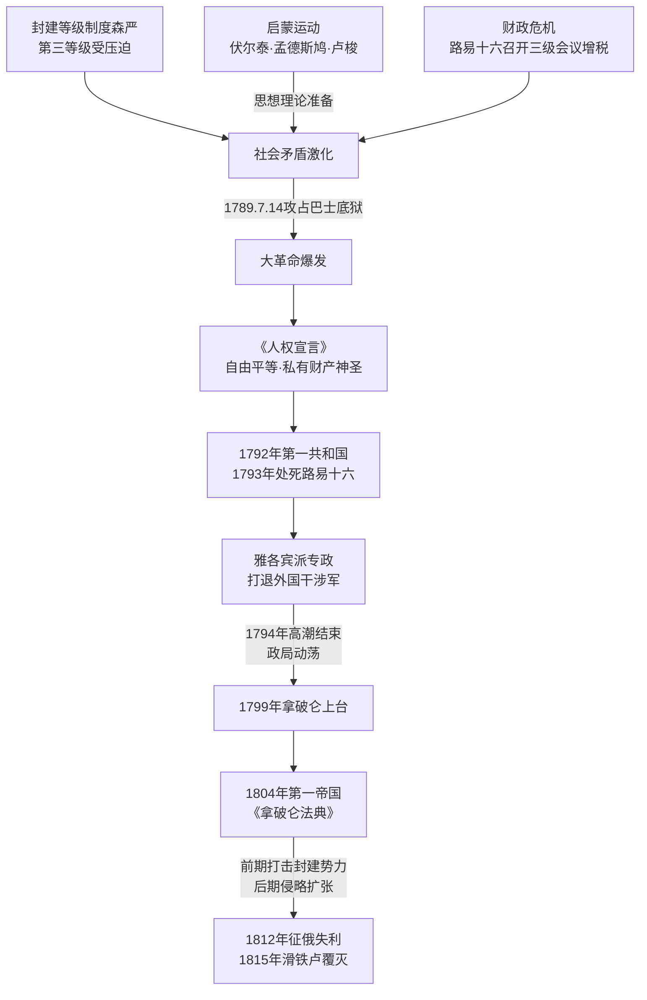

# 第18课 法国大革命和拿破仑帝国

## 时间线

- 18 世纪：法国启蒙运动兴起（伏尔泰、孟德斯鸠、卢梭等）
- 1789 年 5 月：路易十六召开三级会议企图增税
- 1789 年 7 月 14 日：巴黎民众攻占巴士底狱，法国大革命爆发
- 1789 年 8 月：制宪议会通过《人权宣言》
- 1791 年：制宪议会颁布宪法，确立君主立宪制
- 1792 年：法国废除君主制，成立法兰西第一共和国
- 1793 年：路易十六被推上断头台；雅各宾派专政，罗伯斯庇尔打退外国干涉军
- 1794 年：罗伯斯庇尔等被送上断头台，法国大革命高潮结束
- 1799 年：拿破仑发动"雾月政变"，组建新政府
- 1804 年：拿破仑加冕称帝，建立法兰西第一帝国；《拿破仑法典》颁布
- 1812 年：远征俄国失利，帝国由盛转衰
- 1815 年：滑铁卢战役惨败，拿破仑帝国覆灭

## 历史事件

18 世纪的法国，封建等级制度森严：第一等级教士、第二等级贵族占有大量财富却免税，第三等级（资产阶级、农民、工人等）承担沉重赋税而无政治权利。启蒙思想家伏尔泰（批判天主教会、主张自由平等）、孟德斯鸠（三权分立）、卢梭（人民主权）宣传自由、平等、民主，为革命作了思想理论准备（启蒙运动是一场伟大的思想解放运动）。

1789 年攻占巴士底狱揭开革命序幕。《人权宣言》宣告人们生来自由、权利平等，私有财产神圣不可侵犯。革命历经君主立宪派、吉伦特派、雅各宾派统治，1793 年处死路易十六，罗伯斯庇尔采取一系列非常措施打退反法联军。1799 年拿破仑上台，1804 年称帝。他主持制定的《拿破仑法典》体现了自由平等和私有财产神圣不可侵犯等原则，是很多国家民法的参照蓝本。拿破仑对外战争既打击了欧洲封建势力、传播了资产阶级自由民主思想，后期也侵犯了许多国家主权、激起当地人民反抗，最终帝国覆灭。

## 因果关系图

## 人物

- 伏尔泰、孟德斯鸠、卢梭：启蒙思想家，为革命作思想准备
- 罗伯斯庇尔：雅各宾派领袖
- 拿破仑：法兰西第一帝国皇帝，颁布《拿破仑法典》

## 意义与影响

法国大革命摧毁了法国的君主统治，传播了资产阶级自由民主的进步思想，具有世界性影响，是资产阶级革命时代最大、最彻底的一次革命。《拿破仑法典》是资产阶级国家的第一部民法典，巩固了革命成果并影响世界立法。

## 概念对比

- 三次革命比较：英国（君主立宪）、美国（民族独立+共和）、法国（最彻底、影响最广）
- 《人权宣言》vs《独立宣言》：都宣扬天赋人权；前者更强调私有财产神圣不可侵犯
- 拿破仑战争的双重性：前期反干涉、传播革命思想（进步）；后期侵略扩张（非正义）

## 背记要点

1. 思想准备：启蒙运动（伏尔泰、孟德斯鸠、卢梭）
2. 1789 年 7 月 14 日攻占巴士底狱：大革命开始（法国国庆日）
3. 纲领性文件：《人权宣言》（1789 年）
4. 1792 年建立法兰西第一共和国；1793 年处死路易十六
5. 1804 年拿破仑称帝；《拿破仑法典》是第一部资产阶级民法典
6. 大革命意义：传播自由民主思想，具有世界性影响

## 相关链接

与 [[第16课 英国资产阶级革命]]、[[第17课 美国的独立]] 共同构成资本主义制度初步确立的三大事件；美国独立战争对法国大革命有直接推动。

## 自测题

1. 法国大革命爆发的根本原因和思想准备是什么？
2. 《人权宣言》的核心内容是什么？
3. 简述法国大革命的进程（起点、共和国建立、高潮、结束）。
4. 如何评价拿破仑的对外战争？
5. 《拿破仑法典》有什么历史地位？
