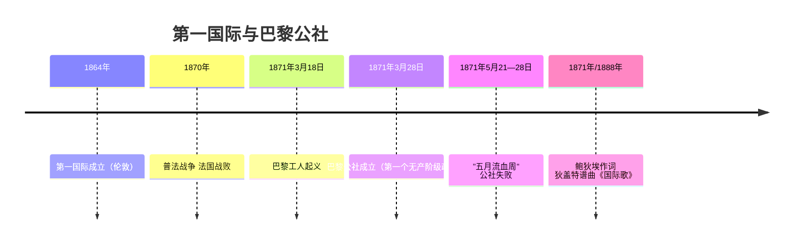
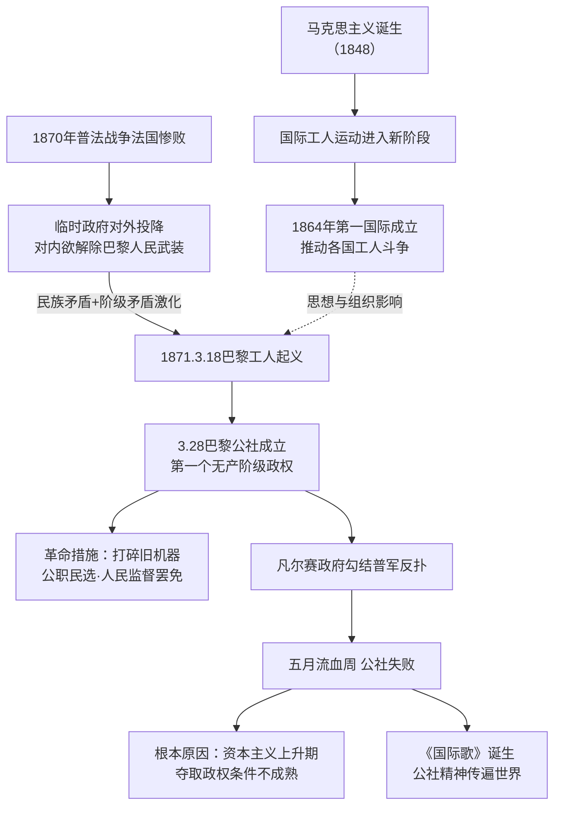

# 第21课 第一国际和巴黎公社

## 时间线

- 1864 年：国际工人协会（第一国际）在伦敦成立，马克思是创始人之一和实际领袖
- 1870 年：普法战争爆发，法国战败，法兰西第二帝国垮台
- 1871 年 3 月 18 日：巴黎工人起义，赶走资产阶级政府军
- 1871 年 3 月 28 日：巴黎公社成立——世界上第一个无产阶级政权
- 1871 年 5 月 21—28 日："五月流血周"，公社社员浴血巷战，公社最终失败
- 1871 年：公社委员欧仁·鲍狄埃创作《国际歌》歌词；1888 年狄盖特谱曲

## 历史事件

马克思主义诞生后，国际工人运动进入新阶段。1864 年第一国际成立，马克思为其起草成立宣言和临时章程，第一国际推动了各国工人运动的发展，支持各国工人的罢工斗争。

1870 年普法战争中法国惨败，资产阶级临时政府对外屈膝投降、对内企图解除巴黎人民武装。1871 年 3 月 18 日巴黎工人起义，3 月 28 日选举产生巴黎公社。公社采取了一系列革命措施：废除旧军队、旧警察，取消资产阶级法庭和议会，代之以国民自卫军和新的治安、司法机构；规定公职人员由民主选举产生，人民有权监督和罢免；维护工人权益等。

凡尔赛资产阶级政府勾结普军反扑，5 月 21 日攻入巴黎，公社战士经过一周血战（"五月流血周"）最终失败，数万社员牺牲。为纪念公社，鲍狄埃创作了《国际歌》歌词，经狄盖特谱曲后传遍全世界。

## 因果关系图

## 人物

- 马克思：第一国际的创始人之一，公社失败后写《法兰西内战》总结经验
- 欧仁·鲍狄埃：公社委员，《国际歌》词作者
- 狄盖特：工人作曲家，为《国际歌》谱曲

## 意义与影响

巴黎公社是世界上第一个无产阶级政权，是无产阶级建立政权的第一次伟大尝试。虽然仅存在 72 天即告失败，但它的实践丰富了马克思主义关于无产阶级革命和无产阶级专政的学说，公社战士英勇不屈的精神永远激励着后人。其失败的根本原因在于当时资本主义仍处于上升阶段，无产阶级夺取和保持政权的条件尚不成熟。

## 概念对比

- 第一国际 vs 共产主义者同盟：都由马克思参与领导；后者是第一个无产阶级政党组织（纲领为《共产党宣言》），前者是国际性工人联合组织
- 巴黎公社政权性质：无产阶级政权（公职人员民选、可罢免；打碎旧国家机器）
- 失败的根本原因 vs 直接原因：资本主义处于上升期、条件不成熟 vs 敌我力量悬殊、缺乏统一领导和农民支持

## 背记要点

1. 1864 年第一国际在伦敦成立，马克思是创始人之一
2. 巴黎公社的背景：普法战争法国战败、民族矛盾与阶级矛盾激化
3. 1871 年 3 月 28 日巴黎公社成立——世界上第一个无产阶级政权
4. 公社措施体现无产阶级性质：民选公职、人民监督罢免
5. "五月流血周"标志公社失败
6. 《国际歌》：鲍狄埃作词、狄盖特谱曲，为纪念巴黎公社而作

## 相关链接

理论指导来自 [[第20课 马克思主义的诞生]]；工人阶级的形成源于 [[第19课 第一次工业革命]]；《国际歌》的学习活动见 [[第22课 活动课 唱响“国际歌”]]。

## 自测题

1. 第一国际是在什么背景下成立的？有何作用？
2. 巴黎公社革命爆发的原因是什么？
3. 巴黎公社采取了哪些革命措施？体现了政权的什么性质？
4. 为什么说巴黎公社是无产阶级建立政权的第一次伟大尝试？
5. 《国际歌》是怎样诞生的？
