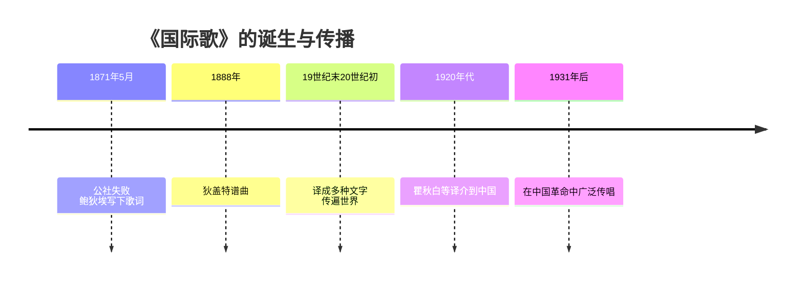
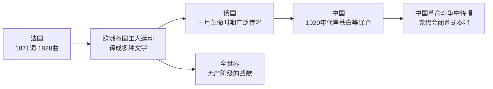

# 第22课 活动课 唱响“国际歌”

## 时间线

- 1871 年 5 月：巴黎公社失败后，公社委员欧仁·鲍狄埃怀着满腔悲愤创作《国际歌》歌词（原为诗歌《英特纳雄耐尔》）
- 1888 年：法国工人作曲家皮埃尔·狄盖特为歌词谱曲
- 19 世纪末 20 世纪初：《国际歌》被译成多种文字，传遍全世界，成为全世界无产阶级的战歌
- 1920 年代：瞿秋白等将《国际歌》译介到中国，"英特纳雄耐尔"的音译由此流传
- 1931 年后：《国际歌》在中国革命斗争中广泛传唱，成为中国共产党全国代表大会闭幕式奏唱曲目

## 活动主题与目标

本课是一节活动课，围绕"唱响《国际歌》"展开。活动目标：通过学唱《国际歌》、了解其创作背景与传播历程，感受巴黎公社战士不屈的斗争精神，理解国际共产主义运动的历史，培养史料搜集、合作探究和历史情感表达能力。

## 活动内容

1. 查资料：搜集《国际歌》词曲作者的生平资料，了解鲍狄埃在公社失败后隐蔽期间写下歌词、狄盖特在工人合唱团中为之谱曲的经过。
2. 析歌词："起来，饥寒交迫的奴隶！起来，全世界受苦的人！"体现了唤醒无产阶级奋起抗争的号召；"从来就没有什么救世主，也不靠神仙皇帝，要创造人类的幸福，全靠我们自己"体现了马克思主义关于人民群众创造历史、无产阶级自己解放自己的思想；"英特纳雄耐尔就一定要实现"表达了共产主义必胜的信念。
3. 学唱歌曲：体会歌曲庄严雄浑的旋律与坚定的战斗精神。
4. 讲传播史：了解《国际歌》从法国传向世界、传入中国的历程及其在中国革命中的作用。

## 传播路线图

## 人物

- 欧仁·鲍狄埃：巴黎公社委员、革命诗人，《国际歌》词作者，被誉为"最伟大的用歌作为工具的宣传家"
- 皮埃尔·狄盖特：法国工人作曲家，《国际歌》曲作者
- 瞿秋白：中国共产党早期领导人，最早把《国际歌》较完整地译成中文并传唱的人之一

## 意义与影响

《国际歌》是巴黎公社革命精神的艺术结晶，是全世界无产阶级的战歌。它跨越国界与时代，激励着世界各国劳动者为争取解放而斗争；在中国，它伴随着中国共产党领导的革命历程，成为革命精神的重要象征。

## 概念对比

- 《国际歌》vs《马赛曲》：前者是国际无产阶级的战歌（1871 年后）；后者是法国大革命时期的革命歌曲、后成为法国国歌
- 艺术作品与历史事件的关系：《国际歌》因巴黎公社而生，又反过来传播了公社精神

## 背记要点

1. 《国际歌》词作者：欧仁·鲍狄埃（1871 年，公社失败后）
2. 曲作者：皮埃尔·狄盖特（1888 年谱曲）
3. 创作背景：纪念巴黎公社，抒发无产阶级斗争精神
4. "英特纳雄耐尔"意为"国际"（international 的音译）
5. 《国际歌》是全世界无产阶级的战歌
6. 歌词核心思想：无产阶级要靠自己解放自己，共产主义必定实现

## 相关链接

创作背景直接源于 [[第21课 第一国际和巴黎公社]]；思想内涵体现 [[第20课 马克思主义的诞生]] 中"全世界无产者，联合起来"的精神；工人阶级的苦难根源可回溯 [[第19课 第一次工业革命]]。

## 自测题

1. 《国际歌》的词、曲作者分别是谁？创作背景是什么？
2. "从来就没有什么救世主"一句体现了什么思想？
3. 《国际歌》为什么能传遍全世界？
4. 《国际歌》与巴黎公社有什么关系？
5. 谈谈你学唱《国际歌》后对巴黎公社精神的理解。
