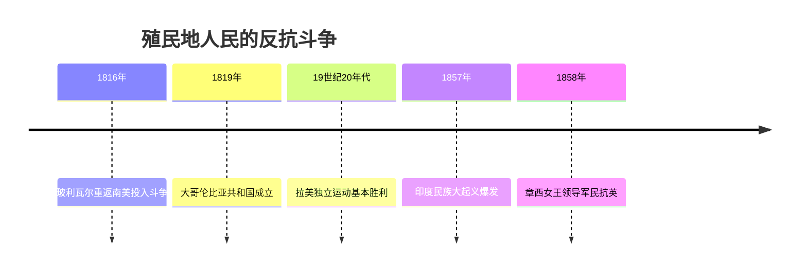
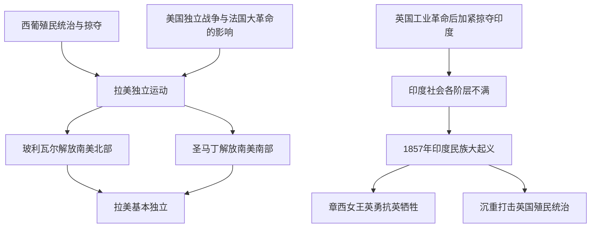

# 第1课 殖民地人民的反抗斗争

## 时间线

- 1816 年：玻利瓦尔率队伍回到南美，投入解放斗争
- 1819 年：玻利瓦尔打败西班牙军队，成立"大哥伦比亚共和国"
- 1857-1859 年：印度民族大起义，章西女王英勇作战牺牲
- 19 世纪二十年代：拉丁美洲基本获得独立

## 历史事件

拉丁美洲独立运动：背景是 19 世纪初拉丁美洲绝大部分地区处于西班牙和葡萄牙的殖民统治之下，殖民者的残暴统治和经济掠夺激起人民反抗；受美国独立战争和法国大革命的影响。经过：玻利瓦尔和圣马丁分别领导了南美洲北部和南部的独立运动，被誉为南美的"解放者"。玻利瓦尔解放了哥伦比亚、委内瑞拉、厄瓜多尔等地，"玻利维亚"即以他的名字命名；圣马丁领导了阿根廷、智利、秘鲁的独立运动。结果：西属拉美殖民地基本获得独立。

印度民族大起义：背景是英国完成工业革命后加紧对印度的经济剥削和政治压迫，导致手工业者破产、农民贫困，土兵（印度士兵）也心怀不满。经过：1857 年起义爆发，章西女王领导军民与英军展开激战，壮烈牺牲。结果：起义虽然失败，但沉重打击了英国殖民者。

## 因果关系图

## 人物

- 玻利瓦尔：南美"解放者"，建立大哥伦比亚共和国，玻利维亚以其名字命名
- 圣马丁：南美"解放者"，领导阿根廷、智利、秘鲁独立
- 章西女王：印度民族大起义中的杰出女英雄，抗英牺牲

## 意义与影响

拉美独立运动结束了西班牙、葡萄牙长达三百年的殖民统治，出现了一批新兴独立国家。印度民族大起义是印度历史上一次伟大的民族起义，沉重打击了英国殖民统治，反映了印度民族意识的觉醒，也是 19 世纪中期亚洲民族解放运动的重要组成部分。两场斗争共同表明：哪里有殖民压迫，哪里就有反抗。

## 概念对比

- 拉美独立运动 vs 印度民族大起义：前者反抗西葡殖民统治并取得独立；后者反抗英国殖民统治，失败但打击了殖民者
- 玻利瓦尔 vs 圣马丁：分别解放南美洲北部与南部，同被誉为"解放者"
- 共同背景：工业革命后西方列强加紧殖民扩张与掠夺

## 背记要点

1. 19 世纪初拉美主要处于西班牙、葡萄牙殖民统治下
2. 玻利瓦尔、圣马丁被誉为南美的"解放者"
3. 1819 年玻利瓦尔成立"大哥伦比亚共和国"
4. 1857-1859 年印度民族大起义，代表人物章西女王
5. 起义原因：英国完成工业革命后加紧对印度的掠夺

## 相关链接

殖民掠夺加剧的经济根源见 [[第19课 第一次工业革命]]；同一时期资本主义力量的壮大见 [[第2课 俄国的改革]] 与 [[第3课 美国内战]]。

## 自测题

1. 拉美独立运动的背景和领导人是谁？
2. "玻利维亚"国名的由来是什么？
3. 印度民族大起义爆发的根本原因是什么？
4. 章西女王的主要事迹是什么？
5. 这两场反抗斗争有何共同意义？
