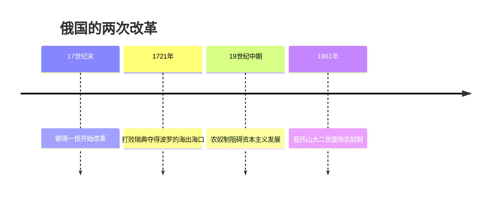
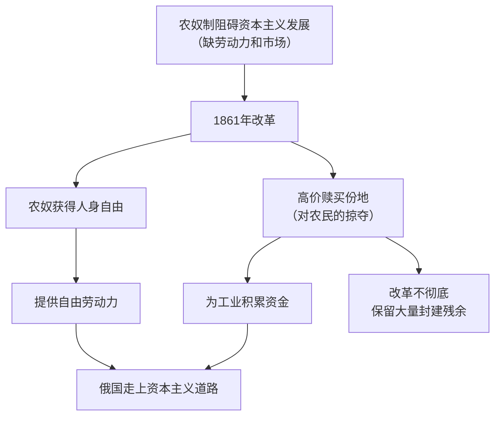

# 第2课 俄国的改革

## 时间线

- 17 世纪末 18 世纪初：彼得一世即位，推行强兵富国的改革
- 1700-1721 年：俄国在北方战争中打败瑞典，夺取波罗的海出海口
- 19 世纪中期：农奴制严重阻碍俄国资本主义经济发展
- 1861 年：亚历山大二世颁布废除农奴制的法令

## 历史事件

彼得一世改革：背景是俄国盛行农奴制，封闭落后，工商业发展极其缓慢。内容：政治上改组行政机构，建立中央集权的行政体制，加强沙皇专制权力；军事上创建纪律严明的新式常备军；经济上鼓励兴办手工工场，准许工场主购买整个村庄的农奴；文化上推行文化教育，派遣留学生，创办科学院和报纸，提倡西方的礼节服饰与生活方式。结果：俄国的经济、军事实力大大增强，一跃成为欧洲军事强国，为对外扩张准备了条件；但农奴制进一步强化，后来成为俄国社会发展的障碍。

1861 年农奴制改革：背景是 19 世纪中期农奴制严重制约俄国资本主义经济的发展（缺乏自由劳动力和国内市场）。经过：1861 年亚历山大二世颁布废除农奴制的法令。内容：农奴获得人身自由，可以改变身份、自由转换职业；农奴在获得解放的同时，可以获得一份土地，但必须出钱赎买，所出的价钱高于当时的地价。

## 因果关系图

## 人物

- 彼得一世：以强兵和学习西方科学技术为目标推行改革，使俄国成为欧洲军事强国
- 亚历山大二世：1861 年颁布废除农奴制法令，推动俄国走上资本主义道路

## 意义与影响

彼得一世改革开启了俄国近代化的进程。1861 年农奴制改革是俄国历史上的一个重要转折点，改革废除了农奴制，促使社会的各个方面出现了新的气象，推动俄国走上了发展资本主义的道路；但改革是自上而下进行的，很不彻底，农奴制的残余仍然存在，影响着俄国经济与社会的发展。

## 概念对比

- 彼得一世改革 vs 1861 年改革：前者强化农奴制，目的是富国强兵；后者废除农奴制，是资产阶级性质的改革
- 1861 年改革两面性：进步性（历史转折点、走上资本主义道路）与局限性（不彻底、保留封建残余、赎金是对农民的掠夺）
- 与日本明治维新同为自上而下的资产阶级性质改革，可类比记忆

## 背记要点

1. 彼得一世改革目标：强兵富国、学习西方，使俄国成为欧洲军事强国
2. 彼得一世改革开启俄国近代化进程，但强化了农奴制
3. 1861 年亚历山大二世废除农奴制
4. 内容：农奴获得人身自由；可出高价赎买一份土地
5. 意义：俄国历史的转折点，走上资本主义道路；局限：保留大量封建残余

## 相关链接

同时期各国扫除资本主义发展障碍的史实见 [[第3课 美国内战]] 和 [[第4课 日本明治维新]]；俄国后续的革命道路见 [[第9课 列宁与十月革命]]。

## 自测题

1. 彼得一世改革的目的和主要内容是什么？
2. 1861 年改革的根本原因是什么？
3. 1861 年改革的主要内容有哪些？
4. 为什么说 1861 年改革是俄国历史的转折点？
5. 1861 年改革有哪些局限性？
