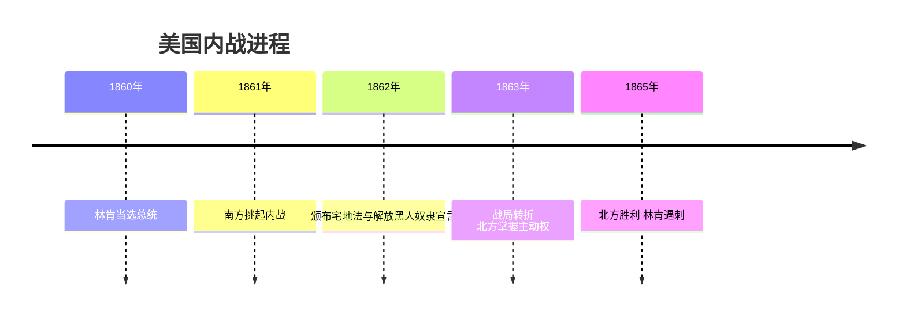
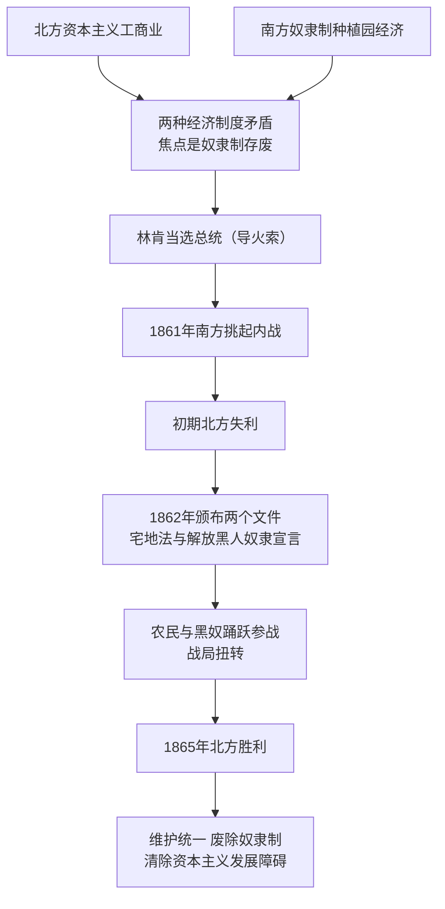

# 第3课 美国内战

## 时间线

- 19 世纪中期：美国北方资本主义工商业与南方种植园经济矛盾激化，焦点是奴隶制的存废
- 1860 年：主张限制奴隶制发展的林肯当选美国总统
- 1861 年 4 月：南方军队挑起内战，美国内战（南北战争）爆发
- 1862 年：联邦政府颁布《宅地法》和《解放黑人奴隶宣言》
- 1865 年：南方军队投降，内战以北方胜利告终；林肯遇刺身亡

## 历史事件

背景：美国独立后领土迅速扩张，北方发展资本主义工商业，南方盛行使用奴隶劳动的种植园经济。双方在原料、市场、劳动力、关税等方面矛盾重重，矛盾焦点是奴隶制的废存问题。1860 年林肯当选总统成为内战爆发的导火索（直接原因）。

经过：1861 年 4 月南方军队首先挑起战争。战争初期北方连连失利。1862 年联邦政府审时度势，颁布《宅地法》（鼓励农民到西部耕种，满足了人民对土地的需求）和《解放黑人奴隶宣言》（宣布从 1863 年元旦起南方叛乱地区的奴隶永远获得自由，可以参加北方军队），扭转了战局，调动了农民和黑人奴隶的积极性。

结果：1865 年南方军队投降，联邦政府获胜，避免了美国分裂。战争刚结束，林肯即遇刺身亡。

## 因果关系图

## 人物

- 林肯：美国第 16 任总统，领导内战维护了国家统一，废除了奴隶制，是美国历史上的著名总统

## 意义与影响

美国内战实质上是美国历史上的第二次资产阶级革命。经过这场战争，美国维护了国家统一，废除了奴隶制，清除了资本主义发展的最大障碍，为以后经济的迅速发展创造了条件。

## 概念对比

- 独立战争 vs 南北战争：前者反抗英国殖民统治、赢得独立（第一次资产阶级革命）；后者维护统一、废除奴隶制（第二次资产阶级革命）
- 《宅地法》vs《解放黑人奴隶宣言》：前者解决土地问题、调动农民；后者解决奴隶制问题、调动黑人奴隶
- 内战根本原因（两种经济制度矛盾）vs 直接原因（林肯当选总统）

## 背记要点

1. 根本原因：南北两种经济制度的矛盾，焦点是奴隶制的存废
2. 导火索：1860 年林肯当选总统
3. 1861 年南方挑起内战；1865 年北方胜利
4. 转折关键：1862 年《宅地法》和《解放黑人奴隶宣言》
5. 性质：美国历史上第二次资产阶级革命
6. 意义：维护统一，废除奴隶制，扫清资本主义发展障碍

## 相关链接

同时期扫除发展障碍的改革见 [[第2课 俄国的改革]] 和 [[第4课 日本明治维新]]；内战后美国经济腾飞见 [[第5课 第二次工业革命]]。

## 自测题

1. 美国内战爆发的根本原因和直接原因分别是什么？
2. 1862 年联邦政府颁布了哪两个重要文件？各起什么作用？
3. 美国内战的性质是什么？
4. 林肯的主要历史功绩有哪些？
5. 为什么说内战为美国经济迅速发展创造了条件？
