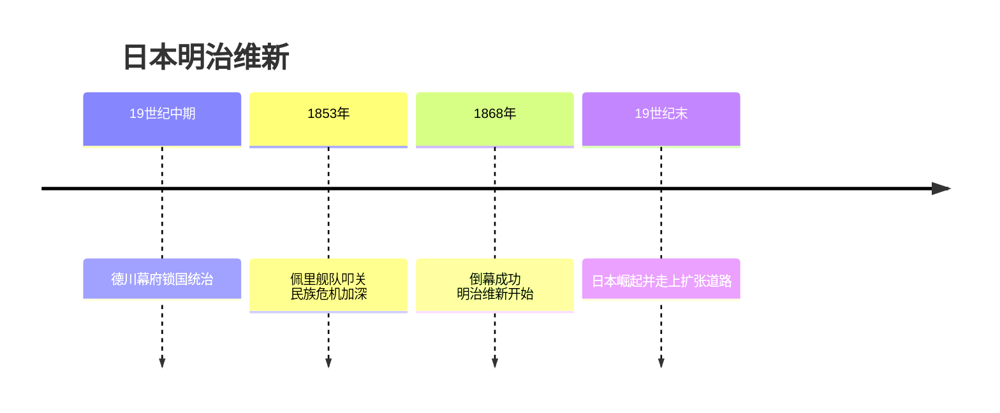
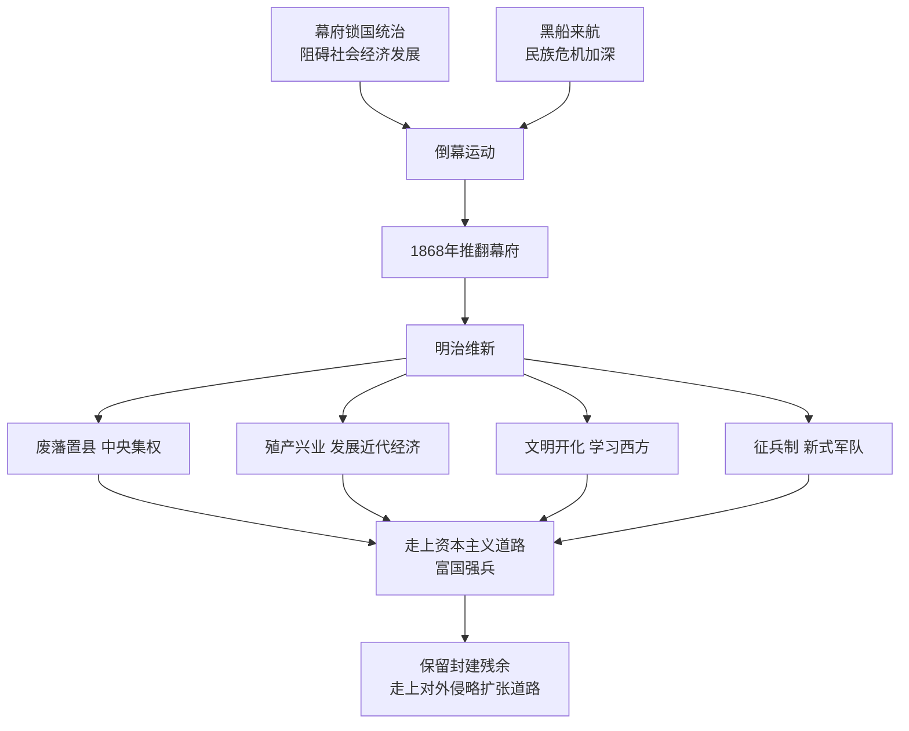

# 第4课 日本明治维新

## 时间线

- 19 世纪中期：日本处于德川幕府统治之下，实行锁国政策
- 1853-1854 年：美国佩里舰队两次强行进入日本港口（"黑船事件"），日本被迫开港通商
- 1868 年 1 月：倒幕派发动"王政复古"政变，结束幕府统治；明治政府开始实行一系列改革
- 19 世纪末：日本走上资本主义道路，实力增强，开始对外侵略扩张

## 历史事件

背景：19 世纪中期，日本名义上是天皇统治，实权掌握在幕府将军手中。德川幕府推行锁国政策，阻碍了社会经济的发展。1853-1854 年美国海军舰队两次强行进入日本港口，日本被迫开放通商口岸，面临沦为半殖民地的民族危机。一部分中下级武士联合西南强藩和朝廷公卿发起倒幕运动。

经过：1868 年 1 月倒幕派发动政变，结束了幕府统治。明治政府以西方为榜样全面改造日本，史称"明治维新"。内容：政治上废藩置县，实现中央集权；军事上实行征兵制，建立新式军队（提倡"武士道"精神）；经济上推行地税改革，以"殖产兴业"为口号大力发展近代经济；社会生活上提倡"文明开化"，向西方学习，改造教育、文化和生活方式。

结果：日本迅速走上了发展资本主义的道路，实现了富国强兵。

## 因果关系图

## 人物

- 明治天皇：改革在其名义下推行，年号"明治"，改革由此得名
- 倒幕派中下级武士：联合西南强藩推翻幕府统治，成为改革的领导力量

## 意义与影响

明治维新成为日本历史的重大转折点。通过明治维新，日本迅速走上了发展资本主义的道路，实现了富国强兵，开始跻身资本主义强国之列。但日本的改革保留了大量旧制度的残余，军国主义色彩浓厚，很快走上了对外侵略扩张的道路（如侵略中国台湾、发动甲午中日战争、吞并朝鲜半岛）。

## 概念对比

- 明治维新 vs 俄国 1861 年改革：都是自上而下的资产阶级性质改革，都不彻底、保留封建残余；日本改革更全面
- 明治维新 vs 中国戊戌变法：一成一败，关键在于领导力量、旧势力强弱与改革的社会基础不同
- "殖产兴业" vs "文明开化"：前者是经济近代化口号；后者是社会文化近代化口号

## 背记要点

1. 背景：幕府锁国统治 + 美国佩里舰队叩关引发的民族危机
2. 1868 年倒幕成功，明治政府开始改革
3. 内容四方面：废藩置县、征兵制、殖产兴业、文明开化
4. 性质：自上而下的资产阶级性质改革
5. 意义：日本历史重大转折点，走上资本主义道路
6. 局限：保留大量封建残余，走上对外侵略扩张道路

## 相关链接

同类改革对比见 [[第2课 俄国的改革]]；同时期革命道路见 [[第3课 美国内战]]；日本此后的扩张野心延续到 [[第10课 《凡尔赛条约》和《九国公约》]] 与 [[第14课 法西斯国家的侵略扩张]]。

## 自测题

1. 明治维新的背景是什么？
2. 明治维新在政治、经济、社会生活方面各有哪些措施？
3. 明治维新的性质和意义是什么？
4. 明治维新有哪些局限性？
5. 比较明治维新与俄国 1861 年改革的异同。
