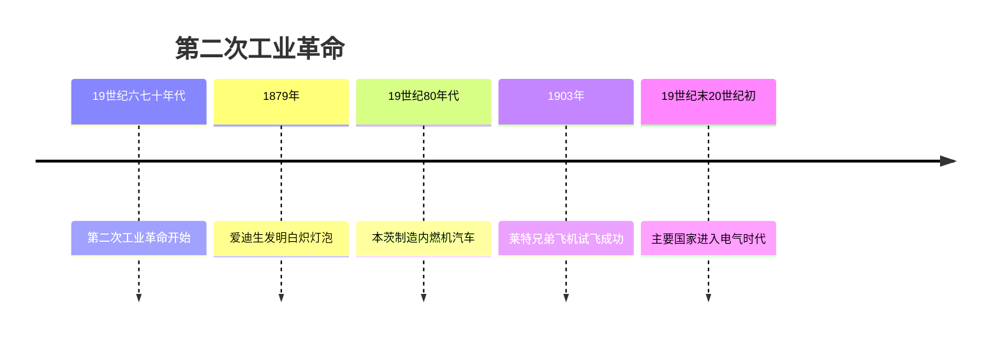
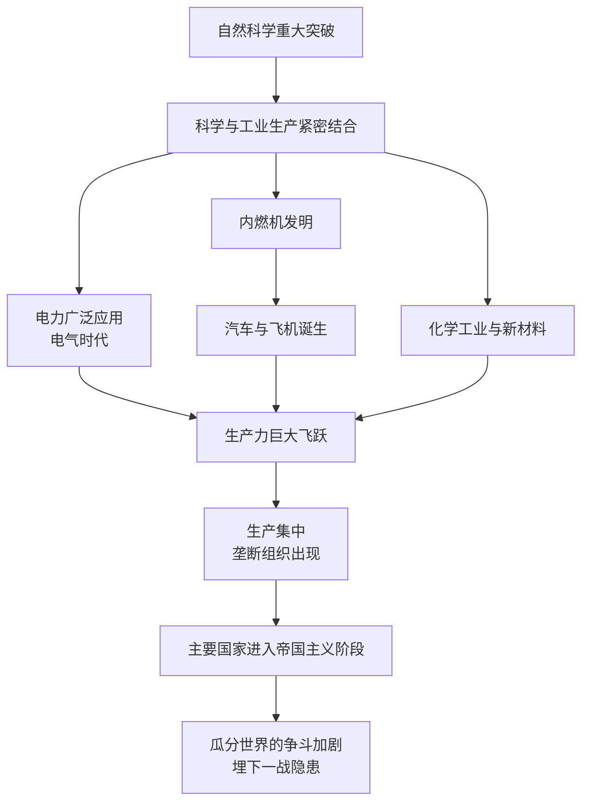

# 第5课 第二次工业革命

## 时间线

- 19 世纪六七十年代：第二次工业革命开始，特点是科学研究同工业生产紧密结合
- 1866 年：德国人西门子研制出发电机
- 1879 年：爱迪生发明耐用的白炽灯泡
- 19 世纪 80 年代：德国人本茨制造出内燃机驱动的汽车
- 1903 年：美国莱特兄弟试飞飞机成功
- 19 世纪末 20 世纪初：主要资本主义国家进入"电气时代"，出现垄断组织

## 历史事件

背景：19 世纪中后期，欧美主要资本主义国家政治稳定、经济发展，自然科学研究取得重大进步并迅速应用于生产。最显著的特点：科学研究同工业生产紧密结合。

主要成就：（1）电的应用是最显著的成就，电力成为新的动力来源，人类进入"电气时代"。美国发明家爱迪生发明白炽灯泡、碱性蓄电池、电影摄影机等，在纽约建成世界上第一个火力发电站，被称为"发明大王"。（2）内燃机是第二次工业革命中应用技术领域的另一重大成就：奥托制造出煤气内燃机，戴姆勒研制出汽油内燃机，狄塞尔发明柴油内燃机。内燃机带动了新的交通工具的出现——本茨制造出内燃机驱动的汽车，莱特兄弟发明飞机。（3）化学工业和新材料兴起：诺贝尔发明现代炸药，海厄特发明赛璐珞制造技术，夏尔多内发明人造纤维。

## 因果关系图

## 人物

- 爱迪生："发明大王"，发明白炽灯泡等上千项发明，建成世界上第一个火力发电站
- 本茨：制造出内燃机驱动的汽车
- 莱特兄弟：1903 年发明并试飞飞机成功
- 诺贝尔：发明现代炸药，遗嘱设立诺贝尔奖

## 意义与影响

第二次工业革命促进了生产力的发展，极大地改善了人们的生活，主要资本主义国家出现了垄断组织，资本主义由自由资本主义向垄断资本主义即帝国主义过渡。随着经济实力的增长，帝国主义国家掀起了瓜分世界的狂潮，对外扩张增强，殖民地半殖民地的民族危机加深，列强之间的矛盾也为第一次世界大战埋下祸根。

## 概念对比

- 第一次工业革命 vs 第二次工业革命：蒸汽时代 vs 电气时代；技术工人经验发明 vs 科学研究与生产紧密结合；英国一枝独秀 vs 几个先进国家同时进行（美德领先）
- 自由资本主义 vs 垄断资本主义：后者以垄断组织控制生产与市场为特征，即帝国主义阶段

## 背记要点

1. 时间：19 世纪六七十年代开始；特点：科学研究同工业生产紧密结合
2. 最显著成就：电力的广泛应用，进入"电气时代"
3. 爱迪生发明白炽灯泡；本茨造汽车；莱特兄弟造飞机
4. 内燃机的发明带动汽车、飞机等新交通工具出现
5. 影响：生产力大发展；出现垄断组织；主要国家进入帝国主义阶段

## 相关链接

第一次工业革命见 [[第19课 第一次工业革命]]；工业化带来的社会问题见 [[第6课 工业化国家的社会变化]]；帝国主义矛盾激化的结果见 [[第8课 第一次世界大战]]。

## 自测题

1. 第二次工业革命最显著的特点是什么？
2. 第二次工业革命最显著的成就是什么？人类进入什么时代？
3. 内燃机的发明带来了哪些新式交通工具？
4. 两次工业革命有哪些不同点？
5. 第二次工业革命对世界格局产生了什么影响？
