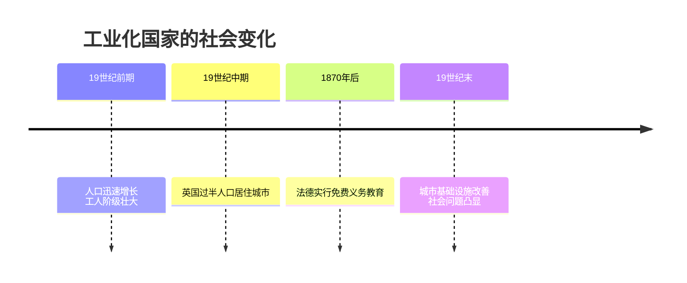
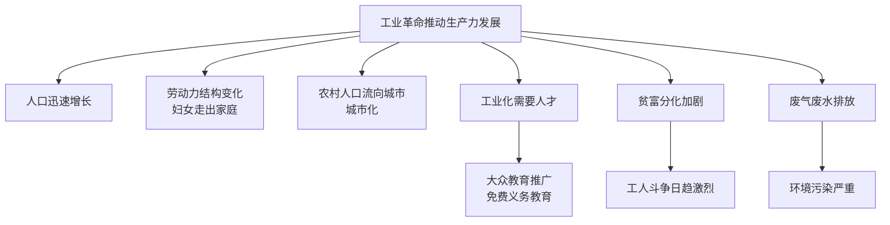

# 第6课 工业化国家的社会变化

## 时间线

- 19 世纪前期：工业革命推动欧洲人口迅速增长，工人阶级队伍壮大
- 19 世纪中期：英国等国开始建立国家教育体系，城市化进程加快
- 1870 年以后：法国、德国开始实行免费义务教育
- 19 世纪末 20 世纪初：城市环境改善，但环境污染、贫富分化等社会问题突出

## 历史事件

人口增长与劳动力结构变化：工业革命极大地推动了生产力的发展，促进了人口的迅速增长。英国、美国人口都明显增多。劳动力结构发生巨大变化：越来越多的人放弃农业生产，专门从事工业和商业；妇女成为工业劳动者，为妇女社会地位的提高创造了条件。

大众教育推广：19 世纪中期以后，为适应工业化发展的需要，欧洲国家开始推广大众教育。德国和法国最早建立起国家教育体系；1870 年以后，英国、法国开始对儿童实行免费义务教育。教育的普及提高了欧美各国的大众文化水平，促进了社会发展。

城市化：工业革命开始后，农村人口不断流向城市，城市越来越大。开始时城市环境很差（卫生、供水、住房等问题突出）；19 世纪中期以后，城市环境开始改善，基础设施逐步完备，人们的生活方式也在发生变化。

社会问题：一是社会矛盾激化——贫富分化加剧，工人的生活环境恶劣，工人对不公平的社会现状不满，斗争日趋激烈；二是环境污染严重——工厂排放的废气和废水污染大气和河流，危害人们的身体健康。

## 因果关系图

## 人物

- 本课以社会群体为主角：工业资产阶级、工人阶级、进入工厂的妇女、流入城市的农民，共同构成工业化社会变迁的图景

## 意义与影响

工业化一方面带来了人口增长、教育普及、城市化等进步性变化，提高了大众文化水平，改变了人们的生产生活方式；另一方面也带来环境污染和贫富分化加剧等严重社会问题。启示：发展经济必须同保护环境、关注公平相协调，走可持续发展道路。

## 概念对比

- 工业化的进步性 vs 弊端：人口增长、教育普及、城市化 vs 环境污染、贫富分化
- 城市化前期 vs 后期：19 世纪中期以前环境恶劣、缺乏规划 vs 中期以后基础设施完善、环境改善
- 最早建立国家教育体系的国家：德国和法国（区别于最早工业化的英国）

## 背记要点

1. 工业革命促进人口迅速增长，劳动力结构变化，妇女成为工业劳动者
2. 德国、法国最早建立国家教育体系
3. 1870 年以后英法对儿童实行免费义务教育
4. 城市化：农村人口不断流向城市
5. 两大社会问题：社会矛盾激化（贫富分化）、环境污染严重

## 相关链接

变化的动力来自 [[第19课 第一次工业革命]] 和 [[第5课 第二次工业革命]]；工人阶级斗争的理论武器见 [[第20课 马克思主义的诞生]]；同时期思想文化成就见 [[第7课 近代科学与文化]]。

## 自测题

1. 工业革命给人口和劳动力结构带来了哪些变化？
2. 哪些国家最早建立起国家教育体系？
3. 欧洲国家推广大众教育的原因是什么？
4. 工业化带来了哪些社会问题？
5. 工业化国家的社会变化给我们什么启示？
