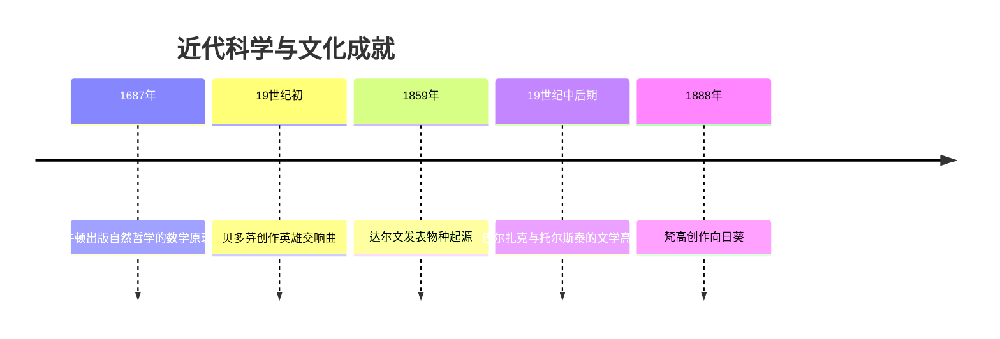
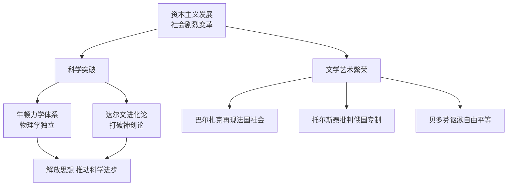

# 第7课 近代科学与文化

## 时间线

- 1687 年：牛顿出版《自然哲学的数学原理》，物理学成为独立学科
- 1859 年：达尔文出版《物种起源》，提出进化论观点
- 19 世纪初：贝多芬创作《英雄交响曲》
- 19 世纪中后期：巴尔扎克完成《人间喜剧》系列小说；托尔斯泰写成多部不朽名著
- 19 世纪末：梵高创作《向日葵》等作品

## 历史事件

科学：英国科学家牛顿是近代自然科学的奠基人之一，在天文学、数学、力学等领域有杰出贡献——发现万有引力定律、创建微积分、进行光学分析。1687 年出版《自然哲学的数学原理》，使物理学成为一门独立的学科。英国生物学家达尔文 1859 年出版《物种起源》，提出"进化论"观点，指出物竞天择、适者生存、优胜劣汰是自然进化的法则，打破了千百年来"上帝创造万物"的神创论，是生物科学的一次伟大革命。

文学：法国作家巴尔扎克的《人间喜剧》（包括《高老头》《欧也妮·葛朗台》等）再现了法国 19 世纪早期纷繁复杂的社会图景，给后人留下一部法国社会特别是巴黎上流社会的变迁史。俄国作家列夫·托尔斯泰的《战争与和平》《安娜·卡列尼娜》《复活》等名著，深刻揭露了俄国专制主义和地主对农民的残酷压榨，他被列宁称为"俄国革命的镜子"。

艺术：德国作曲家贝多芬的《英雄交响曲》气势磅礴、感情奔放，表达了对自由、平等和博爱的渴望，是他第一部明确反映重大社会题材的交响乐作品，标志着贝多芬在思想上和艺术上的成熟。荷兰画家梵高的代表作《向日葵》，色彩明快，表达了对生命的赞美和对美好生活的向往。

## 因果关系图

## 人物

- 牛顿：万有引力定律、微积分、光学分析；《自然哲学的数学原理》
- 达尔文：《物种起源》提出进化论，"打破神创论"
- 巴尔扎克：《人间喜剧》，法国社会的"变迁史"
- 列夫·托尔斯泰："俄国革命的镜子"，《战争与和平》等
- 贝多芬：《英雄交响曲》；梵高：《向日葵》

## 意义与影响

近代科学的发展解放了人们的思想，为两次工业革命提供了理论支撑；进化论沉重打击了宗教神学的统治。近代文学艺术真实反映并深刻批判了当时的社会现实，讴歌自由平等，成为人类宝贵的精神财富。

## 概念对比

- 牛顿 vs 达尔文：物理学（自然哲学的数学原理）vs 生物学（物种起源与进化论）
- 巴尔扎克 vs 托尔斯泰：批判法国金钱社会 vs 批判俄国专制与农奴制压迫
- 进化论核心：物竞天择、适者生存、优胜劣汰

## 背记要点

1. 牛顿：近代自然科学奠基人之一，1687 年《自然哲学的数学原理》
2. 达尔文：1859 年《物种起源》，提出进化论
3. 巴尔扎克：《人间喜剧》；托尔斯泰："俄国革命的镜子"
4. 贝多芬：《英雄交响曲》；梵高：《向日葵》
5. 科学文化繁荣的根源：资本主义经济发展与社会变革

## 相关链接

科学转化为生产力的典型见 [[第5课 第二次工业革命]]；社会变革背景见 [[第6课 工业化国家的社会变化]]；托尔斯泰批判的俄国社会问题见 [[第2课 俄国的改革]]。

## 自测题

1. 牛顿在科学上的主要贡献有哪些？
2. 达尔文进化论的主要观点及意义是什么？
3. 为什么托尔斯泰被称为"俄国革命的镜子"？
4. 《英雄交响曲》表达了怎样的思想感情？
5. 近代科学文化繁荣的原因是什么？
