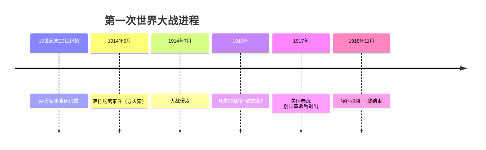
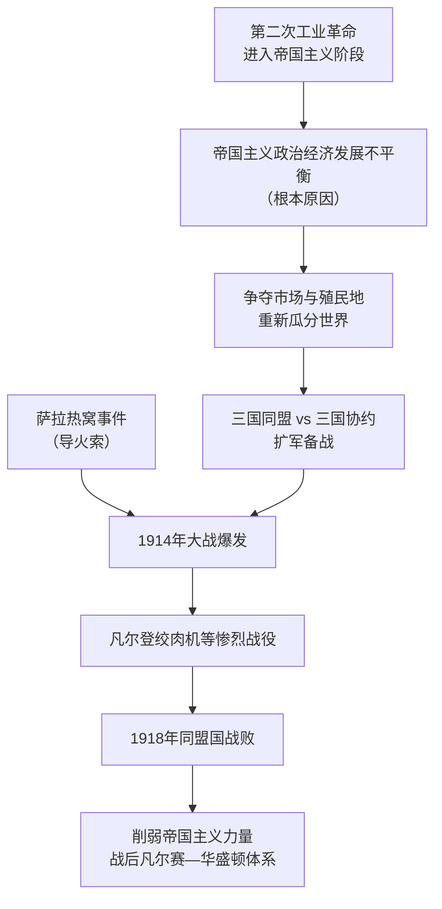

# 第8课 第一次世界大战

## 时间线

- 19 世纪末 20 世纪初：三国同盟（德、奥匈、意）与三国协约（英、法、俄）两大军事集团形成
- 1914 年 6 月 28 日：萨拉热窝事件，奥匈帝国皇储斐迪南大公夫妇被塞尔维亚青年普林西普刺杀
- 1914 年 7 月：奥匈帝国向塞尔维亚宣战，一战爆发
- 1916 年：凡尔登战役，因伤亡惨重被称为"绞肉机"
- 1917 年：美国参加协约国一方作战；俄国爆发十月革命后退出大战
- 1918 年 11 月：德国投降，一战以同盟国失败告终

## 历史事件

背景：第二次工业革命后，主要资本主义国家向帝国主义阶段过渡，帝国主义国家之间政治经济发展不平衡（根本原因），后起的德国等要求重新分割世界，与老牌殖民国家英法矛盾激化。为争夺霸权，欧洲形成三国同盟（德国、奥匈帝国、意大利）与三国协约（英国、法国、俄国）两大敌对军事集团，疯狂扩军备战。

经过：1914 年 6 月 28 日萨拉热窝事件成为大战的导火索。1914 年 7 月奥匈帝国向塞尔维亚宣战，大战爆发。意大利为自身利益参加协约国一方作战。1916 年的凡尔登战役异常惨烈，交战双方伤亡七十多万人，被称为"凡尔登绞肉机"。战争主要在欧洲三条战线进行，还使用了坦克、毒气等新式武器。1917 年美国参加协约国一方作战，中国也加入协约国；俄国十月革命后退出大战。

结果：1918 年 11 月德国投降，历时四年多的一战以同盟国的失败而结束。

## 因果关系图

## 人物

- 普林西普：塞尔维亚青年，刺杀奥匈皇储斐迪南大公夫妇，引发萨拉热窝事件（个人恐怖行为不是解决问题的正确方式）

## 意义与影响

第一次世界大战是西方列强为重新瓜分世界、争夺世界霸权而发动的一场帝国主义战争（性质，非正义）。大战历时四年多，参战国家众多，造成大量人员伤亡，给人类社会带来巨大灾难。大战大大削弱了欧洲的力量，从根本上动摇了欧洲的优势地位；削弱了帝国主义的殖民力量，进一步促进了殖民地半殖民地国家的民族觉醒；俄国十月革命的胜利也与大战密切相关。

## 概念对比

- 根本原因 vs 导火索：帝国主义政治经济发展不平衡 vs 萨拉热窝事件
- 三国同盟 vs 三国协约：德奥匈意 vs 英法俄（意大利后倒向协约国）
- 一战性质：帝国主义战争（塞尔维亚为民族独立而战具有正义性，但不能改变大战整体性质）

## 背记要点

1. 根本原因：帝国主义国家政治经济发展不平衡
2. 两大军事集团：三国同盟（德奥匈意）、三国协约（英法俄）
3. 导火索：1914 年 6 月萨拉热窝事件
4. 1914-1918 年；凡尔登战役"绞肉机"（1916 年）
5. 1917 年美国参战、俄国退出；1918 年 11 月德国投降
6. 性质：帝国主义战争

## 相关链接

大战的经济根源见 [[第5课 第二次工业革命]]；大战引发的革命见 [[第9课 列宁与十月革命]]；战后世界秩序见 [[第10课 《凡尔赛条约》和《九国公约》]]。

## 自测题

1. 一战爆发的根本原因和导火索分别是什么？
2. 两大军事集团分别由哪些国家组成？
3. 为什么凡尔登战役被称为"绞肉机"？
4. 1917 年发生了哪些影响战局的大事？
5. 如何评价第一次世界大战的性质和影响？
