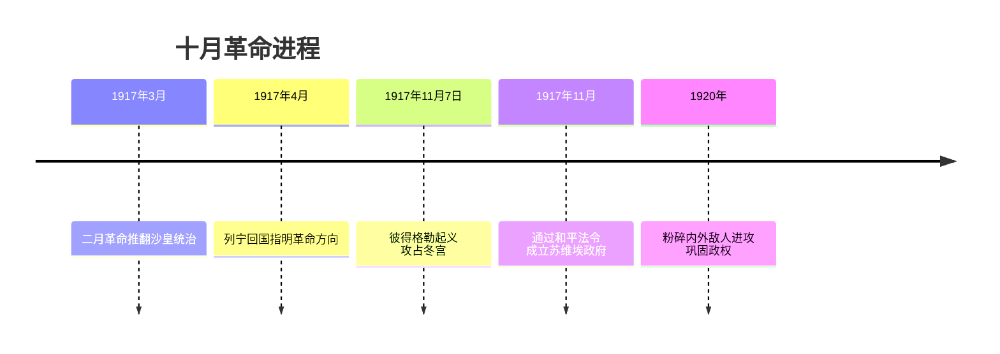
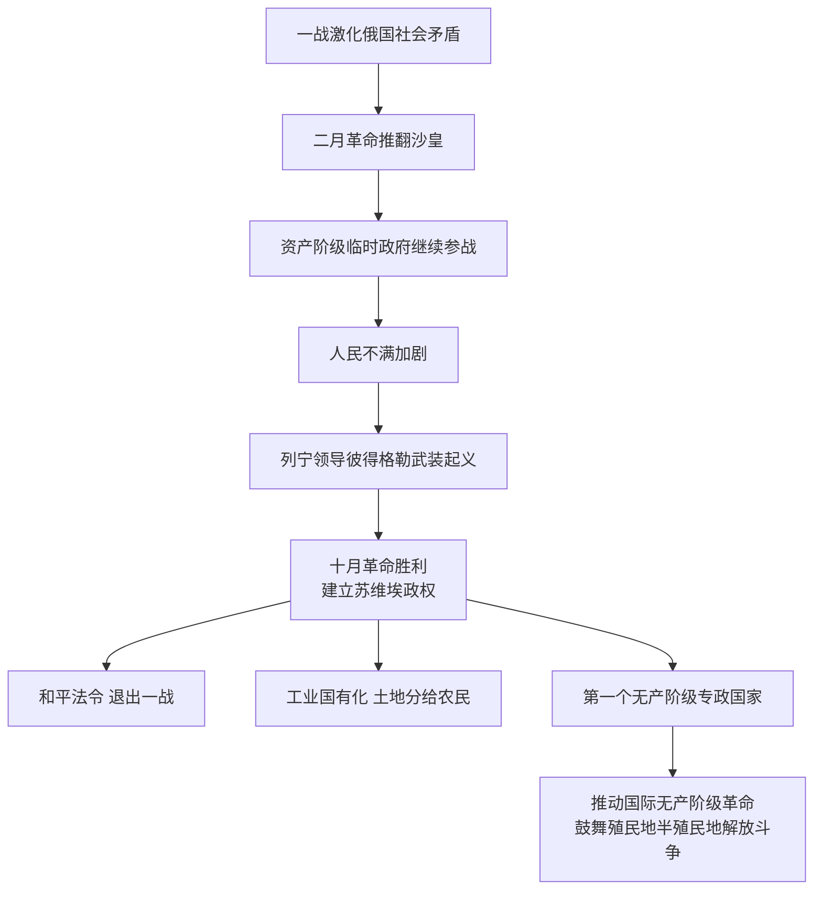

# 第9课 列宁与十月革命

## 时间线

- 1917 年 3 月：二月革命（俄历二月）推翻沙皇专制统治，建立资产阶级临时政府
- 1917 年 4 月：列宁回到彼得格勒，指明革命方向
- 1917 年 11 月 7 日（俄历十月）：彼得格勒武装起义胜利，攻占冬宫，十月革命成功
- 1917 年 11 月：全俄工兵代表苏维埃会议通过《和平法令》，成立苏维埃政府
- 1918-1920 年：苏维埃俄国粉碎国内外反革命武装干涉，巩固政权
- 1922 年底：苏联成立

## 历史事件

背景：20 世纪初俄国各种矛盾尖锐；第一次世界大战激化了俄国的社会矛盾，前线战事不断失利，后方物资匮乏。1917 年 3 月俄国发生二月革命，推翻了沙皇专制统治，建立了资产阶级临时政府。但临时政府继续参加一战，引起人民不满。列宁回国后指出应当以无产阶级革命夺取政权。

经过：1917 年 11 月 7 日（俄历 10 月），列宁秘密回到彼得格勒亲自领导武装起义，起义者攻占临时政府所在地冬宫，彼得格勒武装起义取得胜利。这是人类历史上第一次胜利的社会主义革命。

结果与措施：起义胜利当晚召开全俄工兵代表苏维埃会议，通过《和平法令》，建议交战各国停战议和；成立苏维埃政府，列宁任人民委员会主席。苏维埃政权将银行、铁路和大工业企业收归国有，将土地分给农民耕种，废除沙皇政府和临时政府与外国签订的一切不平等条约，退出一战。经过三年艰苦斗争，粉碎了外国武装干涉和国内反革命叛乱。

## 因果关系图

## 人物

- 列宁：伟大的无产阶级革命导师，领导十月革命胜利，任人民委员会主席，把马克思主义基本原理与俄国具体实际相结合

## 意义与影响

十月革命是人类历史上第一次胜利的社会主义革命，建立了第一个无产阶级专政的国家，推动了国际无产阶级革命运动，鼓舞了殖民地半殖民地人民的解放斗争。十月革命将社会主义由理论变为现实，开辟了人类历史的新纪元（对中国：十月革命一声炮响，给中国送来了马克思列宁主义）。

## 概念对比

- 二月革命 vs 十月革命：资产阶级民主革命（推翻沙皇）vs 社会主义革命（推翻临时政府）
- 巴黎公社 vs 十月革命：前者是建立无产阶级政权的第一次伟大尝试（失败）；后者是第一次胜利的社会主义革命
- 马克思主义由理论（1848）到实践（巴黎公社）再到现实（十月革命）

## 背记要点

1. 1917 年 3 月二月革命推翻沙皇专制，出现资产阶级临时政府
2. 1917 年 11 月 7 日彼得格勒武装起义胜利，攻占冬宫
3. 领导人：列宁；政权机关：人民委员会
4. 措施：《和平法令》、退出一战、工业国有化、土地分给农民
5. 意义：人类历史上第一次胜利的社会主义革命，开辟历史新纪元

## 相关链接

革命的理论来源见 [[第20课 马克思主义的诞生]]；战争背景见 [[第8课 第一次世界大战]]；革命后的建设见 [[第11课 苏联的社会主义建设]]；俄国革命前的社会矛盾见 [[第2课 俄国的改革]]。

## 自测题

1. 二月革命和十月革命的性质有什么不同？
2. 十月革命胜利后苏维埃政权采取了哪些措施？
3. 《和平法令》的主要内容是什么？
4. 十月革命的历史意义是什么？
5. 十月革命对中国革命产生了什么影响？
