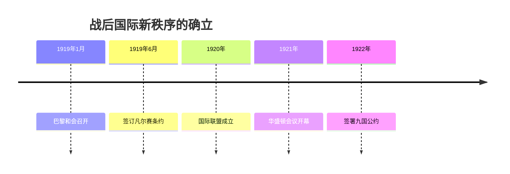
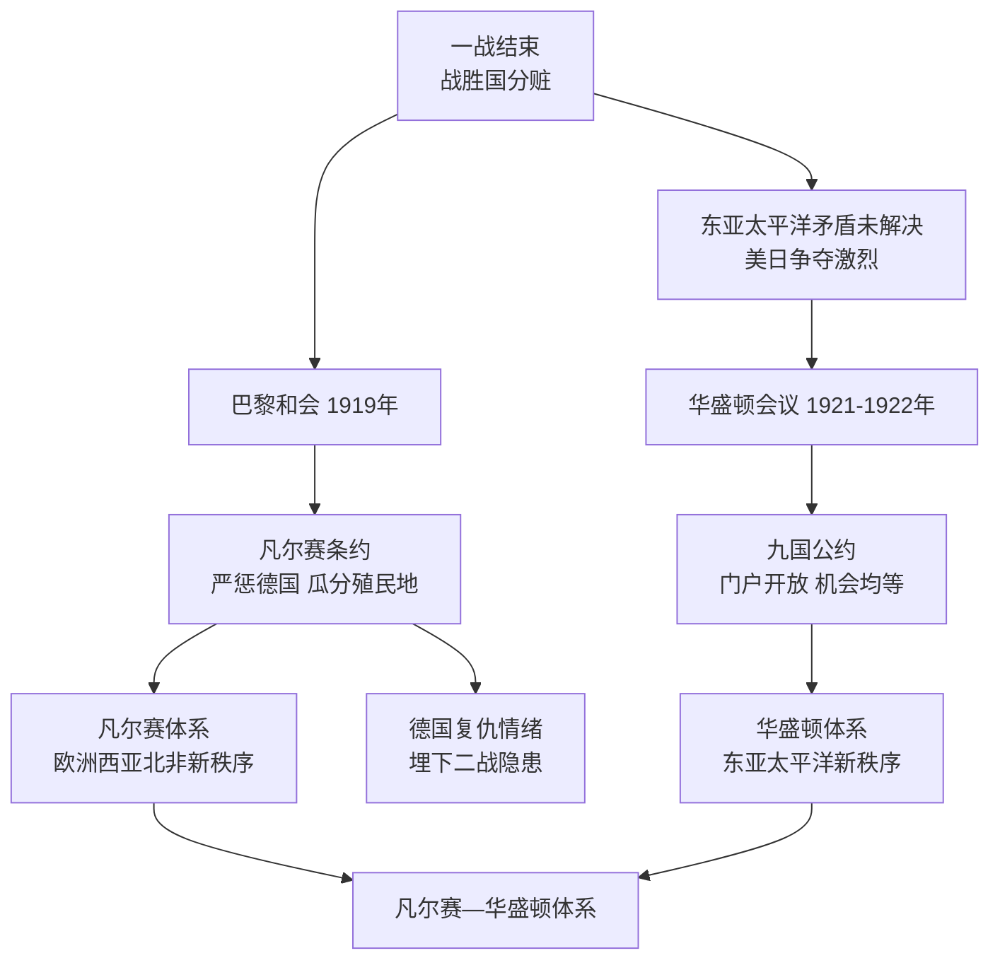

# 第10课 《凡尔赛条约》和《九国公约》

## 时间线

- 1919 年 1 月：巴黎和会在凡尔赛宫召开，英法美三巨头操纵会议
- 1919 年 6 月：协约国与德国签订《凡尔赛条约》
- 1920 年：国际联盟正式成立（美国最终未加入）
- 1921-1922 年：华盛顿会议召开
- 1922 年：九国代表签署《九国公约》

## 历史事件

巴黎和会与《凡尔赛条约》：背景是一战结束后，战胜国需要缔结和约、建立战后世界新秩序。1919 年 1 月，战胜国在巴黎凡尔赛宫召开会议，会议被法国总理克里孟梭、英国首相劳合·乔治和美国总统威尔逊操纵。1919 年 6 月协约国与德国签订《凡尔赛条约》，主要内容：领土方面，重划德国疆界，阿尔萨斯—洛林归还法国，萨尔煤矿归法国开采；军事方面，莱茵河西岸的德国领土由协约国占领 15 年，莱茵河东岸 50 千米内德国不得设防，禁止德国实行义务兵役制；政治方面，德国承认奥地利、波兰等国独立；赔款方面，由协约国设立赔款委员会决定德国战争赔款总数；殖民地方面，德国的全部海外殖民地由英、法、日等国瓜分（体现分赃性质）。会上中国收回山东权益的正当要求被拒绝，引发五四运动。《凡尔赛条约》与对其他战败国的条约构成凡尔赛体系，确立了帝国主义在欧洲、西亚、北非的统治秩序。

华盛顿会议与《九国公约》：背景是巴黎和会未解决帝国主义在东亚和太平洋地区的矛盾，美日矛盾尤为激烈。1921-1922 年美国主导召开华盛顿会议。1922 年九国代表签署《九国公约》：宣称尊重中国的主权、独立与领土完整，遵守各国在中国的"门户开放""机会均等"原则。实质是使美国长期追求的"门户开放"最终实现，维持了几个帝国主义国家共同支配中国的局面。华盛顿会议重新调整和确立了战胜国在东亚和太平洋地区的关系。

## 因果关系图

## 人物

- 三巨头：法国总理克里孟梭、英国首相劳合·乔治、美国总统威尔逊，操纵巴黎和会

## 意义与影响

通过巴黎和会与华盛顿会议，战胜国建立了战后国际新秩序——"凡尔赛—华盛顿体系"。这一体系暂时缓和了帝国主义国家之间的矛盾，但它建立在掠夺和奴役战败国及殖民地半殖民地人民的基础上，不可能从根本上消除矛盾，反而埋下了更大冲突的种子（德国的复仇情绪、美日矛盾）。

## 概念对比

- 巴黎和会 vs 华盛顿会议：调整欧洲西亚北非秩序 vs 调整东亚太平洋秩序；针对德国 vs 针对中国和日本
- 《凡尔赛条约》vs《九国公约》：宰割德国 vs 共同支配中国
- 凡尔赛—华盛顿体系实质：帝国主义重新瓜分世界的分赃体系

## 背记要点

1. 1919 年巴黎和会，三巨头操纵；1919 年 6 月《凡尔赛条约》
2. 《凡尔赛条约》核心：严惩德国（领土、军事、赔款、殖民地被瓜分）
3. 中国山东问题被拒引发五四运动
4. 1921-1922 年华盛顿会议；1922 年《九国公约》
5. 《九国公约》实质：几个帝国主义国家共同支配中国
6. 两次会议共同构成"凡尔赛—华盛顿体系"

## 相关链接

战争背景见 [[第8课 第一次世界大战]]；体系被打破的过程见 [[第14课 法西斯国家的侵略扩张]]；殖民地人民的反抗见 [[第12课 亚非拉民族民主运动的高涨]]。

## 自测题

1. 巴黎和会由哪三个人操纵？
2. 《凡尔赛条约》对德国有哪些规定？
3. 华盛顿会议召开的背景是什么？
4. 《九国公约》的内容和实质是什么？
5. 如何评价凡尔赛—华盛顿体系？
