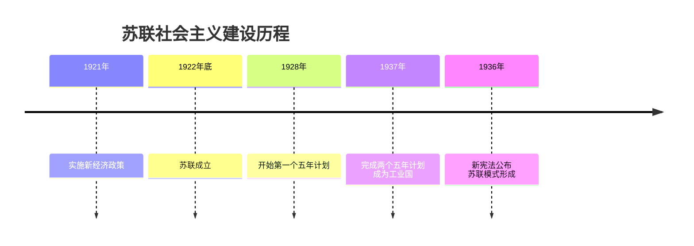
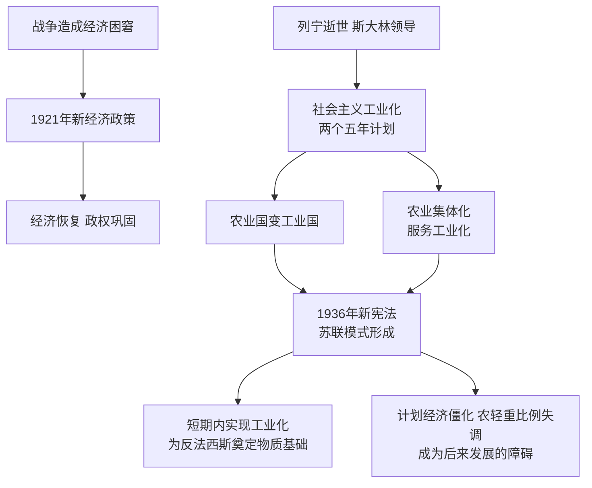

# 第11课 苏联的社会主义建设

## 时间线

- 1921 年春：苏维埃政府开始实施新经济政策
- 1922 年底：苏维埃社会主义共和国联盟（苏联）成立
- 1924 年：列宁逝世，斯大林开始领导苏联
- 1926 年起：苏联开始社会主义工业化建设
- 1928-1937 年：先后完成第一、第二个五年计划，由农业国变为工业国
- 20 世纪 30 年代初：农业集体化运动全面开展
- 1936 年：苏联公布新宪法，标志苏联模式（斯大林模式）形成

## 历史事件

新经济政策：背景是经历数年战争后，苏维埃俄国经济异常困窘，战时共产主义政策已不适应形势。1921 年春开始实施新经济政策：以征收粮食税代替余粮征集制；允许使用雇佣劳动力和出租土地，农民可以自由买卖纳税后的剩余产品，实行自由贸易；允许本国和外国的资本家经营中小企业；实行按劳取酬的工资制。特点：把社会主义同市场、商品货币关系和资本主义直接联系起来。结果：调动了生产者的积极性，迅速缓解了危机，巩固了工农联盟，促使国民经济稳步发展。

苏联工业化与农业集体化：1922 年底苏联成立。1924 年列宁逝世后，斯大林提出实现国家工业化的设想。1926 年起苏联开始社会主义工业化建设，1928-1937 年完成两个五年计划，重点发展重工业，苏联由落后的农业国变成强大的工业国。为适应工业化需要，20 世纪 30 年代初开展了大规模的农业集体化运动，消灭富农，建立集体农庄。

苏联模式：1936 年苏联公布新宪法，宣告确立了社会主义制度，也标志着苏联模式的形成。主要特征是高度集中的计划经济体制和高度集权的政治体制。

## 因果关系图

## 人物

- 列宁：实施新经济政策，从国情出发探索社会主义建设道路
- 斯大林：领导工业化和农业集体化，苏联模式（斯大林模式）以其名字命名

## 意义与影响

新经济政策是列宁从国情出发、对社会主义建设道路的成功探索。苏联模式在特定历史条件下促进了苏联经济社会快速发展，使苏联短期内实现工业化，为日后取得反法西斯战争胜利奠定了物质基础；但由于没有尊重经济规律，排斥市场，片面发展重工业，农轻重比例失调，随着时间推移其弊端日益暴露，成为苏联和东欧剧变的深层原因之一。

## 概念对比

- 战时共产主义政策 vs 新经济政策：余粮征集制 vs 粮食税；取消贸易 vs 自由贸易
- 新经济政策 vs 苏联模式：利用市场和商品货币关系 vs 高度集中的指令性计划
- 苏联工业化特点：优先发展重工业，在高度集中的指令性计划下完成

## 背记要点

1. 1921 年新经济政策：粮食税代替余粮征集制，允许自由贸易
2. 1922 年底苏联成立（注意与"沙俄""苏俄"的区别）
3. 1928-1937 年两个五年计划，重点发展重工业，农业国变工业国
4. 30 年代初农业集体化
5. 1936 年新宪法：社会主义制度确立、苏联模式形成的标志
6. 苏联模式特征：高度集中的计划经济体制 + 高度集权的政治体制

## 相关链接

政权建立过程见 [[第9课 列宁与十月革命]]；苏联模式的后续演变见 [[第18课 社会主义的发展与挫折]]；与资本主义国家应对危机方式的对比见 [[第13课 罗斯福新政]]。

## 自测题

1. 新经济政策的内容和特点是什么？
2. 苏联两个五年计划取得了什么成就？
3. 苏联模式形成的标志是什么？
4. 苏联模式有哪些特征？
5. 如何评价苏联模式的功与过？
