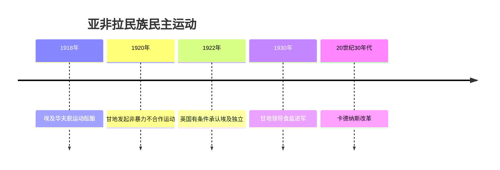
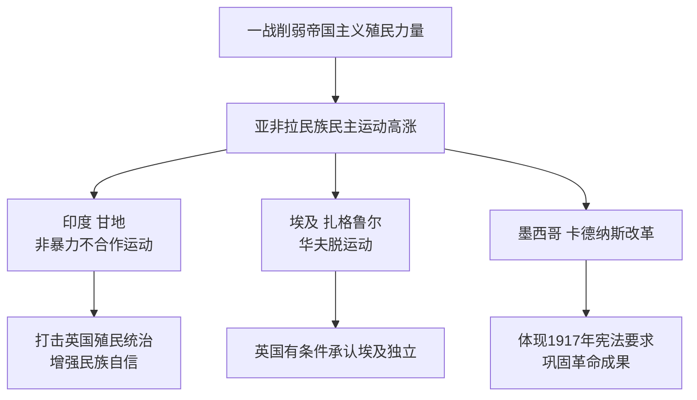

# 第12课 亚非拉民族民主运动的高涨

## 时间线

- 1920 年：甘地号召印度人民开展非暴力不合作运动
- 1922 年：发生农民焚烧警察局事件，甘地决定停止运动
- 1930 年：甘地再次发起非暴力不合作运动（文明不服从运动），"食盐进军"
- 1923 年：埃及华夫脱运动后，英国被迫有条件承认埃及独立
- 1910-1917 年：墨西哥资产阶级革命；1917 年颁布墨西哥宪法
- 20 世纪 30 年代：卡德纳斯推行改革，捍卫宪法成果

## 历史事件

印度非暴力不合作运动：背景是一战期间英国从印度征兵、征税，加重了印度的负担，战后印度民族解放运动高涨。经过：1920 年甘地号召开展非暴力不合作运动，内容包括抵制在殖民政府和法院中工作、拒绝在英国学校读书、鼓励发展手工纺织业抵制英国商品、拒绝纳税等。1922 年发生农民焚烧警察局事件后甘地停止运动。1930 年甘地再次发起运动，采取不服从形式，其中最有影响的是反对《食盐专营法》的"食盐进军"。结果：印度总督与甘地谈判，双方妥协。意义：动员了广大群众，打击了英国殖民统治，增强了印度人民的民族自尊心和自信心；同时甘地为防止爆发革命，控制了群众的斗争方式，保证了资产阶级对运动的领导权。

埃及华夫脱运动：一战后扎格鲁尔为首的华夫脱党要求埃及完全独立，坚持斗争。1922 年英国被迫有条件地承认埃及独立，1923 年埃及颁布第一部宪法。华夫脱运动为埃及民族民主运动的进一步发展奠定了基础。

墨西哥卡德纳斯改革：1910-1917 年墨西哥资产阶级革命后颁布 1917 年宪法，但未得到有效实施。1934 年卡德纳斯当选总统后推行改革：打击寡头势力，发展教育，遏制教会势力，改组国民革命党，实施土地改革，将服务业和大型工业收归国有。改革体现了 1917 年宪法的要求，巩固了墨西哥资产阶级革命的成果。

## 因果关系图

## 人物

- 甘地：印度民族解放运动领袖，倡导"非暴力不合作"
- 扎格鲁尔：埃及华夫脱党领袖，领导埃及独立运动
- 卡德纳斯：墨西哥总统，推行改革捍卫 1917 年宪法

## 意义与影响

一战后亚非拉民族民主运动出现高涨局面，沉重打击了帝国主义的殖民体系。三场运动形式各异——印度以非暴力不合作抗争，埃及以政党领导的独立运动抗争，墨西哥以改革巩固革命成果——共同表明殖民地半殖民地人民的民族意识空前觉醒。

## 概念对比

- 三国运动方式对比：印度非暴力不合作（群众运动）；埃及华夫脱运动（谈判与斗争结合）；墨西哥改革（政府自上而下）
- 甘地运动的两面性：动员群众、打击殖民者 vs 控制斗争方式、防止革命
- "非暴力"与"不合作"：以和平方式拒绝与殖民当局合作

## 背记要点

1. 1920 年甘地发起非暴力不合作运动；1930 年"食盐进军"
2. 甘地运动意义：打击英国殖民统治，增强民族自尊心自信心
3. 埃及：扎格鲁尔、华夫脱运动，1922 年英国有条件承认埃及独立
4. 墨西哥：卡德纳斯改革，体现 1917 年宪法要求
5. 共同背景：一战削弱帝国主义殖民力量，民族意识觉醒

## 相关链接

运动高涨的背景见 [[第8课 第一次世界大战]] 和 [[第10课 《凡尔赛条约》和《九国公约》]]；19 世纪的反抗先声见 [[第1课 殖民地人民的反抗斗争]]；二战后的独立浪潮见 [[第19课 亚非拉国家的新发展]]。

## 自测题

1. 甘地非暴力不合作运动的主要内容有哪些？
2. "食盐进军"发生在哪一年？针对什么法令？
3. 华夫脱运动取得了什么成果？
4. 卡德纳斯改革的主要措施有哪些？
5. 一战后亚非拉民族民主运动高涨的共同原因是什么？
