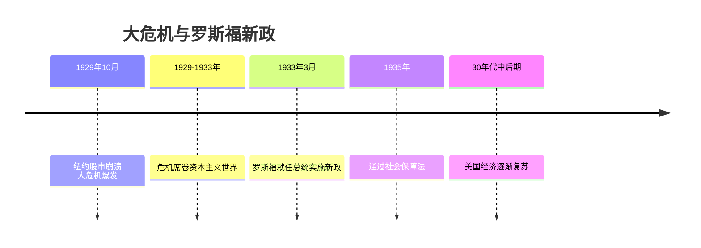
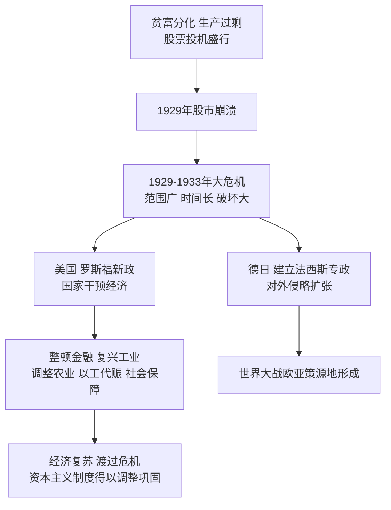

# 第13课 罗斯福新政

## 时间线

- 1929 年 10 月：美国纽约股市崩溃，经济大危机爆发
- 1929-1933 年：经济大危机席卷整个资本主义世界
- 1933 年 3 月：罗斯福就任美国总统，宣布实施新政
- 1935 年：美国通过《社会保障法》，建立社会保障制度
- 20 世纪 30 年代中后期：美国经济开始复苏，新政逐渐见效

## 历史事件

经济大危机：背景是 20 世纪 20 年代美国经济"繁荣"的背后隐藏着巨大危机——贫富分化严重，生产过剩，股票投机盛行。1929 年 10 月美国股市突然崩溃，经济危机迅速波及整个资本主义世界。特点：波及范围广、持续时间长、破坏性大。表现：工业产量骤降、贸易锐减、银行倒闭、企业破产、大量工人失业。危机的实质是生产（相对）过剩。

罗斯福新政：1933 年罗斯福就任总统后宣布实施新政，采用国家干预手段扭转经济形势。主要内容：（1）整顿金融体系：对银行业进行整顿，恢复银行信用；（2）加强对工业的计划指导：通过《国家工业复兴法》，制定公平竞争法规，协调各个工业部门的企业活动（新政中心措施）；（3）调整农业政策：通过《农业调整法》，限制产量，稳定农产品价格；（4）推行"以工代赈"：兴建大量公共设施（如田纳西水利工程），为失业者提供就业机会；（5）建立社会保障制度：通过《社会保障法》，建立社会保障机制和应急救济机构。

结果：美国经济开始缓慢复苏，工业生产恢复，就业人数增加，人民生活得到改善，美国渡过了危机。

## 因果关系图

## 人物

- 罗斯福：美国总统，实施新政，开创了资产阶级政府大规模干预经济的先河，是美国历史上极具影响力的总统

## 意义与影响

新政期间美国经济开始复苏，人民生活得到改善；新政增强了美国政府的宏观调控能力，恢复了美国人民的信心，对资本主义世界产生了深远影响（开创国家干预经济的新模式）。局限性：新政是在维护资本主义制度前提下作出的政策调整，没有改变资本主义的本质，无法解决美国社会的根本矛盾。

## 概念对比

- 新政"新"在何处：开创国家全面干预经济的新模式（此前奉行自由放任）
- 新政中心措施：对工业的计划指导（《国家工业复兴法》）
- 面对同一危机的两种出路：美英法改革（罗斯福新政）vs 德日法西斯化对外扩张

## 背记要点

1. 1929-1933 年经济大危机，从美国开始，实质是生产过剩
2. 危机特点：范围广、时间长、破坏性大
3. 1933 年罗斯福新政，特点是国家干预经济
4. 中心措施：《国家工业复兴法》对工业的计划指导
5. "以工代赈"兴建公共工程；1935 年《社会保障法》
6. 局限：没有改变资本主义本质，不能根除危机

## 相关链接

危机的另一种出路见 [[第14课 法西斯国家的侵略扩张]]；与苏联计划经济的对照见 [[第11课 苏联的社会主义建设]]；国家干预传统在战后的延续见 [[第17课 二战后资本主义的新变化]]。

## 自测题

1. 1929-1933 年经济大危机的特点和实质是什么？
2. 罗斯福新政的特点（手段）是什么？
3. 新政的中心措施是什么？
4. "以工代赈"有什么作用？
5. 如何评价罗斯福新政的作用与局限？
