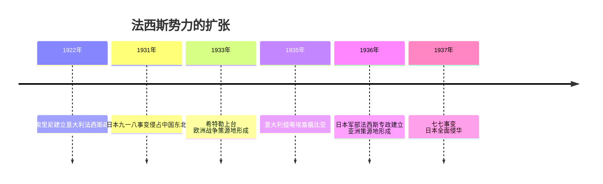
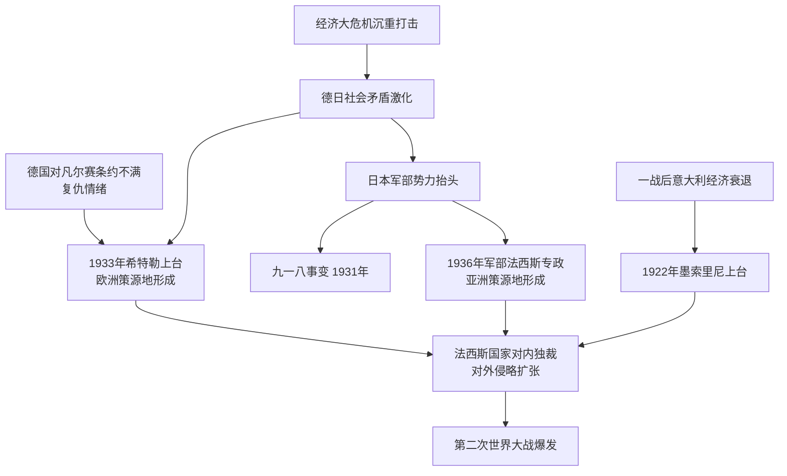

# 第14课 法西斯国家的侵略扩张

## 时间线

- 1922 年：墨索里尼率法西斯党徒向罗马进军，意大利建立法西斯政权
- 1931 年：日本发动九一八事变，侵占中国东北
- 1933 年：希特勒出任德国总理，纳粹党掌握国家政权，世界大战的欧洲策源地形成
- 1935 年：意大利发动侵略埃塞俄比亚的战争
- 1936 年：日本军部法西斯专政建立（受军部控制的内阁上台），世界大战的亚洲策源地形成
- 1937 年：日本发动七七事变，全面侵华战争爆发

## 历史事件

意大利法西斯政权：一战后意大利经济衰退、政治混乱，墨索里尼组织法西斯党。1922 年法西斯党徒向罗马进军，法西斯政权在意大利建立，随后对内实行独裁统治，对外醉心于扩张（1935 年入侵埃塞俄比亚）。

德国纳粹政权：背景是经济大危机沉重打击德国，社会矛盾激化，加之德国对《凡尔赛条约》的不满，希特勒和纳粹党利用民众的不满情绪骗取支持。1933 年希特勒出任总理，纳粹党掌权，世界大战的欧洲策源地形成。法西斯暴行：制造"国会纵火案"打击共产党；解散工会，焚毁进步书籍；疯狂迫害犹太人（反犹暴行）；大力扩军备战，撕毁《凡尔赛条约》。

日本军国主义：日本法西斯势力的核心是军部。经济大危机后日本以对外扩张摆脱困境，1931 年发动九一八事变，霸占中国东北。1936 年受军部控制的内阁上台，日本军部法西斯专政建立，世界大战的亚洲策源地形成。1937 年七七事变后发动全面侵华战争。

## 因果关系图

## 人物

- 墨索里尼：意大利法西斯党头目，1922 年建立法西斯政权
- 希特勒：德国纳粹党头目，1933 年上台，实行独裁恐怖统治并疯狂扩军备战

## 意义与影响

德、意、日法西斯政权对内实行恐怖独裁统治，对外疯狂侵略扩张，形成世界大战的欧、亚两个战争策源地，逐步勾结成轴心国集团（柏林—罗马—东京轴心），对世界和平构成严重威胁，直接导致第二次世界大战的爆发。历史警示：极端民族主义和军国主义是战争的祸根。

## 概念对比

- 三国法西斯化的不同途径：意大利政党夺权最早（1922）；德国借大危机通过选举上台（1933）；日本以军部为核心（1936）
- 欧洲策源地 vs 亚洲策源地：1933 年希特勒上台 vs 1936 年日本军部法西斯专政建立
- 应对大危机两条道路：罗斯福新政改革 vs 德日法西斯化扩张

## 背记要点

1. 1922 年墨索里尼建立意大利法西斯政权（最早）
2. 1933 年希特勒上台，欧洲战争策源地形成
3. 纳粹暴行：国会纵火案、迫害犹太人、撕毁《凡尔赛条约》扩军备战
4. 1931 年九一八事变；1936 年日本军部法西斯专政建立，亚洲策源地形成
5. 1937 年七七事变，日本全面侵华
6. 德日法西斯化的共同原因：经济大危机的打击

## 相关链接

大危机背景见 [[第13课 罗斯福新政]]；德国不满的条约根源见 [[第10课 《凡尔赛条约》和《九国公约》]]；扩张的最终结果见 [[第15课 第二次世界大战]]。

## 自测题

1. 三个法西斯国家建立独裁统治的时间和标志分别是什么？
2. 德国法西斯上台的背景是什么？
3. 纳粹德国有哪些法西斯暴行？
4. 两个战争策源地是如何形成的？
5. 面对经济大危机，美国与德日的选择有何不同？
