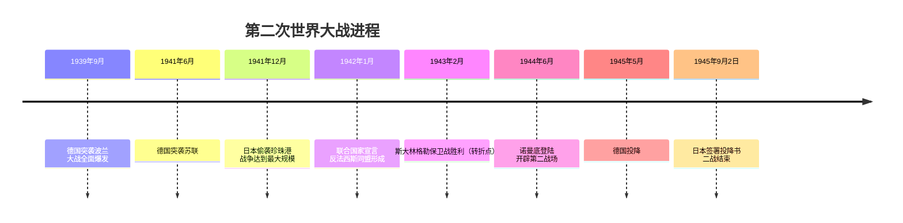
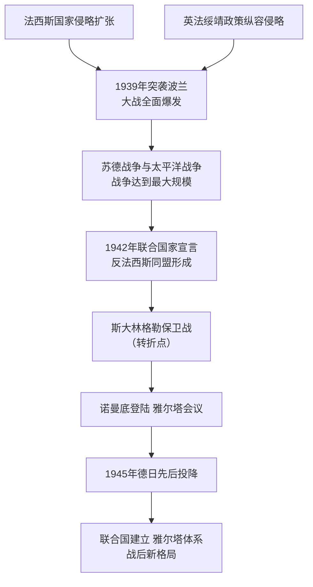

# 第15课 第二次世界大战

## 时间线

- 1939 年 9 月 1 日：德国突袭波兰，英法对德宣战，二战全面爆发
- 1941 年 6 月：德国突袭苏联，苏德战争爆发；莫斯科保卫战粉碎德军不可战胜的神话
- 1941 年 12 月 7 日：日本偷袭珍珠港，太平洋战争爆发，二战达到最大规模
- 1942 年 1 月：26 国签署《联合国家宣言》，世界反法西斯同盟正式形成
- 1942-1943 年：斯大林格勒保卫战，是第二次世界大战的转折点
- 1944 年 6 月：诺曼底登陆，开辟欧洲第二战场
- 1945 年 2 月：雅尔塔会议；5 月 8 日德国投降；8 月美国投放原子弹、苏联对日作战；9 月 2 日日本正式签署投降书，二战结束

## 历史事件

爆发与扩大：1931 年九一八事变揭开了二战的序幕，1937 年七七事变标志着中国全民族抗战的开始，开辟了世界上第一个反法西斯战场。1939 年 9 月 1 日德国以"闪电战"突袭波兰，英法被迫宣战，二战全面爆发。此后德国占领西欧大部，法国投降，英国坚持抵抗。1941 年 6 月德国突袭苏联；同年 12 月日本偷袭美国海军基地珍珠港，美国对日宣战，二战达到最大规模。莫斯科保卫战的胜利粉碎了德军不可战胜的神话。

同盟与转折：1942 年 1 月，美、英、苏、中等 26 国在华盛顿签署《联合国家宣言》，世界反法西斯同盟正式形成，各国协同作战，逐渐扭转战争形势。1942 年 7 月至 1943 年 2 月的斯大林格勒保卫战是第二次世界大战的转折点。1943 年 9 月意大利宣布无条件投降，法西斯集团开始瓦解。

胜利：1944 年 6 月美英盟军诺曼底登陆，开辟欧洲第二战场，德国陷入东西两个战场的夹击。1945 年 2 月美英苏首脑（罗斯福、丘吉尔、斯大林）召开雅尔塔会议，决定彻底消灭德国法西斯主义、战后德国由盟军分区占领、建立联合国，苏联承诺在欧洲战事结束后三个月内参加对日作战。1945 年 5 月 8 日德国正式签署投降书。1945 年 7 月《波茨坦公告》敦促日本投降。8 月美国向广岛、长崎投下原子弹，苏联对日宣战，中国等国举行反攻。8 月 15 日日本宣布无条件投降，9 月 2 日正式签署投降书，二战结束。

## 因果关系图

## 人物

- 罗斯福、丘吉尔、斯大林：雅尔塔会议三巨头，协调对德日作战与战后安排

## 意义与影响

第二次世界大战是人类历史上规模最大的战争，性质是世界人民的反法西斯战争（正义战争）。大战给人类带来空前浩劫，也彻底改变了世界面貌：彻底粉碎了法西斯主义的野心，深刻改变了国际格局（欧洲衰落、美苏崛起），促进了世界殖民体系的瓦解，对维护世界和平、促进共同发展产生了重大而深远的影响。启示：反法西斯同盟的胜利证明，不同社会制度的国家可以合作应对人类共同威胁。

## 概念对比

- 全面爆发 vs 最大规模：1939 年突袭波兰 vs 1941 年珍珠港事件
- 转折点：斯大林格勒保卫战（区别于莫斯科保卫战——粉碎德军不败神话）
- 一战 vs 二战性质：帝国主义战争 vs 世界反法西斯战争

## 背记要点

1. 1939 年 9 月 1 日德国突袭波兰，二战全面爆发
2. 1941 年 12 月珍珠港事件，二战达到最大规模
3. 1942 年 1 月《联合国家宣言》，反法西斯同盟形成
4. 转折点：斯大林格勒保卫战；1944 年诺曼底登陆开辟第二战场
5. 1945 年 2 月雅尔塔会议决定建立联合国
6. 1945 年 5 月 8 日德国投降；9 月 2 日日本签署投降书

## 相关链接

战争根源见 [[第14课 法西斯国家的侵略扩张]]；战后美苏对峙见 [[第16课 冷战]]；战后国际组织见 [[第20课 联合国与世界贸易组织]]。

## 自测题

1. 二战全面爆发和达到最大规模的标志分别是什么？
2. 世界反法西斯同盟正式形成的标志是什么？
3. 二战的转折点是哪次战役？
4. 雅尔塔会议作出了哪些决定？
5. 二战的性质和历史影响是什么？
