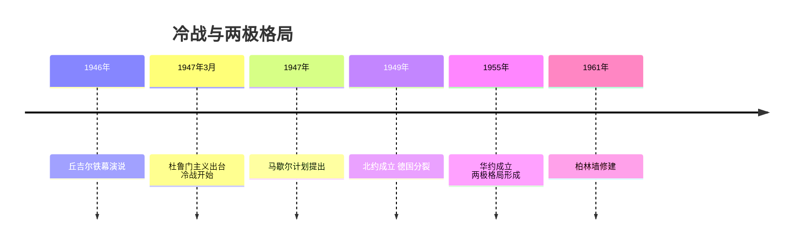
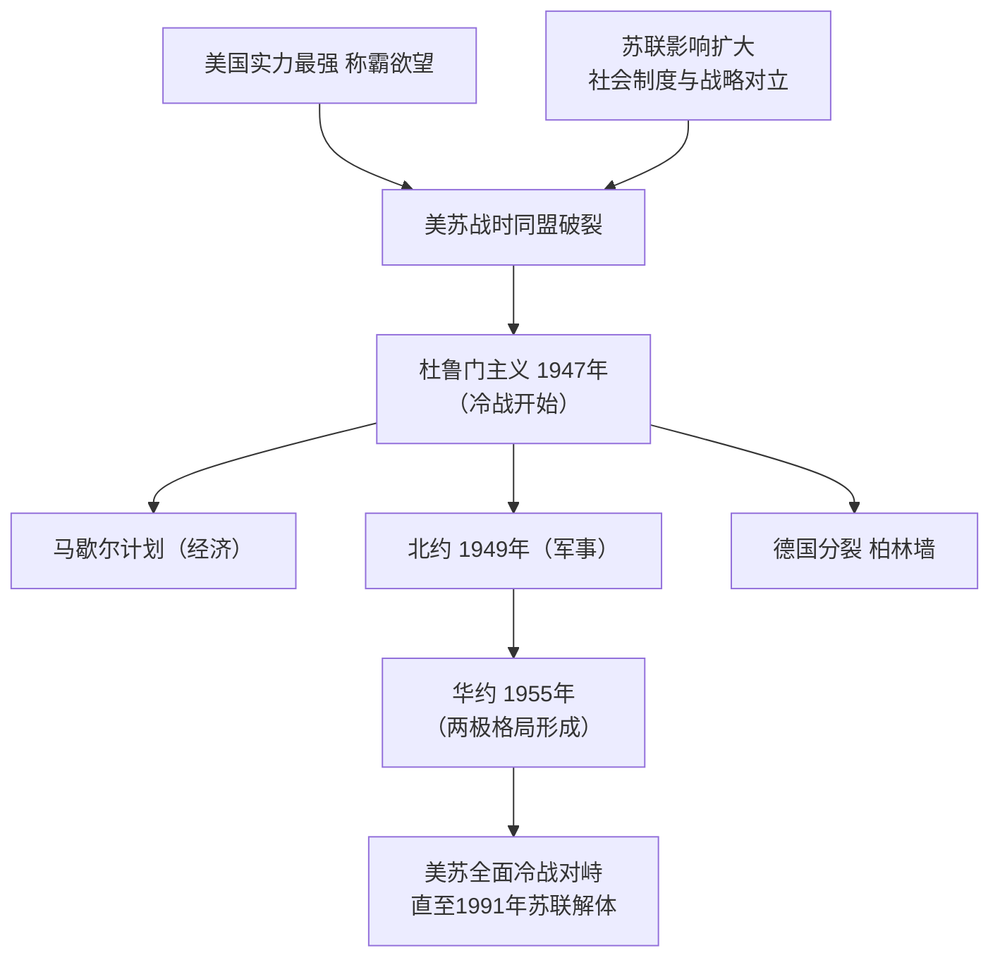

# 第16课 冷战

## 时间线

- 1946 年：丘吉尔发表"铁幕演说"，拉开冷战序幕
- 1947 年 3 月：杜鲁门主义出台，标志美苏冷战开始
- 1947 年：美国提出马歇尔计划（欧洲复兴计划）
- 1949 年：北大西洋公约组织（北约）成立；德国分裂为联邦德国和民主德国
- 1955 年：华沙条约组织（华约）成立，两极格局形成
- 1961 年：柏林墙修建，成为冷战的标志性建筑

## 历史事件

背景：二战后美国成为世界上军事、经济实力最强大的国家，称霸欲望强烈；苏联的实力和国际影响力也大为增强，社会主义国家力量壮大。美国认定苏联是其称霸的障碍，但双方都不愿再次发动战争。美苏国家战略的对立和社会制度的巨大差异，使两国从战时盟友变成战后对手。冷战是指 1947 年至 1991 年间，以美苏为首的两大集团之间既非战争又非和平的对峙与竞争状态。

经过：政治上，1947 年 3 月杜鲁门发表演说，提出"遏制"共产主义、干涉别国内政的纲领和政策，即"杜鲁门主义"，标志着冷战的开始。经济上，1947 年美国提出马歇尔计划（欧洲复兴计划），企图通过援助西欧恢复经济、稳定资本主义制度，是美国实施冷战政策的重要步骤。军事上，1949 年美、英、法等 12 国成立北大西洋公约组织；1955 年苏联同东欧 7 国成立华沙条约组织。德国分裂：1948 年"柏林危机"后，1949 年德国分裂为联邦德国（西德）与民主德国（东德），欧洲冷战对峙的局面基本形成。

结果：北约与华约两大军事集团对峙，美苏双方互相敌对，两极格局形成，冷战一直持续到 1991 年苏联解体。

## 因果关系图

## 人物

- 杜鲁门：美国总统，提出杜鲁门主义，开启冷战
- 丘吉尔：发表"铁幕演说"，为冷战制造舆论

## 意义与影响

冷战使世界形成两极格局，美苏军备竞赛加剧了世界的紧张局势（如柏林危机、古巴导弹危机）；但两大集团势均力敌、互相制衡，又避免了新的世界大战的爆发。冷战深刻影响了战后世界政治、经济、军事格局的演变。

## 概念对比

- 冷战 vs 热战：除直接武装进攻（战争）以外的一切敌对行动 vs 直接军事冲突
- 杜鲁门主义 vs 马歇尔计划：政治纲领（冷战开始标志）vs 经济手段（冷战重要步骤），本质都是遏制苏联、称霸世界
- 北约 vs 华约：1949 美国主导 vs 1955 苏联主导；华约成立标志两极格局形成

## 背记要点

1. 冷战含义：既非战争又非和平的对峙与竞争状态
2. 1947 年杜鲁门主义出台——冷战开始的标志
3. 马歇尔计划：企图通过经济援助控制西欧
4. 1949 年北约成立；1955 年华约成立——两极格局形成
5. 1949 年德国分裂为联邦德国和民主德国
6. 冷战结束：1991 年苏联解体

## 相关链接

冷战格局源于 [[第15课 第二次世界大战]] 后的力量对比；两大阵营内部的发展见 [[第17课 二战后资本主义的新变化]] 和 [[第18课 社会主义的发展与挫折]]；冷战结束后的世界见 [[第21课 冷战后的世界格局]]。

## 自测题

1. 什么是冷战？冷战开始和结束的标志分别是什么？
2. 美苏从盟友变为对手的原因是什么？
3. 马歇尔计划的实质是什么？
4. 两极格局形成的标志是什么？
5. 如何评价冷战对世界的影响？
